# Comprehensive Agile Methodology Guide

> A complete, in-depth guide to Agile software development covering principles, frameworks, tools, and testing practices.

---

## Table of Contents

1. [Unit I: Introduction to Agile](#unit-i-introduction-to-agile)
2. [Unit II: Agile Development Models](#unit-ii-agile-development-models)
3. [Unit III: Scrum and Extreme Programming](#unit-iii-scrum-and-extreme-programming)
4. [Unit IV: Kanban](#unit-iv-kanban)
5. [Unit V: Agile Design and Development Tools](#unit-v-agile-design-and-development-tools)
6. [Unit VI: Agile Testing](#unit-vi-agile-testing)

---

# Unit I: Introduction to Agile

## 1.1 History of Agile

### The Problem with Traditional Development

Before Agile, software development followed the **Waterfall Model**:

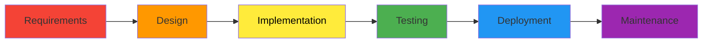

**Problems with Waterfall:**

| Issue | Description |
|-------|-------------|
| **Rigid phases** | Can't go back once a phase is complete |
| **Late testing** | Bugs found at the end, expensive to fix |
| **No customer feedback** | Customer sees product only at delivery |
| **Long cycles** | Months or years between releases |
| **High risk** | Entire project can fail if requirements wrong |

### The Birth of Agile (2001)

In February 2001, **17 software developers** met at a ski resort in Snowbird, Utah. They were frustrated with heavy, documentation-driven methodologies.

**The Lightweight Methods Representatives:**

| Person | Contribution |
|--------|--------------|
| Kent Beck | Extreme Programming (XP) |
| Ken Schwaber, Jeff Sutherland | Scrum |
| Alistair Cockburn | Crystal |
| Jim Highsmith | Adaptive Software Development |
| Martin Fowler | Refactoring, CI |
| Robert C. Martin (Uncle Bob) | Clean Code, SOLID |

**Result:** The **Agile Manifesto** was born.

### Timeline of Agile Evolution

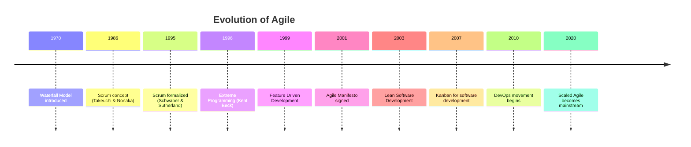

---

## 1.2 Need for Agile Software Development

### Why Traditional Methods Failed

```
Traditional Development Reality:

Project Start                                    Delivery
    ↓                                               ↓
    |←—————————— 18-24 months ——————————→|
    
    📋 Requirements    → Often outdated by delivery
    🏗️ Design         → Too rigid to change
    💻 Development    → No feedback until done
    🧪 Testing        → "Find all bugs at the end"
    📦 Delivery       → "Hope customer likes it!"
```

### The Chaos Report (Standish Group)

Traditional project success rates:

| Outcome | Percentage |
|---------|------------|
| **Successful** (on time, budget, features) | 16% |
| **Challenged** (late, over budget, fewer features) | 53% |
| **Failed** (cancelled) | 31% |

### Business Reality Today

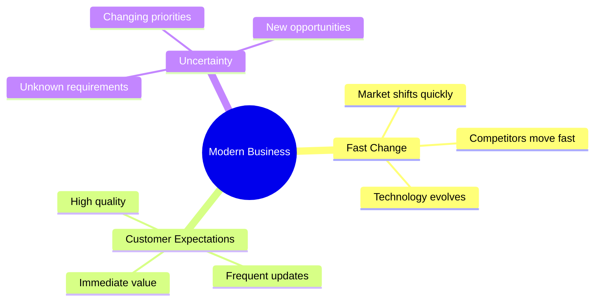

### What Businesses Need

| Need | Traditional | Agile |
|------|-------------|-------|
| **Speed to market** | Months/Years | Days/Weeks |
| **Respond to change** | Difficult, expensive | Natural, expected |
| **Customer feedback** | At the end | Continuous |
| **Risk management** | All-or-nothing | Incremental |
| **Team morale** | Often low | Empowered teams |

---

## 1.3 The Agile Manifesto

### The Four Values

```
┌─────────────────────────────────────────────────────────────────┐
│                    THE AGILE MANIFESTO                          │
├─────────────────────────────────────────────────────────────────┤
│                                                                 │
│   We are uncovering better ways of developing software by      │
│   doing it and helping others do it. Through this work we      │
│   have come to value:                                          │
│                                                                 │
│   ✅ Individuals and interactions  OVER  processes and tools   │
│   ✅ Working software              OVER  comprehensive docs    │
│   ✅ Customer collaboration        OVER  contract negotiation  │
│   ✅ Responding to change          OVER  following a plan      │
│                                                                 │
│   That is, while there is value in the items on the right,     │
│   we value the items on the left more.                         │
│                                                                 │
└─────────────────────────────────────────────────────────────────┘
```

### Understanding the Four Values

#### Value 1: Individuals and Interactions over Processes and Tools

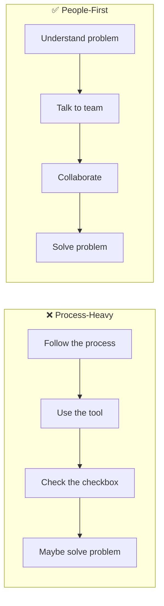

**What it means:**

- Great tools don't guarantee great software
- Face-to-face conversation > documented specs
- Skilled, motivated people > rigid processes
- Team collaboration is key

#### Value 2: Working Software over Comprehensive Documentation

```
Traditional:
📄 500-page requirements document
📄 200-page design document
📄 100-page test plan
💻 ... then maybe some code

Agile:
💻 Working increment
📄 Just enough documentation
💻 Another working increment
📄 Update docs as needed
```

**What it means:**

- Running code is the best proof of progress
- Documentation should serve the project, not vice versa
- "Just enough" documentation, not "all possible" documentation

#### Value 3: Customer Collaboration over Contract Negotiation

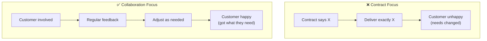

**What it means:**

- Customers are partners, not adversaries
- Requirements will change (and that's okay)
- Regular communication prevents surprises

#### Value 4: Responding to Change over Following a Plan

```
Traditional Mindset:
"The plan is sacred. Deviations are failures."

Agile Mindset:
"The plan is a starting point. Learning is success."
```

**What it means:**

- Change is inevitable in software development
- Plans are useful but not permanent
- The ability to adapt is a competitive advantage

---

## 1.4 The Twelve Agile Principles

### Customer-Focused Principles

| # | Principle | Explanation |
|---|-----------|-------------|
| 1 | **Highest priority is customer satisfaction** through early and continuous delivery | Deliver value frequently |
| 2 | **Welcome changing requirements**, even late in development | Embrace change as competitive advantage |
| 3 | **Deliver working software frequently**, from weeks to months | Shorter timescales preferred |

### Development Principles

| # | Principle | Explanation |
|---|-----------|-------------|
| 4 | **Business people and developers work together daily** | Close collaboration is essential |
| 5 | **Build projects around motivated individuals** | Trust and support the team |
| 6 | **Face-to-face conversation** is most efficient | Talk, don't document everything |
| 7 | **Working software is the primary measure of progress** | Not documents, not meetings |

### Quality Principles

| # | Principle | Explanation |
|---|-----------|-------------|
| 8 | **Sustainable development** – maintain constant pace indefinitely | No death marches |
| 9 | **Continuous attention to technical excellence** | Good design enhances agility |
| 10 | **Simplicity** – maximize work not done | YAGNI (You Ain't Gonna Need It) |

### Team Principles

| # | Principle | Explanation |
|---|-----------|-------------|
| 11 | **Self-organizing teams** produce best architectures and designs | Trust the team |
| 12 | **Regular reflection** on how to become more effective | Inspect and adapt |

### Principles Visualization

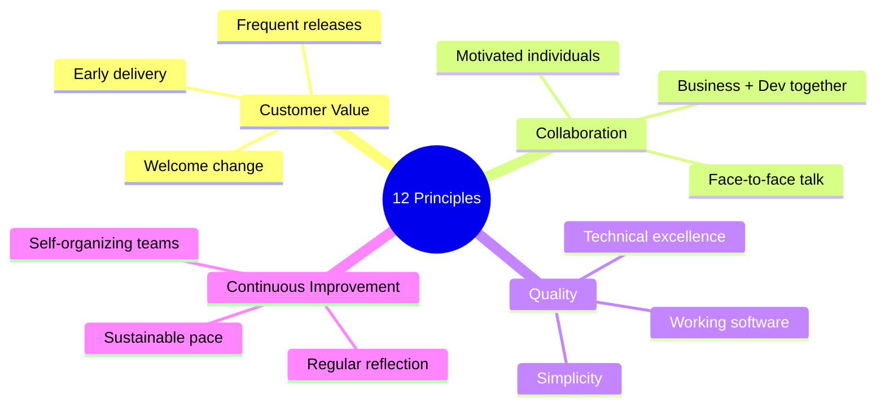

---

## 1.5 Agile Methods Overview

### The Agile Family

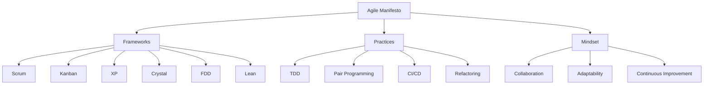

### Method Comparison at a Glance

| Method | Focus | Cadence | Best For |
|--------|-------|---------|----------|
| **Scrum** | Process framework | 2-4 week sprints | Cross-functional teams |
| **Kanban** | Flow management | Continuous | Operations, support |
| **XP** | Engineering practices | 1-2 week iterations | Technical excellence |
| **Lean** | Waste elimination | Continuous | Efficiency focus |
| **FDD** | Feature-based | 2-week cycles | Larger projects |
| **Crystal** | People-centric | Varies | Methodology tailoring |

---

## 1.6 Stakeholders in Agile

### Key Stakeholders

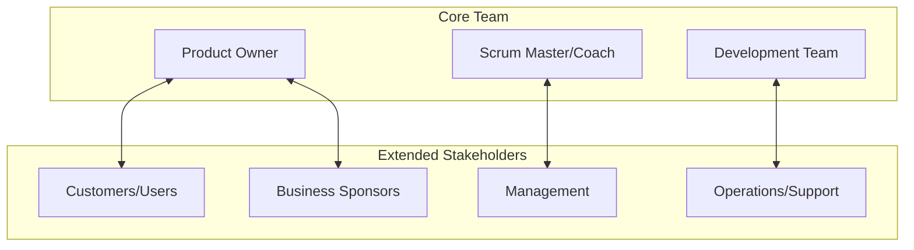

### Stakeholder Responsibilities

| Stakeholder | Role | Key Responsibilities |
|-------------|------|---------------------|
| **Product Owner** | Vision holder | Prioritize backlog, define requirements, accept work |
| **Development Team** | Builders | Design, develop, test, deliver |
| **Scrum Master** | Facilitator | Remove impediments, coach team, ensure process |
| **Customer** | Value definer | Provide feedback, validate value |
| **Sponsor** | Investor | Fund project, set business objectives |
| **Management** | Enabler | Provide resources, remove organizational barriers |

---

## 1.7 Challenges in Agile Adoption

### Common Challenges

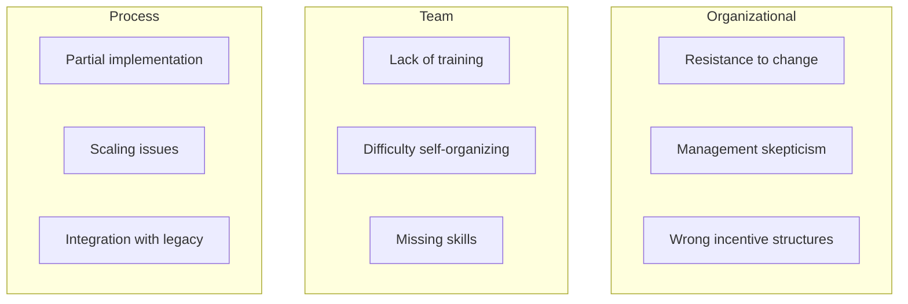

### Challenge Details

| Challenge | Description | Mitigation |
|-----------|-------------|------------|
| **Cultural resistance** | "We've always done it this way" | Start small, demonstrate value |
| **Lack of management support** | Middle management feels threatened | Education, new role definitions |
| **Incomplete adoption** | "Scrumfall" – Scrum + Waterfall mix | Proper training, coaching |
| **Missing technical practices** | Agile without TDD, CI, refactoring | XP practices alongside Scrum |
| **Distributed teams** | Face-to-face is harder | Video calls, good tooling |
| **Fixed contracts** | Traditional contracts vs. agile | Agile contracts, T&M |
| **Documentation needs** | Regulated industries need docs | Automate doc generation |

### The "Agile in Name Only" Problem

```
Fake Agile Signs:
├── ❌ Daily standup = status report to manager
├── ❌ Sprint = 1-month waterfall mini-cycle
├── ❌ Backlog = requirements document
├── ❌ Sprint planning = assigning tasks
├── ❌ Retrospective = blame session
└── ❌ "We're agile, we don't need documentation"

Real Agile Signs:
├── ✅ Team collaborates to solve problems
├── ✅ Working software delivered frequently
├── ✅ Customer provides regular feedback
├── ✅ Team continuously improves
└── ✅ Change is welcomed, not feared
```

---

## 1.8 Benefits of Agile for Software Industry

### Quantifiable Benefits

| Metric | Improvement |
|--------|-------------|
| **Time to market** | 30-40% faster |
| **Product quality** | 25-30% fewer defects |
| **Customer satisfaction** | 50% higher |
| **Employee morale** | 60% higher engagement |
| **Project success rate** | 2-3x higher than waterfall |

### Benefit Categories

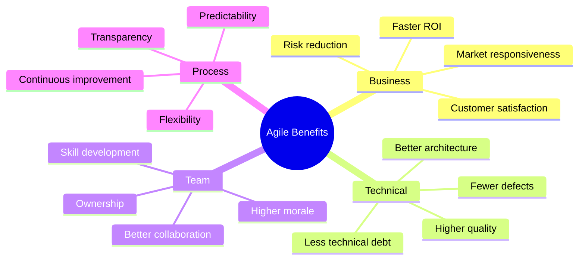

### Business Benefits Explained

**1. Faster Time to Market**

```
Traditional: Wait 18 months for first release
Agile: First release in 2-4 weeks, then every sprint

Value delivered: Incrementally, starting immediately
```

**2. Risk Reduction**

```
Traditional: All risk at the end (big bang delivery)
Agile: Risk spread across many small deliveries

If Sprint 5 fails:
- Lost: 2 weeks of work
- Kept: 4 sprints of delivered, tested software
```

**3. Better ROI**

- Early delivery means earlier revenue
- Can stop project anytime and still have working software
- Features prioritized by business value

### Technical Benefits Explained

**1. Higher Quality**

- Continuous testing catches bugs early
- Frequent integration prevents "merge hell"
- Refactoring keeps code clean

**2. Better Architecture**

- Architecture evolves with understanding
- "Just enough" design upfront
- Continuous improvement of design

### Team Benefits Explained

**1. Higher Morale**

- Self-organizing teams feel empowered
- Regular accomplishments (sprints complete)
- Clear purpose and value delivery

**2. Collaboration**

- Cross-functional teams reduce silos
- Daily communication builds trust
- Shared ownership of outcomes

---

## 1.9 Unit I Summary

### Key Takeaways

1. **Agile emerged** from frustration with heavyweight methodologies (2001)
2. **Four values** prioritize people, working software, collaboration, and adaptability
3. **Twelve principles** guide agile behavior
4. **Multiple methods** implement agile (Scrum, XP, Kanban, etc.)
5. **Challenges exist** but can be overcome with proper adoption
6. **Benefits** are significant for business, teams, and quality

### Quick Reference

```
Agile Manifesto Values:
✅ Individuals and interactions    > Processes and tools
✅ Working software                > Comprehensive documentation
✅ Customer collaboration          > Contract negotiation
✅ Responding to change            > Following a plan

Core Principle:
"Deliver working software frequently, with a preference for shorter timescales."
```

---

# Unit II: Agile Development Models

## 2.1 Overview of Agile Models

### The Agile Landscape

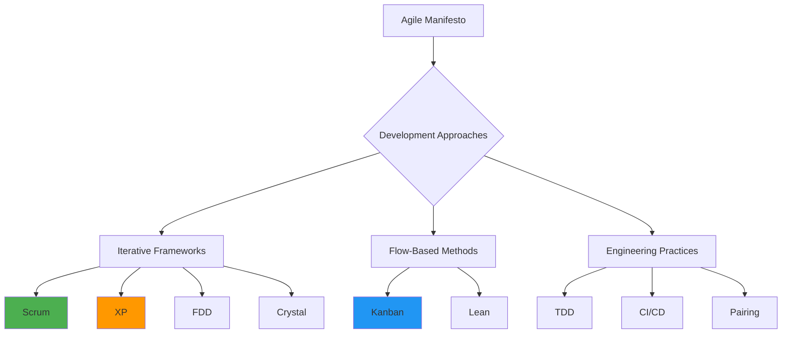

### Framework vs. Practices vs. Mindset

| Type | Examples | Purpose |
|------|----------|---------|
| **Framework** | Scrum, SAFe | Structure for organizing work |
| **Method** | XP, FDD | Technical development approach |
| **Practice** | TDD, Pairing | Specific technique |
| **Mindset** | Lean thinking | Way of thinking |

---

## 2.2 Scrum

### What is Scrum?

Scrum is a **lightweight framework** that helps teams work together to develop, deliver, and sustain complex products.

```
Scrum in One Sentence:
"A small team works in time-boxed iterations called Sprints to deliver
potentially shippable product increments, with regular inspection and adaptation."
```

### Scrum Framework Overview

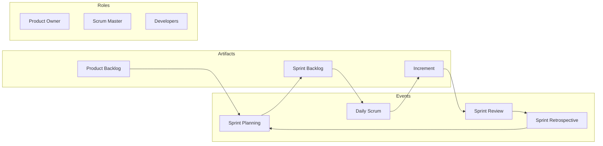

### Scrum Roles

| Role | Responsibilities |
|------|-----------------|
| **Product Owner** | Owns backlog, prioritizes, accepts work |
| **Scrum Master** | Facilitates, coaches, removes impediments |
| **Developers** | Design, develop, test, deliver |

### Scrum Events

| Event | Time-box | Purpose |
|-------|----------|---------|
| **Sprint** | 1-4 weeks | Container for all other events |
| **Sprint Planning** | 8 hours (4-week sprint) | Plan what to deliver |
| **Daily Scrum** | 15 minutes | Synchronize and plan |
| **Sprint Review** | 4 hours | Inspect increment, adapt backlog |
| **Sprint Retrospective** | 3 hours | Improve process |

### Scrum Artifacts

| Artifact | Description | Commitment |
|----------|-------------|------------|
| **Product Backlog** | Ordered list of everything needed | Product Goal |
| **Sprint Backlog** | Sprint Goal + selected items + plan | Sprint Goal |
| **Increment** | Sum of all completed items | Definition of Done |

### Scrum Flow

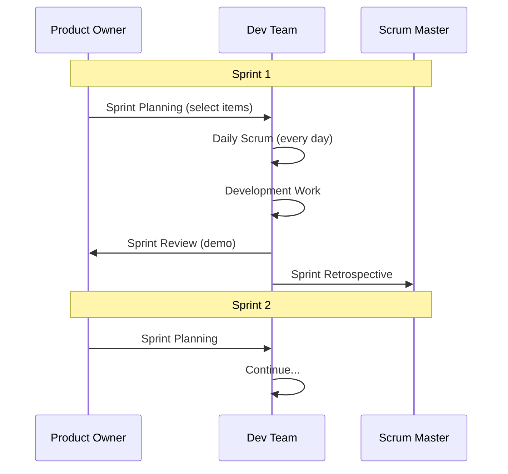

---

## 2.3 Extreme Programming (XP)

### What is XP?

XP is an agile methodology focused on **technical excellence** and **engineering practices**.

```
XP Philosophy:
"Take good development practices to the EXTREME."

Example:
✓ Code review is good → Review ALL code → Pair Programming
✓ Testing is good → Test EVERYTHING → TDD
✓ Simple design is good → Simplest thing that works → Refactoring
```

### XP Values

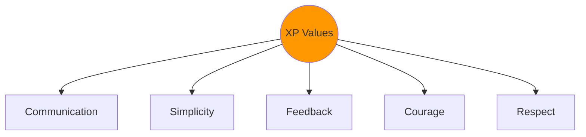

| Value | Description |
|-------|-------------|
| **Communication** | Talk face-to-face, share knowledge |
| **Simplicity** | Do what is needed, no more |
| **Feedback** | Learn and adapt quickly |
| **Courage** | Tell the truth, take risks |
| **Respect** | Everyone's contribution matters |

### XP Practices

```
XP Practice Categories:

Planning Practices:
├── Planning Game
├── Small Releases
├── Customer Tests
└── The Planning Game

Development Practices:
├── Simple Design
├── Pair Programming
├── Test-Driven Development
├── Refactoring
└── Continuous Integration

Team Practices:
├── Collective Ownership
├── Coding Standards
├── Sustainable Pace
└── On-site Customer
```

### Key XP Practices Explained

| Practice | Description |
|----------|-------------|
| **Pair Programming** | Two developers, one keyboard |
| **TDD** | Write test → Write code → Refactor |
| **Continuous Integration** | Integrate code multiple times daily |
| **Refactoring** | Improve code without changing behavior |
| **Simple Design** | No speculative generalization |
| **Collective Ownership** | Anyone can change any code |

---

## 2.4 Feature Driven Development (FDD)

### What is FDD?

FDD is a **model-driven**, **short-iteration** process designed for larger teams and projects.

### FDD Process

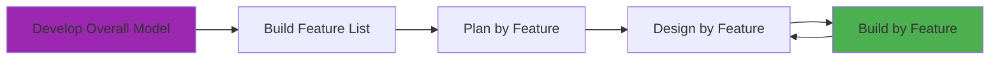

### FDD Phases

| Phase | Duration | Activities |
|-------|----------|------------|
| **Develop Model** | 1-2 weeks | Domain walkthrough, create models |
| **Build Feature List** | 1-2 weeks | Identify all features |
| **Plan by Feature** | Initial | Create development plan |
| **Design by Feature** | Days | Detailed design for feature set |
| **Build by Feature** | Days | Develop and test features |

### FDD Feature Format

```
Feature Format:
<action> the <result> <by|for|of|to> <object>

Examples:
✓ "Calculate the total of a sale"
✓ "Display the list of products for a category"
✓ "Validate the password for a user"
```

### FDD Roles

| Role | Responsibility |
|------|---------------|
| **Project Manager** | Administrative lead |
| **Chief Architect** | Overall design |
| **Development Manager** | Day-to-day operations |
| **Chief Programmer** | Leads feature teams |
| **Class Owner** | Owns specific classes |
| **Domain Expert** | Provides business knowledge |

---

## 2.5 Crystal Methodology

### What is Crystal?

Crystal is a **family of methodologies** designed to be adapted based on team size and project criticality.

### Crystal Family

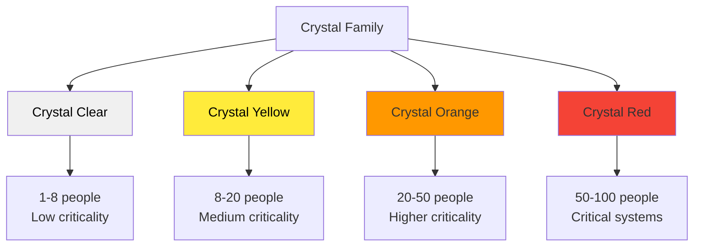

### Crystal Properties

| Property | Description |
|----------|-------------|
| **Frequent Delivery** | Regular working software delivery |
| **Reflective Improvement** | Regular retrospection |
| **Osmotic Communication** | Information flows naturally |
| **Personal Safety** | Speak up without fear |
| **Focus** | Uninterrupted work time |
| **Easy Access to Expert Users** | Quick answers to business questions |
| **Technical Environment** | CI, automated tests, CM |

### Crystal Clear vs. Other Crystals

| Aspect | Crystal Clear | Crystal Orange |
|--------|---------------|----------------|
| **Team Size** | 1-8 | 20-50 |
| **Co-location** | Required | Recommended |
| **Documentation** | Minimal | Moderate |
| **Ceremony** | Very low | Medium |

---

## 2.6 Kanban

### What is Kanban?

Kanban is a **visual flow-based method** for managing work, originating from Toyota's manufacturing system.

### Kanban Principles

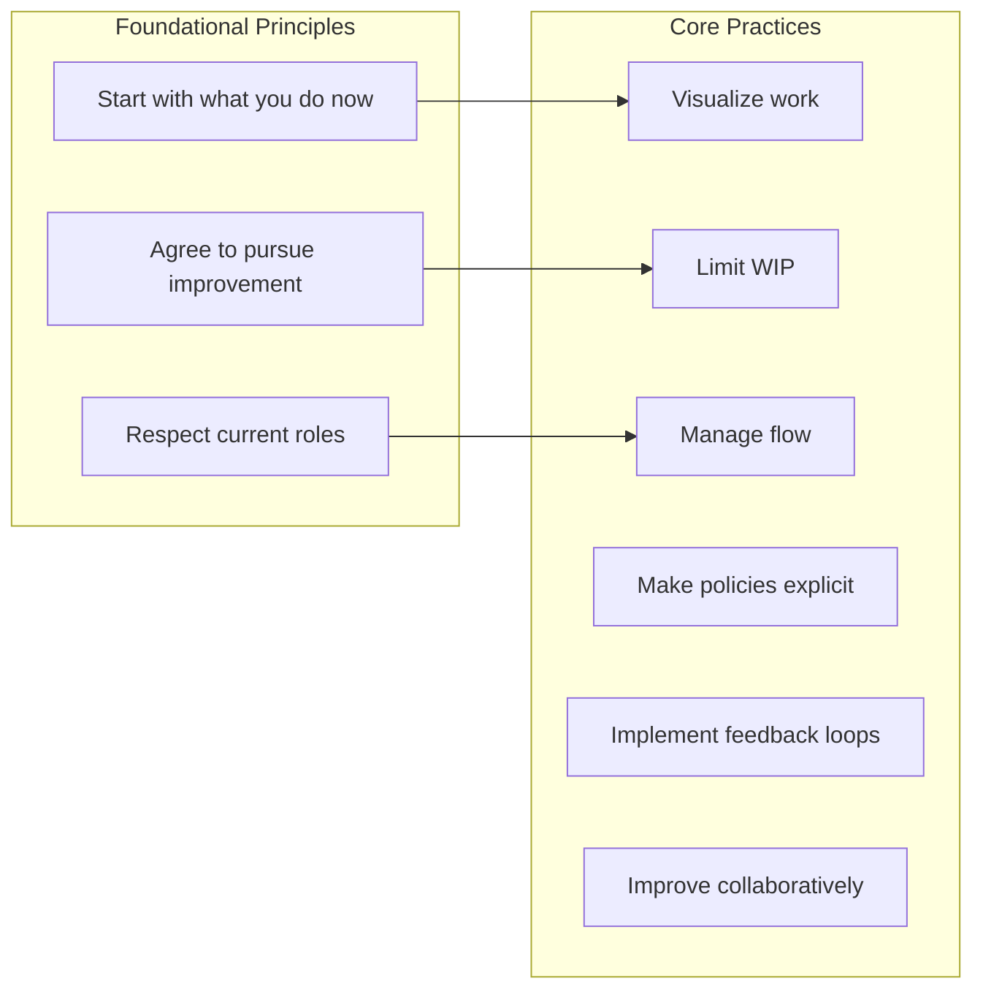

### Kanban Board

```
┌──────────────┬──────────────┬──────────────┬──────────────┐
│   Backlog    │  In Progress │   Review     │    Done      │
│              │    (WIP: 3)  │   (WIP: 2)   │              │
├──────────────┼──────────────┼──────────────┼──────────────┤
│              │              │              │              │
│  [Story A]   │  [Story C]   │  [Story E]   │  [Story F]   │
│  [Story B]   │  [Story D]   │              │  [Story G]   │
│              │              │              │              │
│              │              │              │              │
└──────────────┴──────────────┴──────────────┴──────────────┘
                     ↑                ↑
                  WIP Limit        WIP Limit
```

### Kanban vs. Scrum

| Aspect | Scrum | Kanban |
|--------|-------|--------|
| **Cadence** | Fixed sprints | Continuous flow |
| **Roles** | PO, SM, Developers | No prescribed roles |
| **Changes** | Not during sprint | Any time |
| **Metrics** | Velocity | Lead time, throughput |
| **WIP Limits** | Sprint capacity | Per column |
| **Estimation** | Story points | Optional |

---

## 2.7 Lean Software Development

### What is Lean?

Lean applies **manufacturing principles** from the Toyota Production System to software development.

### The Seven Lean Principles

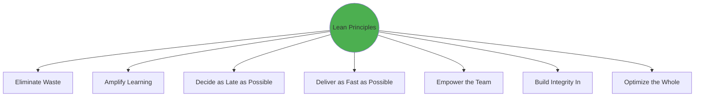

### The Seven Wastes of Software Development

| Manufacturing Waste | Software Waste | Example |
|--------------------|----------------|---------|
| **Inventory** | Partially done work | Unfinished features |
| **Over-production** | Extra features | Gold plating |
| **Extra processing** | Relearning | Poor documentation |
| **Transportation** | Handoffs | Dev → QA → Ops |
| **Waiting** | Delays | Waiting for approval |
| **Motion** | Task switching | Context switching |
| **Defects** | Bugs | Defects found late |

### Lean Thinking

```
Lean Mindset:

1. IDENTIFY value from customer perspective
2. MAP the value stream
3. CREATE flow by eliminating waste
4. ESTABLISH pull (just-in-time)
5. PURSUE perfection continuously
```

---

## 2.8 Model Comparison

### Comprehensive Comparison

| Feature | Scrum | XP | Kanban | Lean | FDD | Crystal |
|---------|-------|-----|--------|------|-----|---------|
| **Iterations** | Fixed sprints | Short iterations | Continuous | Continuous | Feature-based | Varies |
| **Planning** | Sprint planning | Planning game | Just-in-time | Pull-based | Feature planning | Varies |
| **Engineering** | Not prescribed | Core focus | Not prescribed | Not specific | Design patterns | Not prescribed |
| **Team Size** | 5-9 | Small | Any | Any | Larger | Varies by color |
| **Change Policy** | Between sprints | Within release | Anytime | Anytime | Per feature | Flexible |

### When to Use Each

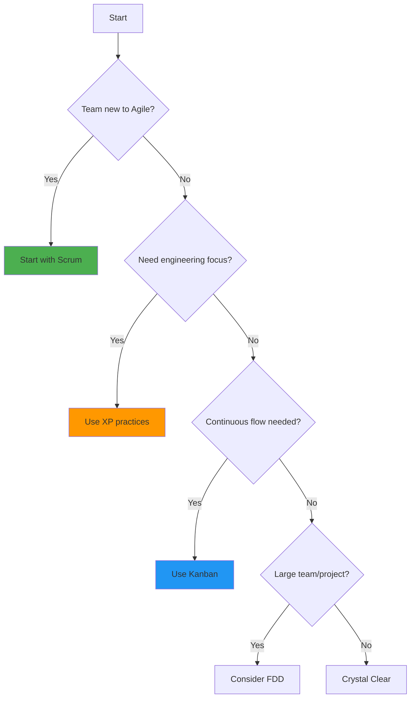

### Decision Matrix

| If you need... | Use... |
|----------------|--------|
| Simple framework to start | Scrum |
| Technical excellence | XP |
| Continuous flow | Kanban |
| Eliminate waste | Lean |
| Larger team structure | FDD |
| Flexible based on team | Crystal |

---

## 2.9 Unit II Summary

### Model Overview

```
Agile Models Quick Reference:

┌─────────────────────────────────────────────────────────┐
│ SCRUM                                                   │
│ Framework with roles, events, artifacts                 │
│ → Best for: Teams needing structure                     │
├─────────────────────────────────────────────────────────┤
│ XP (Extreme Programming)                                │
│ Focus on engineering practices                          │
│ → Best for: Technical excellence                        │
├─────────────────────────────────────────────────────────┤
│ KANBAN                                                  │
│ Visual flow management                                  │
│ → Best for: Continuous delivery, support teams          │
├─────────────────────────────────────────────────────────┤
│ LEAN                                                    │
│ Waste elimination philosophy                            │
│ → Best for: Efficiency focus                            │
├─────────────────────────────────────────────────────────┤
│ FDD (Feature Driven Development)                        │
│ Model-driven, feature-focused                           │
│ → Best for: Larger projects                             │
├─────────────────────────────────────────────────────────┤
│ CRYSTAL                                                 │
│ Family of methodologies by team size                    │
│ → Best for: Tailored approaches                         │
└─────────────────────────────────────────────────────────┘
```

### Key Takeaways

1. **No single "best" method** – choose based on context
2. **Scrum** provides structure and is good for starting
3. **XP** focuses on engineering practices
4. **Kanban** enables continuous flow
5. **Lean** is about eliminating waste
6. **Methods can be combined** (e.g., Scrumban)

---

*Continue to Unit III: Scrum and Extreme Programming (Deep Dive) →*

---

# Unit III: Scrum and Extreme Programming

## 3.1 Introduction to Scrum Framework

### The Scrum Framework

Scrum is the most widely used agile framework. It implements empirical process control through three pillars:

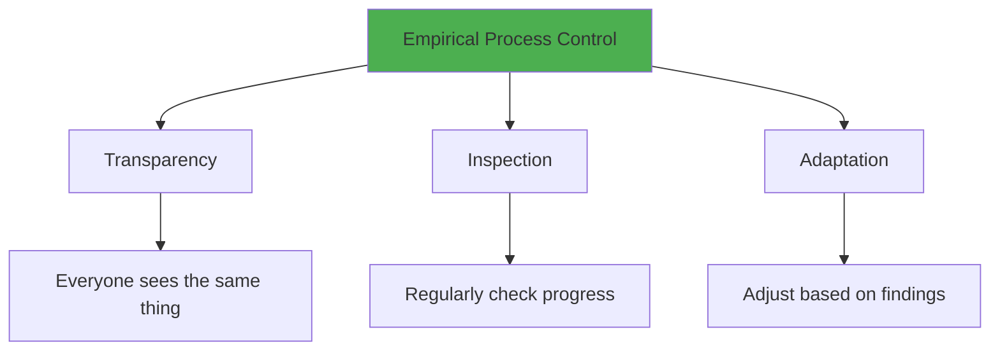

### The Three Pillars

| Pillar | Description | How Scrum Achieves It |
|--------|-------------|----------------------|
| **Transparency** | All aspects visible to those responsible | Product Backlog, Sprint Backlog, Definition of Done |
| **Inspection** | Frequent check of artifacts and progress | Sprint Review, Daily Scrum |
| **Adaptation** | Adjust process when deviation detected | Sprint Retrospective, Backlog Refinement |

### Complete Scrum Overview

```mermaid
flowchart TB
    subgraph "Preparation"
        A[Product Vision] --> B[Product Backlog]
    end
    
    subgraph "Sprint Cycle"
        C[Sprint Planning] --> D[Sprint Backlog]
        D --> E[Daily Scrum]
        E --> F[Development Work]
        F --> E
        F --> G[Increment]
        G --> H[Sprint Review]
        H --> I[Sprint Retrospective]
        I --> C
    end
    
    B --> C
    H --> B
    
    style G fill:#4CAF50
```

---

## 3.2 Scrum Roles

### The Three Scrum Roles

```mermaid
graph TD
    subgraph "Scrum Team"
        A[Product Owner]
        B[Scrum Master]
        C[Developers]
    end
    
    A --> D[WHAT to build]
    B --> E[HOW to work together]
    C --> F[HOW to build it]
    
    style A fill:#2196F3
    style B fill:#FF9800
    style C fill:#4CAF50
```

### Product Owner

**Accountability:** Maximizing the value of the product

| Responsibility | Description |
|----------------|-------------|
| **Vision** | Communicate the product vision |
| **Backlog Management** | Create, order, and maintain Product Backlog |
| **Stakeholder Management** | Represent stakeholder interests |
| **Value Optimization** | Ensure team works on highest value items |
| **Acceptance** | Accept or reject completed work |

**Key Characteristics:**

- Single person (not a committee)
- Available to the team
- Empowered to make decisions
- Understands both business and product

### Scrum Master

**Accountability:** Helping the team and organization adopt Scrum

| Responsibility | Description |
|----------------|-------------|
| **Facilitation** | Facilitate all Scrum events |
| **Coaching** | Help team improve and self-organize |
| **Impediment Removal** | Remove obstacles blocking progress |
| **Protection** | Shield team from external interference |
| **Education** | Help organization understand Scrum |

**Common Misconceptions:**

```
❌ Scrum Master is NOT:          ✅ Scrum Master IS:
├── A project manager            ├── A servant-leader
├── A team boss                  ├── A coach and facilitator
├── A status reporter            ├── An impediment remover
├── An administrator             ├── A process guardian
└── A micro-manager              └── A change agent
```

### Developers (The Development Team)

**Accountability:** Creating the Increment

| Characteristic | Description |
|----------------|-------------|
| **Cross-functional** | All skills needed to create Increment |
| **Self-organizing** | Decide how to do the work |
| **Size** | Typically 3-9 people |
| **No sub-teams** | No hierarchies within the team |
| **Collective Ownership** | Whole team owns the outcome |

---

## 3.3 Sprint

### What is a Sprint?

A Sprint is a **time-boxed iteration** during which a potentially releasable product increment is created.

```
Sprint Characteristics:

Duration:     1-4 weeks (2 weeks most common)
Output:       Potentially shippable Increment
Commitment:   Sprint Goal
Rule:         No changes that endanger Sprint Goal
```

### Sprint Timeline (2-week Sprint)

```
Week 1                           Week 2
Mon Tue Wed Thu Fri | Mon Tue Wed Thu Fri
 │                  |                  │
 │ Sprint Planning  |                  │ Sprint Review
 │ (4 hours)        |                  │ Sprint Retro
 │                  |                  │
 └── Daily Scrum (15 min each day) ──────┘
     Development Work Throughout
```

### Sprint Rules

```
Sprint Do's:
✅ Fixed duration (don't extend)
✅ Sprint Goal stays constant
✅ Quality standards maintained
✅ Scope can be clarified with PO

Sprint Don'ts:
❌ No scope changes that endanger goal
❌ Don't cancel unless Sprint Goal obsolete
❌ Don't reduce quality
❌ Don't extend the time-box
```

---

## 3.4 Sprint Planning

### Purpose

Sprint Planning initiates the Sprint by defining **what** can be done and **how** the work will be achieved.

### Sprint Planning Structure

```mermaid
flowchart LR
    subgraph "Topic 1: What can be done?"
        A[Review Product Backlog]
        B[Discuss Sprint Goal]
        C[Select Items]
    end
    
    subgraph "Topic 2: How will it be done?"
        D[Break into tasks]
        E[Estimate effort]
        F[Create Sprint Backlog]
    end
    
    A --> B --> C --> D --> E --> F
```

### Inputs and Outputs

| Inputs | Outputs |
|--------|---------|
| Product Backlog | Sprint Goal |
| Latest Increment | Sprint Backlog |
| Team velocity | Initial plan for delivery |
| Team capacity | |
| Definition of Done | |

### Sprint Goal

The Sprint Goal is a **commitment** that provides coherence and focus.

```
Good Sprint Goal:
✅ "Enable customers to check out with Apple Pay"
✅ "Reduce page load time to under 2 seconds"
✅ "Allow users to reset their password"

Bad Sprint Goal:
❌ "Complete 8 stories" (task-focused, not value)
❌ "Work on backend stuff" (vague)
❌ "Do some bug fixes" (no clear value)
```

---

## 3.5 Daily Scrum

### Purpose

Synchronize activities and create a plan for the next 24 hours.

### Format

```
Time-box: 15 minutes maximum
Frequency: Every day, same time, same place
Participants: Developers (SM facilitates, PO optional)

Classic Three Questions:
1. What did I do yesterday?
2. What will I do today?
3. What impediments do I have?

Modern Alternative (focus on Sprint Goal):
1. How are we progressing toward the Sprint Goal?
2. What should we do next?
3. What's blocking us?
```

### Effective Daily Scrum

```mermaid
flowchart TD
    A[Start: 15 min timer] --> B[Update board visual]
    B --> C[Each person speaks]
    C --> D{Impediments?}
    D -->|Yes| E[Note for after meeting]
    D -->|No| F[Continue]
    E --> F
    F --> G{All done?}
    G -->|No| C
    G -->|Yes| H[End - Exactly 15 min]
    
    style H fill:#4CAF50
```

### Common Anti-Patterns

| Anti-Pattern | Better Approach |
|--------------|----------------|
| Status report to Scrum Master | Peer-to-peer sync |
| Going over 15 minutes | Time-box strictly |
| Problem-solving during standup | "Take offline" |
| Only updates, no planning | Focus on today's plan |
| Sitting down | Stand to keep it short |

---

## 3.6 Sprint Review

### Purpose

Inspect the Increment and adapt the Product Backlog.

```
Sprint Review Facts:
├── Time-box: 4 hours (2-week sprint)
├── Who: Scrum Team + Stakeholders
├── What: Demo working software
├── Output: Updated Product Backlog
└── Vibe: Collaborative, not a sign-off meeting
```

### Sprint Review Agenda

| Phase | Activity | Duration |
|-------|----------|----------|
| **Opening** | Sprint Goal recap | 10 min |
| **Demo** | Show completed work | 60 min |
| **Discussion** | Gather feedback | 30 min |
| **Backlog Update** | Adjust priorities | 20 min |
| **Forecast** | Discuss what's next | 10 min |

### What to Demo

```
Demo Checklist:
✅ Complete items only (meets Definition of Done)
✅ Working software, not slides
✅ From user perspective
✅ Show real data (or realistic fake data)
✅ Cover happy path and edge cases

Not a Demo:
❌ "We worked on the database schema"
❌ Code walkthrough
❌ PowerPoint slides about features
```

---

## 3.7 Sprint Retrospective

### Purpose

Inspect how the Sprint went and create improvements for the next Sprint.

```mermaid
flowchart LR
    A[What went well?] --> D[Actions]
    B[What didn't go well?] --> D
    C[What can we improve?] --> D
    D --> E[Implement in next Sprint]
    
    style D fill:#4CAF50
```

### Popular Retrospective Formats

**1. Start-Stop-Continue**

```
┌────────────────┬────────────────┬────────────────┐
│     START      │      STOP      │   CONTINUE     │
├────────────────┼────────────────┼────────────────┤
│ Writing tests  │ Long meetings  │ Pair program   │
│ Code reviews   │ Blame culture  │ Daily standups │
└────────────────┴────────────────┴────────────────┘
```

**2. Glad-Sad-Mad**

```
😊 GLAD            😢 SAD              😠 MAD
Things that       Things that         Things that
made us happy     disappointed us     frustrated us
```

**3. 4Ls: Liked, Learned, Lacked, Longed For**

**4. Sailboat**

```
        🏔️ Rocks (Risks)
                 |
    Wind >>>>    |    ⛵
    (What helps) |    (Goal)
                 |
        ⚓ Anchors (What holds us back)
```

### Effective Retrospectives

| Do | Don't |
|----|-------|
| Create safe space | Blame individuals |
| Focus on process | Make it personal |
| Pick 1-3 actions | Try to fix everything |
| Follow up on actions | Forget previous actions |
| Vary the format | Same format every time |

---

## 3.8 User Stories

### What is a User Story?

A user story is a short description of a feature from the user's perspective.

### User Story Format

```
As a [type of user]
I want [some goal]
So that [some reason]
```

### Examples

```
Good User Stories:

As a customer,
I want to save items to a wishlist
So that I can buy them later.

As an admin,
I want to export user data to CSV
So that I can analyze usage patterns.

As a mobile user,
I want to use fingerprint login
So that I can access my account quickly.
```

### INVEST Criteria

| Criterion | Description |
|-----------|-------------|
| **I**ndependent | Can be developed in any order |
| **N**egotiable | Details can be discussed |
| **V**aluable | Provides value to users |
| **E**stimable | Can be sized by the team |
| **S**mall | Fits in a Sprint |
| **T**estable | Has clear acceptance criteria |

### User Story Components

```mermaid
graph TD
    A[User Story Card] --> B[Front: Story]
    A --> C[Back: Acceptance Criteria]
    
    B --> D["As a...<br/>I want...<br/>So that..."]
    C --> E["Given...<br/>When...<br/>Then..."]
    
    style A fill:#FFEB3B,color:black
```

### Acceptance Criteria (Gherkin Format)

```gherkin
Feature: User Login

Scenario: Successful login
  Given I am on the login page
  And I have a valid account
  When I enter correct credentials
  And I click the login button
  Then I should see my dashboard
  And I should see a welcome message

Scenario: Failed login
  Given I am on the login page
  When I enter incorrect password
  And I click the login button
  Then I should see an error message
  And I should remain on the login page
```

---

## 3.9 Scrum Case Study

### Company: TechShop E-commerce Platform

**Background:**

- E-commerce startup with 12 developers
- Waterfall approach causing 6-month release cycles
- Customer complaints about slow feature delivery

**Scrum Implementation:**

```
Before Scrum:
├── Release cycle: 6 months
├── Bug discovery: After release
├── Customer feedback: Once a year
├── Team morale: Low
└── Features delivered: 2 major/year

After Scrum (1 year later):
├── Release cycle: 2 weeks
├── Bug discovery: During Sprint
├── Customer feedback: Every Sprint
├── Team morale: High
└── Features delivered: 52 increments/year
```

**Sprint Example:**

```mermaid
gantt
    title Sprint 15: Mobile Checkout
    dateFormat  YYYY-MM-DD
    
    section Planning
    Sprint Planning     :2024-01-01, 1d
    
    section Development
    Payment UI          :2024-01-02, 3d
    Cart Integration    :2024-01-02, 4d
    Apple Pay           :2024-01-05, 3d
    Testing             :2024-01-08, 2d
    
    section Events
    Daily Scrum         :2024-01-02, 9d
    Sprint Review       :2024-01-12, 1d
    Retrospective       :2024-01-12, 1d
```

**User Story Breakdown:**

| Story | Points | Status |
|-------|--------|--------|
| Mobile cart page | 5 | Done ✅ |
| Apple Pay integration | 8 | Done ✅ |
| Order confirmation | 3 | Done ✅ |
| Payment error handling | 5 | Done ✅ |

**Retrospective Outcomes:**

- Action 1: Add automated tests for payment flows
- Action 2: Invite QA earlier in sprint
- Action 3: Document Apple Pay setup process

---

## 3.10 Extreme Programming (XP) - Deep Dive

### XP Overview

XP is an agile methodology emphasizing **technical excellence** through specific engineering practices.

```
XP Core Idea:
"If a practice is good, do it all the time. Take it to the extreme."

Testing is good         → Test-Driven Development (test first)
Integration is good     → Continuous Integration (multiple times/day)
Code review is good     → Pair Programming (review all the time)
Simple design is good   → YAGNI, Refactoring (simplest possible)
Short iterations good   → 1-2 week cycles
```

### XP Values

```mermaid
graph TD
    A((XP Values)) --> B[Communication]
    A --> C[Simplicity]
    A --> D[Feedback]
    A --> E[Courage]
    A --> F[Respect]
    
    B --> B1[Talk face-to-face]
    C --> C1[Do what's needed, no more]
    D --> D1[Learn and adapt quickly]
    E --> E1[Make hard decisions]
    F --> F1[Value each contribution]
    
    style A fill:#FF9800
```

### XP Principles

| Principle | Description |
|-----------|-------------|
| **Humanity** | Software is made by people |
| **Economics** | Business value matters |
| **Mutual Benefit** | Win-win for all parties |
| **Self-Similarity** | Similar patterns at all scales |
| **Improvement** | Continuous improvement |
| **Diversity** | Different perspectives valued |
| **Reflection** | Think about how to work better |
| **Flow** | Continuous delivery of value |
| **Opportunity** | Problems are opportunities |
| **Redundancy** | Multiple checks for quality |
| **Failure** | Learn from mistakes |
| **Quality** | No trade-off on quality |
| **Baby Steps** | Small incremental changes |
| **Accepted Responsibility** | Take ownership |

---

## 3.11 Pair Programming

### What is Pair Programming?

Two developers work together at one workstation.

```
┌─────────────────────────────────────────────────────┐
│                    PAIR PROGRAMMING                  │
├─────────────────────────────────────────────────────┤
│                                                     │
│   👤 DRIVER           👤 NAVIGATOR                  │
│   Types code          Thinks strategically          │
│   Focus: tactics      Focus: strategy               │
│   Hands on keyboard   Reviews, suggests             │
│                                                     │
│   ←────── Switch roles frequently ──────→          │
│           (every 10-30 minutes)                     │
│                                                     │
└─────────────────────────────────────────────────────┘
```

### Pair Programming Benefits

| Benefit | Explanation |
|---------|-------------|
| **Code Review Built-in** | Continuous review while coding |
| **Knowledge Sharing** | Both learn from each other |
| **Fewer Bugs** | Two minds catch more issues |
| **Better Design** | Discussion leads to better solutions |
| **Team Cohesion** | Builds relationships |
| **Reduced Risk** | No single point of failure |

### When to Pair

```
Best for Pairing:
✅ Complex or critical code
✅ New team member onboarding
✅ Learning new technology
✅ Bug hunting
✅ Design decisions

Maybe Solo:
⚠️ Simple, routine tasks
⚠️ Spikes/exploration
⚠️ Administrative work
```

### Pair Programming Anti-Patterns

| Anti-Pattern | Problem | Solution |
|--------------|---------|----------|
| **Backseat Driver** | Navigator takes over | Respect roles, take turns |
| **Silent Pair** | No communication | Talk through decisions |
| **Distracted Partner** | Checking phone/email | Full attention |
| **Expert-Novice Imbalance** | Expert dominates | Expert narrates, novice drives |

---

## 3.12 XP Team and Lifecycle

### XP Team Roles

| Role | Responsibility |
|------|---------------|
| **Customer** | Defines requirements, sets priorities |
| **Programmer** | Writes code and tests |
| **Tester** | Helps customer write acceptance tests |
| **Tracker** | Tracks progress, identifies risks |
| **Coach** | Guides team in XP practices |

### XP Lifecycle

```mermaid
flowchart TD
    A[Exploration Phase] --> B[Planning Phase]
    B --> C[Iterations to Release]
    C --> D[Productionizing]
    D --> E[Maintenance]
    E --> F[Death]
    
    C --> C1[Weekly Cycles]
    C1 --> C2[Daily Builds]
    C2 --> C3[Continuous Integration]
    
    style D fill:#4CAF50
```

### XP Iteration (Weekly Cycle)

```
Monday:
├── Customer reviews last week
├── Team selects stories for this week
└── Stories broken into tasks

Tuesday - Thursday:
├── Pair programming
├── Test-driven development
├── Continuous integration
└── Daily standup

Friday:
├── Code review
├── Demo to customer
├── Retrospective
└── Preparation for next week
```

---

## 3.13 XP Practices Summary

### Primary Practices

| Practice | Description | Benefit |
|----------|-------------|---------|
| **Sit Together** | Co-located team | Better communication |
| **Whole Team** | Cross-functional | All skills present |
| **Informative Workspace** | Visible information | Transparency |
| **Energized Work** | Sustainable pace | Quality, morale |
| **Pair Programming** | Two people, one screen | Quality, knowledge |
| **Stories** | User story format | User focus |
| **Weekly Cycle** | Plan week by week | Flexibility |
| **Quarterly Cycle** | Seasonal planning | Big picture |
| **Slack** | Include slack time | Handle unexpected |
| **Ten-Minute Build** | Fast build | Quick feedback |
| **Continuous Integration** | Integrate often | Early bug detection |
| **Test-First Programming** | TDD | Design, quality |
| **Incremental Design** | Design as you go | Right-sized design |

---

## 3.14 XP Case Study

### Company: FinancePro - Trading Platform

**Background:**

- Financial software company
- High-quality requirements (money involved)
- Previous: High defect rate, slow releases

**XP Implementation:**

```
Practices Adopted:
├── Test-Driven Development
├── Pair Programming
├── Continuous Integration
├── Collective Code Ownership
├── Simple Design
└── Customer On-Site
```

**Before vs. After:**

| Metric | Before XP | After XP |
|--------|-----------|----------|
| **Defect Rate** | 15 bugs/release | 2 bugs/release |
| **Release Frequency** | Quarterly | Bi-weekly |
| **Code Coverage** | 30% | 90% |
| **Developer Satisfaction** | 3.2/5 | 4.5/5 |
| **Customer Satisfaction** | 2.8/5 | 4.7/5 |

**Daily Schedule:**

```
9:00 AM   - Standup
9:15 AM   - Pair up for the day
9:30 AM   - TDD cycle: Red-Green-Refactor
12:00 PM  - Lunch (often together)
1:00 PM   - Continue pairing (switch pairs)
3:00 PM   - 15-minute break
3:15 PM   - Continue development
5:00 PM   - Integration, CI green check
5:30 PM   - End (sustainable pace!)
```

**TDD Example from the Project:**

```javascript
// Step 1: RED - Write failing test
describe('Trade Calculator', () => {
    test('calculates commission correctly', () => {
        const trade = { amount: 10000, rate: 0.001 };
        expect(calculateCommission(trade)).toBe(10);
    });
});

// Step 2: GREEN - Make it pass
function calculateCommission(trade) {
    return trade.amount * trade.rate;
}

// Step 3: REFACTOR - Improve if needed
function calculateCommission({ amount, rate }) {
    const commission = amount * rate;
    return Math.round(commission * 100) / 100;
}
```

---

## 3.15 Unit III Summary

### Scrum Key Points

```
Scrum Essentials:
├── 3 Roles: PO, SM, Developers
├── 5 Events: Sprint, Planning, Daily, Review, Retro
├── 3 Artifacts: Product Backlog, Sprint Backlog, Increment
├── 3 Pillars: Transparency, Inspection, Adaptation
└── Values: Commitment, Focus, Openness, Respect, Courage
```

### XP Key Points

```
XP Essentials:
├── 5 Values: Communication, Simplicity, Feedback, Courage, Respect
├── Core Practices: TDD, Pair Programming, CI, Refactoring
├── Planning: User Stories, Planning Game, Small Releases
└── Focus: Technical Excellence
```

### When to Use

| Choose Scrum When | Choose XP When |
|-------------------|----------------|
| Need process framework | Need engineering practices |
| Project management focus | Technical excellence focus |
| Various technical practices OK | High-quality critical |
| Team needs structure | Team is technically skilled |

---

# Unit IV: Kanban

## 4.1 Introduction to Kanban Framework

### What is Kanban?

Kanban is a **visual system** for managing work as it moves through a process. The word "Kanban" is Japanese for "visual signal" or "card."

```
Origin Story:
1940s - Toyota Production System (TPS)
        Just-in-time manufacturing
        "Pull" system for inventory

2007 - David J. Anderson
       Applied Kanban to software development
       "Kanban: Successful Evolutionary Change"
```

### Kanban Principles

```mermaid
graph TD
    subgraph "Change Management Principles"
        A[Start with what you do now]
        B[Agree to pursue improvement]
        C[Respect current roles]
    end
    
    subgraph "Service Delivery Principles"
        D[Focus on customer needs]
        E[Manage the work, not workers]
        F[Evolve policies to improve]
    end
```

### Six Core Practices

| # | Practice | Description |
|---|----------|-------------|
| 1 | **Visualize** | Make work visible on a board |
| 2 | **Limit WIP** | Cap work-in-progress |
| 3 | **Manage Flow** | Monitor and optimize flow |
| 4 | **Make Policies Explicit** | Write down the rules |
| 5 | **Implement Feedback Loops** | Regular reviews and meetings |
| 6 | **Improve Collaboratively** | Evolve through experimentation |

---

## 4.2 Kanban Characteristics

### The Kanban Board

```
┌─────────────────────────────────────────────────────────────────────┐
│                         KANBAN BOARD                                │
├────────────┬────────────┬────────────┬────────────┬────────────────┤
│  BACKLOG   │    TODO    │ IN PROGRESS│   REVIEW   │      DONE      │
│            │   (WIP: 4) │   (WIP: 3) │   (WIP: 2) │                │
├────────────┼────────────┼────────────┼────────────┼────────────────┤
│            │            │            │            │                │
│ [Story E]  │ [Story C]  │ [Story A]  │ [Story D]  │ [Story Z] ✓    │
│ [Story F]  │ [Story B]  │            │            │ [Story Y] ✓    │
│ [Story G]  │            │            │            │ [Story X] ✓    │
│            │            │            │            │                │
└────────────┴────────────┴────────────┴────────────┴────────────────┘
             ↑                         ↑
          WIP Limit                 WIP Limit
          NOT exceeded              At capacity
```

### Work-in-Progress (WIP) Limits

WIP limits are the **most important** aspect of Kanban.

```
Why WIP Limits Matter:

Without WIP Limits:                With WIP Limits:
├── Start many tasks               ├── Finish before starting new
├── Nothing gets done              ├── Work flows through
├── Context switching              ├── Focused work
├── Long lead times                ├── Short lead times
└── Stress and burnout             └── Sustainable pace
```

### Little's Law

```
Lead Time = WIP / Throughput

Example:
├── WIP = 12 items in progress
├── Throughput = 4 items per week
├── Lead Time = 12 / 4 = 3 weeks

To reduce Lead Time:
├── Option 1: Reduce WIP  → 8 / 4 = 2 weeks
├── Option 2: Increase Throughput → 12 / 6 = 2 weeks
└── Option 3: Both → 8 / 6 = 1.3 weeks
```

### Pull System

```mermaid
flowchart LR
    A[Backlog] -->|Pull| B[TODO]
    B -->|Pull| C[In Progress]
    C -->|Pull| D[Review]
    D -->|Pull| E[Done]
    
    F[❌ Push: Start new work] --> A
    G[✅ Pull: Take when capacity] -.-> D
```

---

## 4.3 Kanban Project Management

### Kanban Metrics

| Metric | Definition | Purpose |
|--------|------------|---------|
| **Lead Time** | Time from request to delivery | Customer perspective |
| **Cycle Time** | Time from start to completion | Process efficiency |
| **Throughput** | Items completed per time period | Team capacity |
| **WIP** | Items currently in progress | System load |
| **Flow Efficiency** | Active time / Total time | Identify wait time |

### Cumulative Flow Diagram (CFD)

```
Number of Items
     ^
  40 │         ████████████████████████ Done
     │     ████████████████████████████
  30 │ ████████████████████████████████ Review
     │████████████████████████████████
  20 │████████████████████████████████ In Progress
     │██████████████████████████████
  10 │██████████████████████ TODO
     │████████████████████
   0 └────────────────────────────────────────> Time
     Week 1    Week 2    Week 3    Week 4

↕ Band width = WIP at any point
→ Horizontal = Lead time
```

### Kanban Meetings

| Meeting | Frequency | Duration | Purpose |
|---------|-----------|----------|---------|
| **Daily Standup** | Daily | 15 min | Sync, identify blockers |
| **Replenishment** | Weekly | 30 min | Pull new items into system |
| **Delivery Planning** | Weekly | 30 min | Plan upcoming deliveries |
| **Service Delivery Review** | Bi-weekly | 1 hour | Review metrics, improve |
| **Operations Review** | Monthly | 2 hours | Cross-service improvements |
| **Risk Review** | Monthly | 30 min | Identify and manage risks |

---

## 4.4 Kanban and Scrum Comparison

### Side-by-Side Comparison

| Aspect | Scrum | Kanban |
|--------|-------|--------|
| **Cadence** | Fixed Sprints (1-4 weeks) | Continuous flow |
| **Roles** | PO, SM, Developers | No prescribed roles |
| **Meetings** | 5 defined events | As needed |
| **WIP Limit** | Sprint capacity | Per column |
| **Changes** | Wait for next Sprint | Any time |
| **Estimation** | Story points/hours | Optional |
| **Board Reset** | Every Sprint | Continuous |
| **Metrics** | Velocity | Lead time, throughput |
| **Planning** | Sprint Planning | Just-in-time |

### When to Use Each

```mermaid
flowchart TD
    A[Start] --> B{Predictable releases needed?}
    B -->|Yes| C[Consider Scrum]
    B -->|No| D{Work arrives unpredictably?}
    D -->|Yes| E[Consider Kanban]
    D -->|No| F{Need strict framework?}
    F -->|Yes| C
    F -->|No| G{Continuous flow valued?}
    G -->|Yes| E
    G -->|No| H[Either works - try Scrumban]
    
    style C fill:#4CAF50
    style E fill:#2196F3
    style H fill:#FF9800
```

### Best Fit Scenarios

| Kanban Best For | Scrum Best For |
|-----------------|----------------|
| Support/Operations | Product development |
| Unpredictable work | Planned features |
| Continuous delivery | Sprint deliveries |
| Flow optimization | Sprint commitments |
| Existing process to improve | New team structure |

---

## 4.5 Scrumban

### What is Scrumban?

Scrumban combines **Scrum's structure** with **Kanban's flow**.

```
Scrumban = Scrum Events + Kanban Practices

From Scrum:                 From Kanban:
├── Sprint Planning         ├── Visual board
├── Daily Scrum             ├── WIP limits
├── Sprint Review           ├── Pull system
├── Retrospective           ├── Flow metrics
└── Roles (optional)        └── Continuous improvement
```

### Scrumban Board

```
┌────────────────────────────────────────────────────────────────────┐
│                      SCRUMBAN BOARD                                │
├────────────┬────────────┬─────────────────────────┬───────────────┤
│  BACKLOG   │  READY     │      IN PROGRESS        │     DONE      │
│            │  (WIP: 3)  ├──────────┬──────────────┤               │
│            │            │   DEV    │    TEST      │               │
│            │            │ (WIP: 4) │   (WIP: 2)   │               │
├────────────┼────────────┼──────────┼──────────────┼───────────────┤
│            │            │          │              │               │
│ [Story H]  │ [Story E]  │[Story B] │ [Story D]    │ [Story A] ✓   │
│ [Story I]  │ [Story F]  │[Story C] │              │ Sprint Goal   │
│ [Story J]  │            │          │              │ Achieved!     │
│            │            │          │              │               │
└────────────┴────────────┴──────────┴──────────────┴───────────────┘
                               Sprint 5: 2 weeks
```

---

## 4.6 Lean and Agile Kanban

### Lean Principles in Kanban

```mermaid
mindmap
    root((Lean Kanban))
        Eliminate Waste
            Reduce WIP
            Remove blockers
            Minimize handoffs
        Amplify Learning
            Feedback loops
            Metrics review
            Experiments
        Decide Late
            Just-in-time planning
            Pull when ready
            Defer commitment
        Deliver Fast
            Reduce lead time
            Flow efficiency
            Continuous delivery
        Empower Team
            Self-organization
            Improvement ideas
            Ownership
        Build Quality In
            Definition of Done
            Quality gates
            Automated testing
        Optimize Whole
            End-to-end flow
            System thinking
            Cross-functional
```

### Value Stream Mapping

Identify waste in your process:

```
Value Stream for Feature Delivery:

Request → Analysis → Design → Development → Testing → Deploy → Live
   │         │         │          │           │         │
   5d        3d        2d         5d          3d        1d    = 19 days total
             ↓         ↓          ↓           ↓         ↓
           Wait:2d   Wait:1d    Wait:0    Wait:3d   Wait:1d  = 7 days waiting

Value-add time: 12 days
Wait time: 7 days
Flow efficiency: 12/19 = 63%

Goal: Reduce wait time to improve flow efficiency
```

---

## 4.7 Kanban Tools

### Popular Kanban Tools

| Tool | Best For | Key Features |
|------|----------|--------------|
| **Jira** | Enterprise, Scrum/Kanban | Powerful, configurable |
| **Trello** | Simple, visual | Easy to use, free tier |
| **Azure DevOps** | Microsoft ecosystem | CI/CD integration |
| **Asana** | Work management | Project views |
| **Monday.com** | Visual management | Automation |
| **Kanbanize** | Advanced Kanban | Portfolio level |
| **Physical Board** | Co-located teams | Tangible, no login |

### Jira Kanban Board

```
Features to Configure:
├── Columns (workflow states)
├── WIP limits per column
├── Swimlanes (grouping)
├── Quick filters
├── Card colors (priorities)
├── Card layout (fields shown)
└── Control chart, CFD
```

### Physical vs. Digital Boards

| Physical Board | Digital Board |
|----------------|---------------|
| ✅ Highly visible | ✅ Remote access |
| ✅ Tactile engagement | ✅ Metrics automated |
| ✅ No login required | ✅ History preserved |
| ❌ Not for remote | ❌ Less visible |
| ❌ Manual metrics | ❌ Can be ignored |

---

## 4.8 Kanban Implementation Guide

### Getting Started with Kanban

```mermaid
flowchart TD
    A[Step 1: Map Current Workflow] --> B[Step 2: Visualize on Board]
    B --> C[Step 3: Set Initial WIP Limits]
    C --> D[Step 4: Define Policies]
    D --> E[Step 5: Start Pulling Work]
    E --> F[Step 6: Measure and Improve]
    F --> G{Better Flow?}
    G -->|No| H[Adjust WIP, Policies]
    H --> E
    G -->|Yes| I[Celebrate & Continue]
    I --> F
```

### Step-by-Step Implementation

**Step 1: Map Current Workflow**

```
Questions to Ask:
├── What stages does work go through?
├── Where does work wait?
├── Who does what?
├── What are the handoffs?
└── Where are the bottlenecks?
```

**Step 2: Design the Board**

```
Basic Columns:
Backlog → Ready → In Progress → Review → Done

More Detailed:
Backlog → Refined → Dev → Code Review → QA → Staging → Production
```

**Step 3: Set WIP Limits**

```
Starting Point:
├── Team size method: WIP = Team size × 1.5
├── Example: 4 developers → WIP limit of 6
├── Start conservative, adjust based on flow
└── If blocked often → lower WIP
```

---

## 4.9 Unit IV Summary

### Kanban Key Points

```
Kanban Essentials:
├── 6 Practices: Visualize, Limit WIP, Manage Flow,
│                Explicit Policies, Feedback, Improve
├── Key Metrics: Lead Time, Cycle Time, Throughput, WIP
├── Core Concept: Pull system with WIP limits
├── Philosophy: Evolutionary change, start with current
└── Origin: Toyota Production System
```

### Quick Reference

```
Kanban Quick Reference:

┌─────────────────────────────────────────────────────┐
│ WIP Limit Rule:                                     │
│ "Stop starting, start finishing"                    │
├─────────────────────────────────────────────────────┤
│ Little's Law:                                       │
│ Lead Time = WIP ÷ Throughput                        │
├─────────────────────────────────────────────────────┤
│ Pull System:                                        │
│ Work is pulled when there's capacity, not pushed   │
└─────────────────────────────────────────────────────┘
```

### Key Takeaways

1. **Visualize** all work on a board
2. **Limit WIP** to improve flow
3. **Measure** lead time and throughput
4. **Pull** work, don't push
5. **Improve** continuously through experiments

---

*Continue to Unit V: Agile Design and Development Tools →*

---

# Unit V: Agile Design and Development Tools

## 5.1 Principles in Agile Design

### Agile Design Philosophy

Agile design is about **emerging architecture** - design decisions are made incrementally as understanding grows.

```
Traditional Design:
├── Big Design Up Front (BDUF)
├── Predict all requirements
├── Design complete system before coding
└── Change is expensive

Agile Design:
├── Just Enough Design
├── Evolve design as you learn
├── Design and code together
└── Embrace change
```

### Core Design Principles

```mermaid
mindmap
    root((Agile Design))
        SOLID Principles
            Single Responsibility
            Open/Closed
            Liskov Substitution
            Interface Segregation
            Dependency Inversion
        DRY
            Don't Repeat Yourself
        KISS
            Keep It Simple Stupid
        YAGNI
            You Ain't Gonna Need It
```

### SOLID Principles

| Principle | Description | Benefit |
|-----------|-------------|---------|
| **S**ingle Responsibility | One class, one reason to change | Easier maintenance |
| **O**pen/Closed | Open for extension, closed for modification | Safer changes |
| **L**iskov Substitution | Subtypes must be substitutable | Reliable inheritance |
| **I**nterface Segregation | Many specific interfaces > one general | Cleaner dependencies |
| **D**ependency Inversion | Depend on abstractions, not concretions | Loose coupling |

### Single Responsibility Example

```javascript
// ❌ BAD: Multiple responsibilities
class User {
    saveToDatabase() { /* ... */ }
    sendEmail() { /* ... */ }
    generateReport() { /* ... */ }
}

// ✅ GOOD: Single responsibility each
class User {
    constructor(name, email) { /* ... */ }
}

class UserRepository {
    save(user) { /* ... */ }
}

class EmailService {
    send(to, subject, body) { /* ... */ }
}

class ReportGenerator {
    generate(user) { /* ... */ }
}
```

### YAGNI (You Ain't Gonna Need It)

```
YAGNI Philosophy:
├── Don't add features "just in case"
├── Build only what's needed now
├── Speculative features are often wrong
└── Unused code is maintenance burden

Example:
❌ "Let's add support for 5 database types...we might need them"
✅ "We need MySQL now. Add others when needed."
```

### Simple Design Rules (Kent Beck)

```
A design is "simple" if it:
1. ✅ Passes all tests
2. ✅ Reveals intention (readable)
3. ✅ Has no duplication
4. ✅ Uses minimal elements

Priority order: 1 → 2 → 3 → 4
```

---

## 5.2 Code Refactoring

### What is Refactoring?

Refactoring is **improving the internal structure of code without changing its external behavior**.

```mermaid
flowchart LR
    A[Working Code<br/>Bad Structure] --> B[Refactor]
    B --> C[Working Code<br/>Good Structure]
    
    D[Same behavior] -.-> A
    D -.-> C
    
    style C fill:#4CAF50
```

### Why Refactoring Matters

| Without Refactoring | With Refactoring |
|---------------------|------------------|
| Technical debt grows | Technical debt managed |
| Code becomes tangled | Code stays clean |
| Changes become risky | Changes stay safe |
| Development slows | Sustainable pace |
| Bugs multiply | Bugs easier to fix |

### When to Refactor

```
Refactoring Triggers:
├── Before adding new features
├── When fixing bugs
├── During code review
├── When you see "code smell"
├── When tests are passing (safe to change)
└── NOT during late-night emergency fixes!
```

### Code Smells

| Smell | Description | Refactoring |
|-------|-------------|-------------|
| **Long Method** | Method > 20 lines | Extract Method |
| **Large Class** | Class doing too much | Extract Class |
| **Long Parameter List** | > 3 parameters | Introduce Parameter Object |
| **Duplicated Code** | Same code in multiple places | Extract Method/Class |
| **Feature Envy** | Method uses another class more | Move Method |
| **Data Clumps** | Same data grouped repeatedly | Extract Class |
| **Primitive Obsession** | Overuse of primitives | Replace with Value Object |
| **Switch Statements** | Complex conditionals | Replace with Polymorphism |

---

## 5.3 Refactoring Techniques

### Extract Method

```javascript
// Before
function printOrder(order) {
    console.log("=== Order Details ===");
    console.log(`Customer: ${order.customer.name}`);
    console.log(`Email: ${order.customer.email}`);
    console.log("=== Items ===");
    order.items.forEach(item => {
        console.log(`${item.name}: $${item.price}`);
    });
    let total = order.items.reduce((sum, item) => sum + item.price, 0);
    console.log(`Total: $${total}`);
}

// After
function printOrder(order) {
    printHeader();
    printCustomerInfo(order.customer);
    printItems(order.items);
    printTotal(order.items);
}

function printHeader() {
    console.log("=== Order Details ===");
}

function printCustomerInfo(customer) {
    console.log(`Customer: ${customer.name}`);
    console.log(`Email: ${customer.email}`);
}

function printItems(items) {
    console.log("=== Items ===");
    items.forEach(item => console.log(`${item.name}: $${item.price}`));
}

function printTotal(items) {
    const total = calculateTotal(items);
    console.log(`Total: $${total}`);
}

function calculateTotal(items) {
    return items.reduce((sum, item) => sum + item.price, 0);
}
```

### Rename Variables

```javascript
// Before (unclear)
function calc(a, b, c) {
    return a * b * (1 - c);
}

// After (clear intent)
function calculateDiscountedPrice(quantity, unitPrice, discountRate) {
    return quantity * unitPrice * (1 - discountRate);
}
```

### Replace Magic Numbers

```javascript
// Before
if (user.age >= 18) {
    // allow access
}
if (order.total > 100) {
    // apply discount
}

// After
const MINIMUM_AGE = 18;
const DISCOUNT_THRESHOLD = 100;

if (user.age >= MINIMUM_AGE) {
    // allow access
}
if (order.total > DISCOUNT_THRESHOLD) {
    // apply discount
}
```

### Replace Conditional with Polymorphism

```javascript
// Before
function calculatePay(employee) {
    switch (employee.type) {
        case 'hourly':
            return employee.hours * employee.hourlyRate;
        case 'salaried':
            return employee.salary / 12;
        case 'contractor':
            return employee.rate * employee.hoursWorked * 1.2;
    }
}

// After
class HourlyEmployee {
    calculatePay() {
        return this.hours * this.hourlyRate;
    }
}

class SalariedEmployee {
    calculatePay() {
        return this.salary / 12;
    }
}

class Contractor {
    calculatePay() {
        return this.rate * this.hoursWorked * 1.2;
    }
}
```

### Refactoring Safely

```
Safe Refactoring Process:
1. ✅ Ensure tests exist and pass
2. ✅ Make small changes
3. ✅ Run tests after each change
4. ✅ Commit frequently
5. ✅ Use IDE refactoring tools
```

---

## 5.4 Continuous Integration (CI)

### What is Continuous Integration?

CI is the practice of **frequently integrating code changes** into a shared repository, with automated builds and tests.

```mermaid
flowchart LR
    A[Developer Commits] --> B[CI Server]
    B --> C[Build]
    C --> D[Run Tests]
    D --> E{Pass?}
    E -->|Yes| F[✅ Success]
    E -->|No| G[❌ Fix Immediately]
    
    style F fill:#4CAF50
    style G fill:#f44336
```

### CI Principles

```
Core CI Practices:
├── Maintain single source repository
├── Automate the build
├── Make build self-testing
├── Everyone commits frequently (daily minimum)
├── Every commit triggers build
├── Fix broken builds immediately
├── Keep the build fast (< 10 min)
├── Test in clone of production
├── Make latest build easily available
└── Everyone can see what's happening
```

### CI vs CD vs CD

| Term | Stands For | Description |
|------|------------|-------------|
| **CI** | Continuous Integration | Frequent code integration with auto build/test |
| **CD** | Continuous Delivery | CI + automated release process (manual deploy) |
| **CD** | Continuous Deployment | CI + automated deployment (no manual step) |

```mermaid
flowchart LR
    A[Code Commit] --> B[Build]
    B --> C[Unit Tests]
    C --> D[Integration Tests]
    D --> E[Staging Deploy]
    E --> F[Acceptance Tests]
    
    subgraph "CI"
        B
        C
    end
    
    subgraph "Continuous Delivery"
        D
        E
        F
    end
    
    F -->|Manual| G[Production]
    F -->|Automatic| H[Production]
    
    subgraph "Continuous Deployment"
        H
    end
```

### CI Benefits

| Benefit | Description |
|---------|-------------|
| **Early bug detection** | Issues found when small |
| **Reduced merge conflicts** | Frequent small merges |
| **Always deployable** | Main branch always works |
| **Faster feedback** | Know within minutes |
| **Lower risk** | Small changes, easy rollback |
| **Confidence** | Tests prove code works |

---

## 5.5 Automated Build Tools

### Popular Build Tools

| Language | Build Tool | Key Feature |
|----------|------------|-------------|
| JavaScript | npm, Yarn, pnpm | Package management |
| JavaScript | Webpack, Vite | Module bundling |
| Java | Maven | Convention over config |
| Java | Gradle | Flexible, fast |
| Python | pip, Poetry | Dependency mgmt |
| .NET | MSBuild, dotnet CLI | Microsoft ecosystem |
| Go | go build | Built-in |
| Rust | Cargo | Package + build |

### CI/CD Platforms

| Platform | Type | Best For |
|----------|------|----------|
| **GitHub Actions** | Cloud | GitHub projects |
| **GitLab CI** | Cloud/Self-hosted | GitLab projects |
| **Jenkins** | Self-hosted | Enterprise, customization |
| **CircleCI** | Cloud | Docker-friendly |
| **Travis CI** | Cloud | Open source |
| **Azure DevOps** | Cloud | Microsoft stack |

### Example: GitHub Actions

```yaml
# .github/workflows/ci.yml
name: CI

on:
  push:
    branches: [main]
  pull_request:
    branches: [main]

jobs:
  build:
    runs-on: ubuntu-latest
    
    steps:
      - uses: actions/checkout@v3
      
      - name: Setup Node.js
        uses: actions/setup-node@v3
        with:
          node-version: '18'
          
      - name: Install dependencies
        run: npm ci
        
      - name: Run linter
        run: npm run lint
        
      - name: Run tests
        run: npm test
        
      - name: Build
        run: npm run build
```

### Build Pipeline Stages

```
Typical CI Pipeline:

1. CHECKOUT
   └── Get code from repository

2. INSTALL
   └── Install dependencies

3. LINT
   └── Check code style/quality

4. TEST
   ├── Unit tests
   ├── Integration tests
   └── E2E tests

5. BUILD
   └── Compile/bundle

6. DEPLOY (CD)
   ├── Staging
   └── Production
```

---

## 5.6 Version Control

### Git Fundamentals

Git is the standard version control system for agile teams.

```mermaid
flowchart TB
    subgraph "Local"
        A[Working Directory] -->|git add| B[Staging Area]
        B -->|git commit| C[Local Repository]
    end
    
    subgraph "Remote"
        D[Remote Repository]
    end
    
    C -->|git push| D
    D -->|git pull| C
    D -->|git fetch| C
```

### Git Branching Strategies

**1. Feature Branching**

```
main ─────●─────●─────●─────●─────●─────
          │           ↑
          └──●──●──●──┘
            feature branch
```

**2. Git Flow**

```
main    ─────●───────────────●─────
             ↑               ↑
release ─────●───────────────●─────
             ↑               ↑
develop ─────●──●──●──●──●───●─────
             ↑     ↑
feature  ────●─────●
```

**3. Trunk-Based Development**

```
main/trunk ─────●──●──●──●──●──●─────
                ↑  ↑  ↑  ↑  ↑  ↑
              Small, frequent commits
              (Feature flags for WIP)
```

### Git Commands Reference

| Command | Purpose |
|---------|---------|
| `git clone` | Copy repository |
| `git branch` | Create/list branches |
| `git checkout -b` | Create and switch branch |
| `git add` | Stage changes |
| `git commit` | Commit staged changes |
| `git push` | Upload to remote |
| `git pull` | Download and merge |
| `git merge` | Merge branches |
| `git rebase` | Reapply commits |
| `git stash` | Temporarily save changes |

### Commit Message Best Practices

```
Format:
<type>: <subject>

<body>

<footer>

Types:
├── feat: New feature
├── fix: Bug fix
├── docs: Documentation
├── style: Formatting
├── refactor: Code restructure
├── test: Adding tests
└── chore: Maintenance

Example:
feat: add user authentication

- Implement JWT-based auth
- Add login/logout endpoints
- Create auth middleware

Closes #123
```

### Pull Request Best Practices

```
PR Checklist:
├── ✅ Small, focused changes
├── ✅ Clear title and description
├── ✅ Tests included
├── ✅ CI passing
├── ✅ No merge conflicts
├── ✅ Documentation updated
└── ✅ Screenshots for UI changes
```

---

## 5.7 Unit V Summary

### Key Concepts

```
Agile Design & Tools Summary:

Design Principles:
├── SOLID, DRY, KISS, YAGNI
├── Simple Design Rules
└── Emergent Architecture

Refactoring:
├── Improve without changing behavior
├── Small, safe steps
├── Identify code smells
└── Common techniques (Extract, Rename, etc.)

CI/CD:
├── Frequent integration
├── Automated builds and tests
├── Fast feedback
└── Always deployable

Version Control:
├── Git fundamentals
├── Branching strategies
├── Good commit practices
└── Pull request workflow
```

### Quick Reference

| Practice | Frequency |
|----------|-----------|
| Commit code | Multiple times/day |
| Run tests | Every commit |
| Refactor | Continuously |
| Code review | Every change |
| Deploy to staging | Daily or more |
| Retrospective on tools | Every sprint |

---

# Unit VI: Agile Testing

## 6.1 Agile Lifecycle and Testing

### Testing in Traditional vs Agile

```
Traditional (Waterfall):                Agile:
                                        
Requirements ──┐                    Sprint 1
Design        │                    ├── Plan
Development   │  Testing           ├── Build + Test
Testing ◄─────┘  at end            └── Review
Deployment                         
                                    Sprint 2
Problem: Bugs found late           ├── Plan
         Expensive to fix          ├── Build + Test
                                   └── Review
                                   
                                   Testing: Continuous
                                   Problems found early
```

### Testing Pyramid

```mermaid
graph TB
    subgraph "Testing Pyramid"
        A[E2E Tests<br/>Few, slow, expensive]
        B[Integration Tests<br/>Some, medium speed]
        C[Unit Tests<br/>Many, fast, cheap]
    end
    
    A --> B --> C
    
    style A fill:#f44336
    style B fill:#ff9800
    style C fill:#4CAF50
```

### Types of Tests in Agile

| Test Type | Scope | Speed | Who Writes |
|-----------|-------|-------|------------|
| **Unit** | Single function/class | Fast (ms) | Developers |
| **Integration** | Multiple components | Medium (sec) | Developers |
| **E2E/Functional** | Entire system | Slow (min) | QA/Developers |
| **Acceptance** | User stories | Varies | PO + QA |
| **Regression** | All features | Varies | Automated |
| **Performance** | Load/stress | Long | Specialists |

### Shift Left Testing

```
Traditional:
Development ──────────────────> Testing ──> Deploy
                                 ↑
                              Bugs found here
                              (expensive)

Shift Left:
Testing ─────────────────────────────────────────>
Development ─────────────────────────────────────>
    ↑
 Bugs found early (cheap to fix)
```

---

## 6.2 Test-Driven Development (TDD)

### What is TDD?

TDD is a development practice where you write tests **before** writing production code.

### The TDD Cycle

```mermaid
flowchart TD
    A[RED<br/>Write failing test] --> B[GREEN<br/>Make it pass]
    B --> C[REFACTOR<br/>Clean up code]
    C --> A
    
    style A fill:#f44336
    style B fill:#4CAF50
    style C fill:#2196F3
```

### TDD Rules

```
Three Laws of TDD (Robert C. Martin):

1. You may not write production code until you have
   written a failing unit test.

2. You may not write more of a unit test than is
   sufficient to fail.

3. You may not write more production code than is
   sufficient to pass the currently failing test.
```

### TDD Example

```javascript
// Step 1: RED - Write a failing test
describe('Calculator', () => {
    test('adds two numbers', () => {
        expect(add(2, 3)).toBe(5);
    });
});
// Run: ❌ FAIL - add is not defined

// Step 2: GREEN - Make it pass (minimal code)
function add(a, b) {
    return a + b;
}
// Run: ✅ PASS

// Step 3: REFACTOR - Improve if needed
// (In this case, code is already clean)

// Step 4: Write next test
describe('Calculator', () => {
    test('adds two numbers', () => {
        expect(add(2, 3)).toBe(5);
    });
    
    test('subtracts two numbers', () => {
        expect(subtract(5, 3)).toBe(2);
    });
});
// Run: ❌ FAIL - subtract is not defined

// Step 5: Make it pass
function subtract(a, b) {
    return a - b;
}
// Run: ✅ PASS

// Continue the cycle...
```

### TDD Benefits

| Benefit | Description |
|---------|-------------|
| **Better design** | Tests force modular, testable code |
| **Documentation** | Tests show how code should work |
| **Confidence** | Changes are safe with test suite |
| **Focus** | Work on one thing at a time |
| **Less debugging** | Bugs caught immediately |

---

## 6.3 Acceptance Testing

### What are Acceptance Tests?

Acceptance tests verify that a **user story** works correctly from the user's perspective.

```
User Story:
As a customer,
I want to add items to my cart
So that I can purchase them later.

Acceptance Tests:
✅ Can add a single item to cart
✅ Can add multiple items
✅ Cart shows correct total
✅ Can remove items from cart
✅ Cart persists between sessions
```

### Acceptance Criteria Format

```gherkin
Feature: Shopping Cart

  Scenario: Adding item to cart
    Given I am on the product page for "Blue Widget"
    And the product costs $29.99
    When I click "Add to Cart"
    Then the cart should contain 1 item
    And the cart total should be $29.99

  Scenario: Adding multiple items
    Given my cart contains 1 "Blue Widget" at $29.99
    When I add 2 "Red Gadget" at $19.99 each
    Then the cart should contain 3 items
    And the cart total should be $69.97
```

### Automating Acceptance Tests

**Tools for BDD/ATDD:**

| Tool | Language | Description |
|------|----------|-------------|
| **Cucumber** | Multiple | Gherkin syntax |
| **Playwright** | JS/TS | E2E browser testing |
| **Cypress** | JS/TS | E2E browser testing |
| **Selenium** | Multiple | Browser automation |
| **Robot Framework** | Python | Keyword-driven |

### Example: Playwright Test

```javascript
import { test, expect } from '@playwright/test';

test('user can add item to cart', async ({ page }) => {
    // Given I am on the product page
    await page.goto('/products/blue-widget');
    
    // When I click "Add to Cart"
    await page.click('button:text("Add to Cart")');
    
    // Then the cart should contain 1 item
    await page.goto('/cart');
    await expect(page.locator('.cart-item')).toHaveCount(1);
    
    // And the total should be correct
    await expect(page.locator('.cart-total')).toHaveText('$29.99');
});
```

---

## 6.4 Writing User Acceptance Tests

### Characteristics of Good Acceptance Tests

```
Good Acceptance Tests:
├── Written in business language
├── Describe behavior, not implementation
├── Independent (can run in isolation)
├── Deterministic (same result every time)
├── Fast enough for regular use
└── Maintained as requirements evolve
```

### The Three Amigos

```mermaid
graph TD
    A[Product Owner] --> D[Acceptance Criteria]
    B[Developer] --> D
    C[Tester] --> D
    
    A --> A1[What is valuable?]
    B --> B1[What is feasible?]
    C --> C1[What could go wrong?]
```

### Writing Effective Scenarios

```gherkin
# ❌ BAD: Too technical
Scenario: Database update
  Given user_id 123 exists in users table
  When POST /api/cart with item_id 456
  Then items_cart table has new row

# ✅ GOOD: Business language
Scenario: Customer adds item to cart
  Given I am logged in as "john@example.com"
  When I add "Wireless Mouse" to my cart
  Then my cart shows the Wireless Mouse
  And I see a confirmation message
```

### Acceptance Test Patterns

| Pattern | Purpose | Example |
|---------|---------|---------|
| **Happy Path** | Normal success flow | Valid login |
| **Sad Path** | Expected failures | Wrong password |
| **Edge Cases** | Boundary conditions | Max items in cart |
| **Error Handling** | System failures | Network timeout |

---

## 6.5 Test Suites and Regression Testing

### Building Effective Test Suites

```
Test Suite Organization:
├── unit/
│   ├── components/
│   ├── services/
│   └── utils/
├── integration/
│   ├── api/
│   └── database/
├── e2e/
│   ├── features/
│   └── workflows/
└── acceptance/
    └── stories/
```

### Test Categories

| Category | Run When | Coverage |
|----------|----------|----------|
| **Smoke Tests** | Every deploy | Critical paths only |
| **Regression Tests** | Daily/PR | All functionality |
| **Full Suite** | Nightly | Everything + slow tests |

### Regression Testing Strategy

```mermaid
flowchart LR
    A[Code Change] --> B{Risk Level?}
    B -->|Low| C[Run Unit + Smoke]
    B -->|Medium| D[Run Unit + Integration]
    B -->|High| E[Run Full Suite]
    
    C --> F[Deploy if Pass]
    D --> F
    E --> F
```

### Maintaining Test Suites

```
Test Maintenance Tips:
├── Delete flaky tests or fix them
├── Remove duplicate coverage
├── Keep tests fast (< 10 min total)
├── Use test data factories
├── Mock external dependencies
├── Regular test refactoring
└── Monitor test coverage trends
```

---

## 6.6 Risk-Based Testing

### What is Risk-Based Testing?

Prioritize testing effort based on **risk** (likelihood × impact).

```
Risk Matrix:

                 LIKELIHOOD
              Low    Med    High
         ┌────────────────────────┐
    High │  Med  │ High  │  !!!  │
IMPACT   ├───────┼───────┼───────┤
    Med  │  Low  │  Med  │ High  │
         ├───────┼───────┼───────┤
    Low  │  Min  │  Low  │  Med  │
         └────────────────────────┘
```

### Applying Risk-Based Testing

| Area | Risk | Testing Approach |
|------|------|------------------|
| **Payment processing** | Very High | Extensive automated + manual |
| **User registration** | High | Thorough automated testing |
| **Profile page** | Medium | Standard automated tests |
| **About page** | Low | Smoke test only |

### Risk Factors

```
Risk Considerations:
├── Business Impact
│   ├── Revenue loss
│   ├── Reputation damage
│   └── Legal/compliance
├── Technical Risk
│   ├── Complexity
│   ├── New technology
│   └── Integration points
└── Change Risk
    ├── Frequency of changes
    ├── Areas recently modified
    └── Developer experience
```

---

## 6.7 Test Automation

### Automation Strategy

```mermaid
flowchart TD
    subgraph "Automate"
        A[Repetitive tests]
        B[Regression suite]
        C[Data-driven tests]
        D[Cross-browser tests]
    end
    
    subgraph "Manual"
        E[Exploratory testing]
        F[Usability testing]
        G[Visual inspection]
        H[Ad-hoc scenarios]
    end
```

### Automation ROI

```
When to Automate:
├── Test runs frequently (> 3 times)
├── Test is repetitive
├── Test is stable (feature won't change)
├── Manual test is error-prone
└── Quick feedback is valuable

When NOT to Automate:
├── One-time validation
├── Rapidly changing features
├── Subjective evaluation (UX)
├── Complex setup, simple verification
└── Automation cost > manual cost
```

### Test Automation Frameworks

| Framework | Language | Type |
|-----------|----------|------|
| **Jest** | JavaScript | Unit/Integration |
| **Playwright** | JS/TS/Python | E2E |
| **Cypress** | JavaScript | E2E |
| **pytest** | Python | Unit/Integration |
| **JUnit** | Java | Unit |
| **TestNG** | Java | Unit/Integration |
| **Selenium** | Multiple | Browser automation |

### Automation Best Practices

```
Test Automation Tips:
├── Use Page Object pattern
├── Avoid hard-coded waits
├── Use meaningful test names
├── Keep tests independent
├── Clean up test data
├── Use CI for test runs
├── Monitor test metrics
└── Review and refactor tests
```

### Page Object Pattern Example

```javascript
// Page Object
class LoginPage {
    constructor(page) {
        this.page = page;
        this.emailInput = page.locator('#email');
        this.passwordInput = page.locator('#password');
        this.loginButton = page.locator('button[type="submit"]');
        this.errorMessage = page.locator('.error-message');
    }

    async goto() {
        await this.page.goto('/login');
    }

    async login(email, password) {
        await this.emailInput.fill(email);
        await this.passwordInput.fill(password);
        await this.loginButton.click();
    }
}

// Test using Page Object
test('successful login', async ({ page }) => {
    const loginPage = new LoginPage(page);
    await loginPage.goto();
    await loginPage.login('user@test.com', 'password123');
    await expect(page).toHaveURL('/dashboard');
});
```

---

## 6.8 Unit VI Summary

### Testing in Agile - Key Points

```
Agile Testing Summary:

Principles:
├── Test early and often
├── Whole team owns quality
├── Automate where valuable
├── Testing is continuous, not a phase

Practices:
├── TDD: Red-Green-Refactor
├── Acceptance Tests: Verify stories
├── Regression: Automated safety net
├── Risk-Based: Focus on what matters

Test Pyramid:
├── Many unit tests (fast, cheap)
├── Some integration tests
└── Few E2E tests (slow, expensive)
```

### Quick Reference

| Test Type | When | Who |
|-----------|------|-----|
| **Unit Tests** | During development | Developers |
| **Integration Tests** | After integration | Developers |
| **Acceptance Tests** | Story completion | Team + PO |
| **Regression Tests** | Every CI build | Automated |
| **Exploratory Tests** | Ongoing | Testers |

### Key Takeaways

1. **TDD** improves design and catches bugs early
2. **Acceptance tests** verify business value
3. **Automation** enables continuous testing
4. **Risk-based** approach optimizes effort
5. **Whole team** is responsible for quality

---

# Agile Guide Summary

## What We Covered

| Unit | Topics |
|------|--------|
| **I** | Agile history, values, principles, benefits |
| **II** | Scrum, XP, Kanban, Lean, FDD, Crystal |
| **III** | Scrum deep dive, XP practices, case studies |
| **IV** | Kanban framework, WIP limits, metrics |
| **V** | Design principles, refactoring, CI/CD, Git |
| **VI** | TDD, acceptance testing, automation |

## Agile Mindset

```
Core Agile Values (Remember These!):
├── Individuals and interactions > Processes and tools
├── Working software > Comprehensive documentation
├── Customer collaboration > Contract negotiation
└── Responding to change > Following a plan

Key Practices:
├── Iterative development
├── Continuous feedback
├── Self-organizing teams
├── Technical excellence
└── Sustainable pace
```

## Final Thoughts

```
Agile is not just a methodology, it's a mindset.

Success comes from:
├── Embracing change
├── Delivering value frequently
├── Collaborating with customers
├── Continuously improving
└── Building quality in

"Being agile" > "Doing agile"
```

---

*End of Comprehensive Agile Methodology Guide*
