# 🚀 Complete Web Performance Optimization Guide

> **A comprehensive, beginner-friendly guide to making websites lightning-fast.**

---

## Table of Contents

1. [Introduction & Core Web Vitals](#section-1-introduction--core-web-vitals)
2. [Performance Measurement Tools](#section-2-performance-measurement-tools)
3. [Critical Rendering Path](#section-3-critical-rendering-path)
4. [HTML Optimization](#section-4-html-optimization)
5. [CSS Optimization](#section-5-css-optimization)
6. [JavaScript Optimization](#section-6-javascript-optimization)
7. [Image Optimization](#section-7-image-optimization)
8. [Font Optimization](#section-8-font-optimization)
9. [Caching & Network Optimization](#section-9-caching--network-optimization)
10. [Finding & Fixing Performance Issues](#section-10-finding--fixing-performance-issues)
11. [Advanced Techniques & Best Practices](#section-11-advanced-techniques--best-practices)

---

# Section 1: Introduction & Core Web Vitals

## 1.1 What is Web Performance Optimization?

**Web Performance Optimization (WPO)** is the practice of making websites load faster and run smoother. Think of it like tuning a car engine – you're making everything work as efficiently as possible.

### Why Should You Care?

```
🐌 Slow Website = 😠 Frustrated Users = 💸 Lost Revenue
⚡ Fast Website = 😊 Happy Users = 📈 Better Business
```

**Real Impact of Performance:**

| Load Time | Bounce Rate Increase |
|-----------|---------------------|
| 1-3 seconds | 32% |
| 1-5 seconds | 90% |
| 1-6 seconds | 106% |
| 1-10 seconds | 123% |

> **Key Insight:** Every second counts! Amazon found that every 100ms of latency cost them 1% in sales.

### The Three Pillars of Web Performance

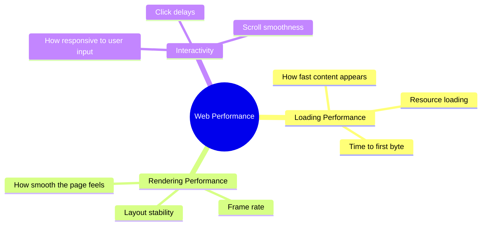

---

## 1.2 Core Web Vitals Explained

**Core Web Vitals** are Google's official metrics for measuring user experience. They directly affect your SEO ranking!

### The Big Three (Core Web Vitals)

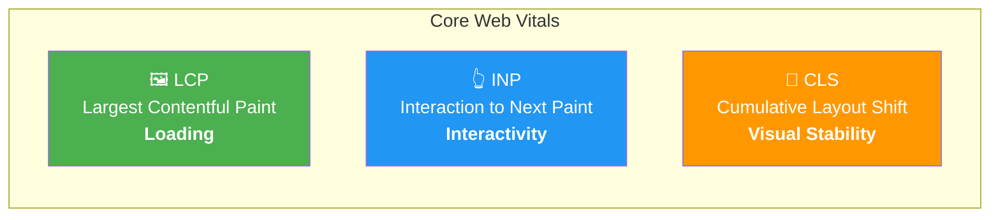

---

### 1.2.1 LCP (Largest Contentful Paint) 🖼️

**What it measures:** How long it takes for the BIGGEST visible content element to appear on screen.

**Target:** Under **2.5 seconds**

```
Timeline:
|-------- Page Load --------|
[0s]----[1s]----[2s]----[3s]----[4s]
    🟢      🟢      🟡      🔴
   Good    Good   Needs   Poor
                  Work
```

**What counts as LCP element?**
- Large images
- Video poster images
- Background images (via CSS)
- Large text blocks

**Example - What triggers LCP:**

```html
<!-- This hero image is likely your LCP element -->
<section class="hero">
    
    <h1>Welcome to Our Amazing Website</h1>
</section>
```

**How to improve LCP:**

```html
<!-- ❌ BAD: Slow LCP -->


<!-- ✅ GOOD: Optimized for fast LCP -->

```

```css
/* ❌ BAD: LCP image loaded via CSS (slower) */
.hero {
    background-image: url('hero.jpg');
}

/* ✅ GOOD: Use  tag for LCP images instead */
```

---

### 1.2.2 INP (Interaction to Next Paint) 👆

**What it measures:** How quickly your page responds when users click, tap, or type.

> **Note:** INP replaced FID (First Input Delay) in March 2024 as a Core Web Vital.

**Target:** Under **200 milliseconds**

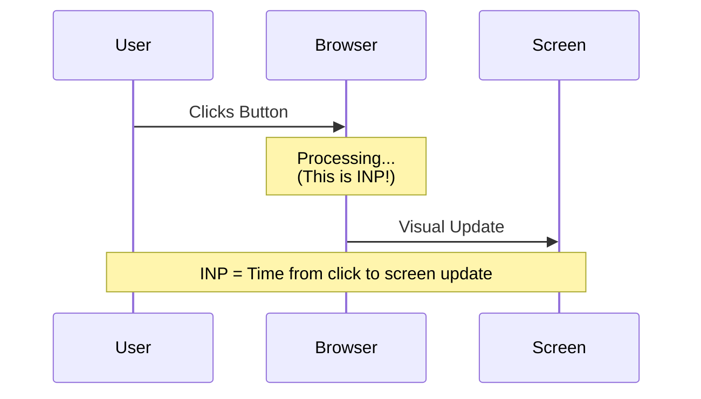

**Score Breakdown:**

| INP Score | Rating |
|-----------|--------|
| ≤ 200ms | 🟢 Good |
| 200-500ms | 🟡 Needs Improvement |
| > 500ms | 🔴 Poor |

**Example - Good vs Bad Interactivity:**

```javascript
// ❌ BAD: Blocks the main thread, causes high INP
button.addEventListener('click', () => {
    // Huge computation that takes 500ms
    for (let i = 0; i < 10000000; i++) {
        heavyCalculation(i);
    }
    updateUI();
});

// ✅ GOOD: Break up work, keeps INP low
button.addEventListener('click', async () => {
    // Show immediate feedback
    button.textContent = 'Processing...';
    
    // Defer heavy work
    await scheduler.yield(); // Let browser breathe
    
    // Do work in chunks
    for (let i = 0; i < 100; i++) {
        await processChunk(i);
        await scheduler.yield();
    }
    updateUI();
});
```

---

### 1.2.3 CLS (Cumulative Layout Shift) 📐

**What it measures:** How much the page content unexpectedly moves around while loading.

**Target:** Under **0.1**

**Visual Example of Layout Shift:**

```
BEFORE SHIFT:              AFTER SHIFT (BAD!):
┌──────────────────┐       ┌──────────────────┐
│     Header       │       │     Header       │
├──────────────────┤       ├──────────────────┤
│                  │       │   [AD LOADED]    │ ← Pushed content down!
│  Article Text    │       ├──────────────────┤
│  you're reading  │       │                  │
│                  │       │  Article Text    │
│                  │       │  you're reading  │
└──────────────────┘       └──────────────────┘

User was about to click here ↑ but content moved!
```

**Common Causes & Fixes:**

```html
<!-- ❌ BAD: No dimensions, causes layout shift -->


<!-- ✅ GOOD: Always specify dimensions -->

```

```css
/* ❌ BAD: Dynamic content without reserved space */
.ad-container {
    /* No height specified, shifts content when ad loads */
}

/* ✅ GOOD: Reserve space for dynamic content */
.ad-container {
    min-height: 250px; /* Reserve expected ad height */
    aspect-ratio: 16 / 9; /* Or use aspect-ratio */
}
```

---

## 1.3 Other Important Metrics

### FCP (First Contentful Paint) 🎨

**What it measures:** When the first piece of content appears (text, image, anything).

```
|-------- Page Load Timeline --------|
[0s]                              [3s]
  │                                 │
  │  BLANK → │█ FCP → ███████ LCP  │
  │          │                      │
  └──────────┴──────────────────────┘
             ↑
        First content appears here
```

**Target:** Under **1.8 seconds**

---

### TTFB (Time to First Byte) 📡

**What it measures:** How long until the browser receives the FIRST byte of data from the server.

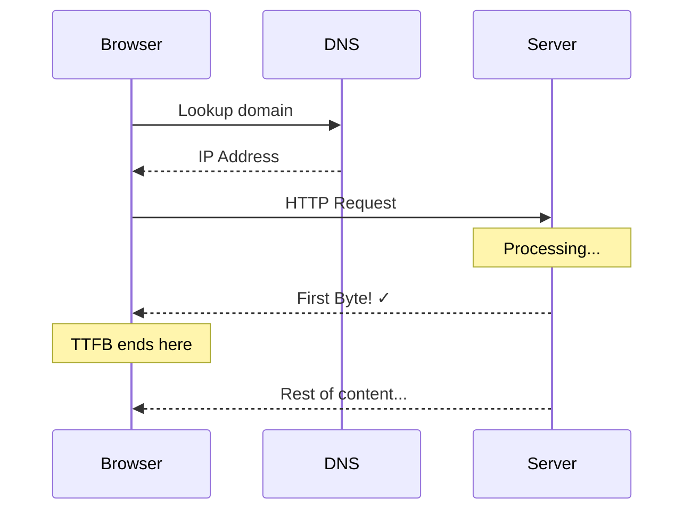

**Target:** Under **800 milliseconds**

**What affects TTFB:**
- Server location (use CDN!)
- Server processing time
- Database queries
- Network latency

---

## 1.4 Complete Performance Metrics Timeline

```mermaid
gantt
    title Page Load Timeline
    dateFormat X
    axisFormat %s
    
    section Server
    TTFB           :ttfb, 0, 800
    
    section Rendering
    FCP            :fcp, 800, 1800
    LCP            :lcp, 1800, 2500
    
    section Interaction
    Page Interactive :done, 2500, 3000
    INP Measured    :active, 3000, 5000
    
    section Stability
    CLS Monitored   :crit, 0, 5000
```

---

## 1.5 Quick Reference: All Metrics at a Glance

| Metric | Measures | Good | Needs Work | Poor |
|--------|----------|------|------------|------|
| **LCP** | Loading | ≤ 2.5s | 2.5-4s | > 4s |
| **INP** | Interactivity | ≤ 200ms | 200-500ms | > 500ms |
| **CLS** | Stability | ≤ 0.1 | 0.1-0.25 | > 0.25 |
| **FCP** | First Paint | ≤ 1.8s | 1.8-3s | > 3s |
| **TTFB** | Server Response | ≤ 800ms | 800-1800ms | > 1800ms |

---

## 1.6 Key Takeaways ✨

1. **LCP** = Make the biggest element load fast (optimize hero images!)
2. **INP** = Keep JavaScript work small and chunked
3. **CLS** = Always set image/ad dimensions
4. **FCP** = Get SOMETHING on screen quickly
5. **TTFB** = Use fast servers and CDNs

> **Remember:** Core Web Vitals affect your Google ranking. Optimize them to rank higher!

---

# Section 2: Performance Measurement Tools

## 2.1 Overview: Your Performance Toolkit

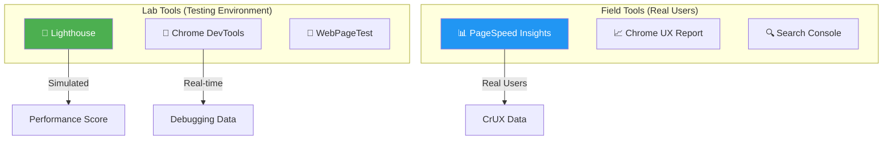

**Lab vs Field Data:**
- **Lab Data:** Tests run on a controlled machine (good for debugging)
- **Field Data:** Data from real users (shows actual experience)

---

## 2.2 Lighthouse: Complete Guide

### What is Lighthouse?

Lighthouse is Google's official auditing tool built into Chrome. It gives you a performance score and tells you exactly what to fix.

### How to Run Lighthouse

**Method 1: Chrome DevTools (Recommended)**

```
Step 1: Open Chrome
Step 2: Press F12 (or Ctrl+Shift+I) to open DevTools
Step 3: Go to "Lighthouse" tab
Step 4: Select categories (Performance, SEO, etc.)
Step 5: Click "Analyze page load"
```

**Method 2: Command Line**

```bash
# Install Lighthouse globally
npm install -g lighthouse

# Run audit
lighthouse https://example.com --output html --output-path report.html

# Run with specific settings
lighthouse https://example.com --preset=desktop --output json
```

**Method 3: PageSpeed Insights**
Just paste your URL at [pagespeed.web.dev](https://pagespeed.web.dev)

---

### Understanding Lighthouse Scores

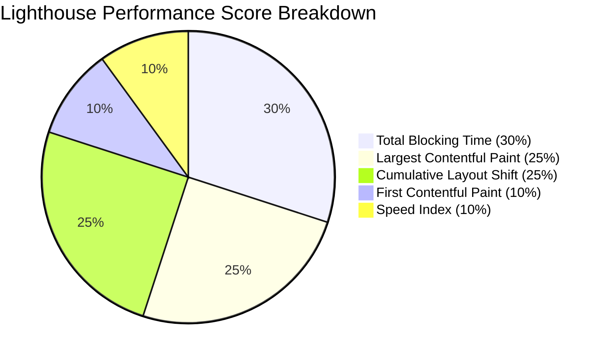

**Score Ranges:**

| Score | Color | Meaning |
|-------|-------|---------|
| 90-100 | 🟢 Green | Excellent |
| 50-89 | 🟠 Orange | Needs Improvement |
| 0-49 | 🔴 Red | Poor |

---

### Reading Lighthouse Results

**1. Opportunities Section** - Things to fix for faster loading:

```
┌─────────────────────────────────────────────────────────┐
│ ⚠️ OPPORTUNITY                          │ SAVINGS      │
├─────────────────────────────────────────────────────────┤
│ Serve images in next-gen formats        │ 1.2s         │
│ Eliminate render-blocking resources     │ 0.8s         │
│ Reduce unused JavaScript                │ 0.5s         │
│ Properly size images                    │ 0.3s         │
└─────────────────────────────────────────────────────────┘
```

**2. Diagnostics Section** - Additional insights:

```
┌─────────────────────────────────────────────────────────┐
│ ℹ️ DIAGNOSTIC                                           │
├─────────────────────────────────────────────────────────┤
│ Avoid enormous network payloads (5.2 MB total)         │
│ Serve static assets with efficient cache policy        │
│ Avoid long main-thread tasks (3 tasks > 50ms)          │
│ Minimize third-party usage (500ms blocked)             │
└─────────────────────────────────────────────────────────┘
```

---

### Lighthouse Auditing Workflow

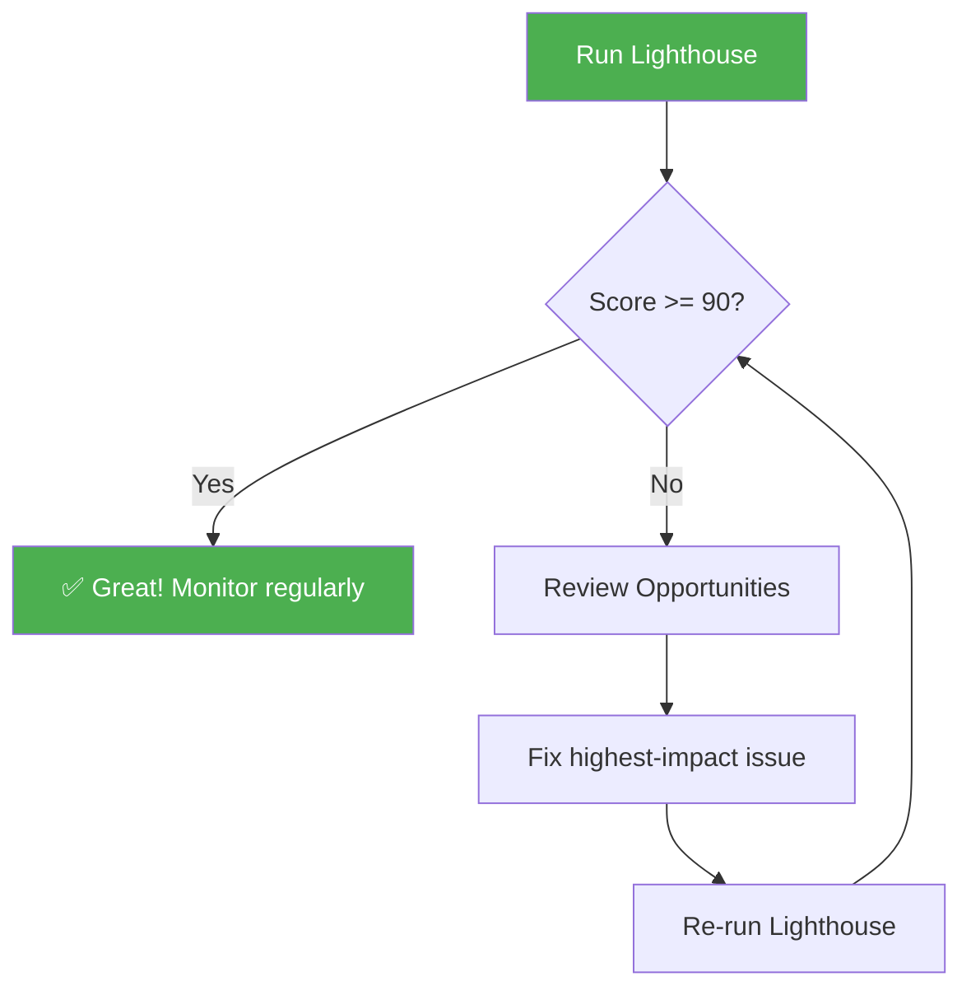

---

## 2.3 Chrome DevTools: Network Tab

The Network tab shows every file your page loads. This is where you find heavy, slow, or blocking resources.

### Opening Network Tab

```
1. Press F12 to open DevTools
2. Click "Network" tab
3. Refresh the page (Ctrl+R)
4. Watch all requests appear!
```

### Understanding the Waterfall

```
Network Waterfall Visualization:

┌─ File Name ────────┬─ Waterfall ──────────────────────────┐
│                    │ 0ms    500ms   1000ms  1500ms  2000ms│
├────────────────────┼──────────────────────────────────────┤
│ index.html         │ ██░░░░░░░░░░░░░░░░░░░░░░░░░░░░░░░░   │
│ styles.css         │    ███████░░░░░░░░░░░░░░░░░░░░░░░░   │ ← Blocks rendering!
│ bundle.js          │    ████████████░░░░░░░░░░░░░░░░░░░   │ ← Blocks parsing!
│ hero.jpg           │           ██████████████░░░░░░░░░░   │
│ font.woff2         │              ████████░░░░░░░░░░░░░   │
│ analytics.js       │                   ██████░░░░░░░░░░   │
└────────────────────┴──────────────────────────────────────┘

Legend:
██ = Downloading
░░ = Waiting/Idle
```

### Key Network Tab Columns

| Column | What It Shows | Look For |
|--------|--------------|----------|
| **Name** | File name | Large files |
| **Status** | HTTP code | 404 errors |
| **Type** | File type | Heavy JS |
| **Size** | File size | > 500KB files |
| **Time** | Load time | > 500ms files |
| **Waterfall** | Timeline | Long bars |

### Finding Heavy Files

```
Quick Filters in Network Tab:

[All] [Fetch/XHR] [JS] [CSS] [Img] [Media] [Font] [Doc]

1. Click "JS" to see only JavaScript files
2. Click "Size" column header to sort by size
3. Look for files > 100KB
4. Click file to see details in sidebar
```

**Identifying Problem Files:**

```javascript
// Questions to ask for each large file:

// 1. Is this file necessary?
//    - Remove unused libraries

// 2. Can it be smaller?
//    - Minify, compress, split

// 3. Can it load later?  
//    - Use async/defer, lazy load

// 4. Is it blocking rendering?
//    - Move to bottom, defer
```

---

### Network Tab: Throttling

Test your site on slow connections:

```
DevTools → Network Tab → No throttling ▼

Options:
├── No throttling (default)
├── Fast 3G (562.5 kbps, 150ms latency)
├── Slow 3G (376 kbps, 2000ms latency)  ← Test with this!
└── Offline
```

---

## 2.4 Chrome DevTools: Performance Tab

The Performance tab records everything that happens during page load.

### Recording a Performance Profile

```
Steps:
1. Open DevTools → Performance tab
2. Click 🔴 Record button
3. Refresh the page
4. Stop recording after page loads
5. Analyze the flamegraph
```

### Understanding the Flamegraph

```
Performance Flamegraph Structure:

┌─ Frames ────────────────────────────────────────────────┐
│ ░░░░░░░░░░░░░░░░░░░░░░░░░░░░░░░░░░░░░░░░░░░░░░░░░░░░░░ │
├─ Main Thread ───────────────────────────────────────────┤
│ ████████ Parse HTML                                     │
│     ████ Evaluate Script (bundle.js)  ← Long task!     │
│         ██ Compile Script                              │
│     ████████████████ Evaluate Script  ← Very long task!│
│                      ██ Recalculate Style              │
│                        ███ Layout                      │
│                            █ Paint                     │
├─ Network ───────────────────────────────────────────────┤
│ ██ html  ████ css  ████████ js  ████████ images        │
└─────────────────────────────────────────────────────────┘
```

### Identifying Long Tasks

**What's a Long Task?**
Any task taking more than 50ms blocks the main thread.

```
Long Task Example in Performance Tab:

┌─────────────────────────────────────────────────────────┐
│ Main Thread                                             │
│                                                         │
│ ██████████████████████ [Red corner = Long Task!]       │
│ ↑                                                       │
│ This script took 350ms - BLOCKING user interaction!    │
└─────────────────────────────────────────────────────────┘
```

**Finding Long Tasks:**

```javascript
// Look for these in Performance tab:
// - Red triangles in the corners (long tasks)
// - Tall flame chart bars (heavy functions)
// - Purple bars during idle time (blocking)
```

---

## 2.5 Chrome DevTools: Coverage Tab

Find unused CSS and JavaScript!

### Using Coverage Tool

```
Steps:
1. Press Ctrl+Shift+P (Command palette)
2. Type "coverage" and select "Show Coverage"
3. Click 🔴 to start recording
4. Refresh the page
5. See unused code highlighted in RED
```

### Reading Coverage Results

```
Coverage Results:

┌─ URL ──────────────────────┬─ Unused Bytes ─┬─ Usage ─┐
│ styles.css                 │ 45.2 KB        │  ███░░  │ 60% used
│ bundle.js                  │ 120.5 KB       │  ██░░░  │ 40% used  ← Problem!
│ vendor.js                  │ 80.3 KB        │  █░░░░  │ 20% used  ← Big problem!
└────────────────────────────┴────────────────┴─────────┘

Click a file to see line-by-line usage:
- 🟢 Green = Used code (keep it)
- 🔴 Red = Unused code (remove it!)
```

---

## 2.6 PageSpeed Insights

### What Makes It Special?

PageSpeed Insights shows **real user data** (CrUX) + **lab data** (Lighthouse).

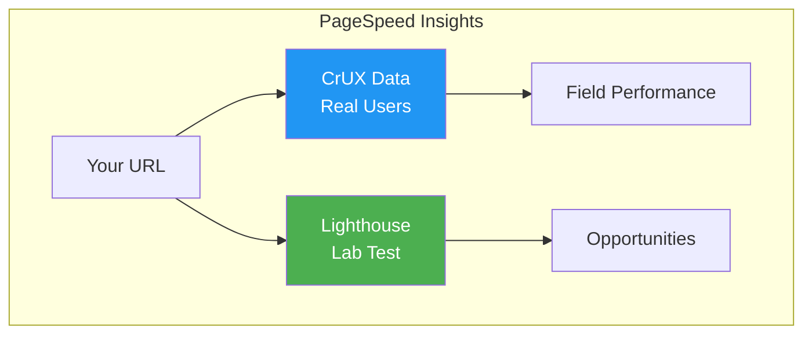

### Reading PSI Results

```
┌─────────────────────────────────────────────────────────┐
│  📊 FIELD DATA (Real Users - Last 28 days)             │
├─────────────────────────────────────────────────────────┤
│  FCP: 1.2s 🟢   LCP: 2.1s 🟢   CLS: 0.05 🟢           │
│  INP: 180ms 🟢  TTFB: 0.6s 🟢                          │
├─────────────────────────────────────────────────────────┤
│  📱 Mobile: 78  💻 Desktop: 95                         │
└─────────────────────────────────────────────────────────┘
                           ↓
┌─────────────────────────────────────────────────────────┐
│  🔬 LAB DATA (Simulated Test)                          │
├─────────────────────────────────────────────────────────┤
│  Performance Score: 72                                  │
│  See Opportunities & Diagnostics below...              │
└─────────────────────────────────────────────────────────┘
```

---

## 2.7 WebPageTest

### Why Use WebPageTest?

- Test from real locations worldwide
- Test on real devices
- Video comparison
- Detailed waterfall charts

### WebPageTest Results

```
Visual Progress Timeline:

0.0s   0.5s   1.0s   1.5s   2.0s   2.5s   3.0s
  │      │      │      │      │      │      │
  ▼      ▼      ▼      ▼      ▼      ▼      ▼
[___] [░░░] [▓▓▓] [███] [███] [███] [███]
Blank  TTFB   FCP   Loading...        LCP

Start Render: 0.8s
First Contentful Paint: 1.1s
Largest Contentful Paint: 2.3s
```

---

## 2.8 Tool Comparison & When to Use Each

| Tool | Best For | Data Type |
|------|----------|-----------|
| **Lighthouse** | Quick audits, debugging | Lab |
| **Network Tab** | Finding slow/heavy files | Lab |
| **Performance Tab** | Finding JavaScript bottlenecks | Lab |
| **Coverage Tab** | Finding unused code | Lab |
| **PageSpeed Insights** | Real user data + quick test | Field + Lab |
| **WebPageTest** | Deep analysis, comparisons | Lab |

---

## 2.9 Key Takeaways ✨

1. **Lighthouse first** – Run it for an overall health check
2. **Network tab** – Find heavy and blocking files
3. **Performance tab** – Find slow JavaScript
4. **Coverage tab** – Find unused CSS/JS
5. **PageSpeed Insights** – See real user experience
6. **Always test on slow connections** – Enable throttling!

---

# Section 3: Critical Rendering Path

## 3.1 What is the Critical Rendering Path?

The **Critical Rendering Path (CRP)** is the sequence of steps the browser takes to convert your HTML, CSS, and JavaScript into pixels on the screen.

> **Think of it like this:** You give the browser a recipe (code), and it follows steps to cook (render) the final dish (webpage).

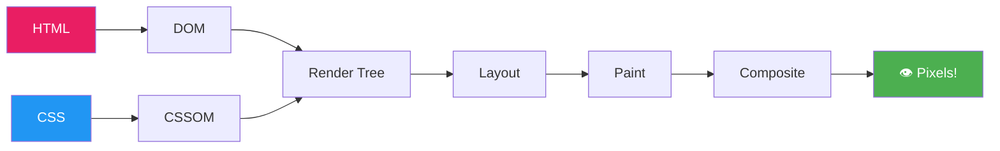

---

## 3.2 Step-by-Step: How Browsers Render Pages

### Step 1: Parse HTML → Build DOM

The browser reads HTML and creates a **Document Object Model (DOM)** tree.

```html
<!-- HTML Code -->
<html>
  <head>
    <title>My Page</title>
  </head>
  <body>
    <div class="container">
      <h1>Hello World</h1>
      <p>Welcome!</p>
    </div>
  </body>
</html>
```

```
DOM Tree Visualization:

                  Document
                     │
                   <html>
                   /    \
              <head>    <body>
                │          │
             <title>   <div.container>
                │        /      \
            "My Page"  <h1>      <p>
                        │         │
                   "Hello"    "Welcome!"
```

**Key Points:**
- DOM construction is **incremental** (starts immediately)
- Each HTML tag becomes a **node**
- Nodes form a **tree structure**

---

### Step 2: Parse CSS → Build CSSOM

The browser reads CSS and creates a **CSS Object Model (CSSOM)** tree.

```css
/* CSS Code */
body {
    font-family: Arial;
}
.container {
    max-width: 800px;
    margin: 0 auto;
}
h1 {
    color: blue;
    font-size: 32px;
}
p {
    color: gray;
}
```

```
CSSOM Tree Visualization:

                    body
           font-family: Arial
                    │
              .container
          max-width: 800px
           margin: 0 auto
               /       \
             h1          p
        color: blue   color: gray
       font-size: 32px
```

> ⚠️ **Important:** CSS is **render-blocking!** The browser won't paint anything until CSSOM is complete.

---

### Step 3: Combine DOM + CSSOM → Render Tree

The browser combines DOM and CSSOM to create the **Render Tree** – only visible elements!

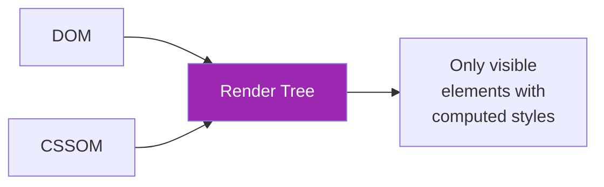

**What's NOT in the Render Tree:**
- `<head>` and its contents
- `<script>` tags
- Elements with `display: none`
- Hidden elements

```html
<!-- DOM has all of these... -->
<head><title>Hi</title></head>        <!-- Not in Render Tree -->
<body>
    <div style="display: none">X</div> <!-- Not in Render Tree -->
    <h1>Hello</h1>                      <!-- IN Render Tree! -->
    <p>World</p>                        <!-- IN Render Tree! -->
</body>
```

---

### Step 4: Layout (Reflow)

The browser calculates the **exact position and size** of every element.

```
Layout Calculation:

┌─ Viewport (1200px wide) ────────────────────────────────┐
│                                                         │
│  ┌─ .container (800px, centered) ─────────────────────┐ │
│  │                                                    │ │
│  │  ┌─ h1 (full width, 40px tall) ──────────────────┐ │ │
│  │  │ Hello World                                    │ │ │
│  │  └────────────────────────────────────────────────┘ │ │
│  │                                                    │ │
│  │  ┌─ p (full width, 20px tall) ───────────────────┐ │ │
│  │  │ Welcome!                                       │ │ │
│  │  └────────────────────────────────────────────────┘ │ │
│  │                                                    │ │
│  └────────────────────────────────────────────────────┘ │
│                                                         │
└─────────────────────────────────────────────────────────┘
```

**Layout is triggered by:**
- Initial page load
- Window resize
- DOM changes (adding/removing elements)
- CSS changes affecting size/position

---

### Step 5: Paint

The browser fills in **pixels** – colors, text, images, borders, shadows.

```
Paint Layers:

Layer 1: Background colors
Layer 2: Background images
Layer 3: Borders
Layer 4: Text
Layer 5: Outlines
```

---

### Step 6: Composite

For complex pages, the browser divides content into **layers** and combines them.

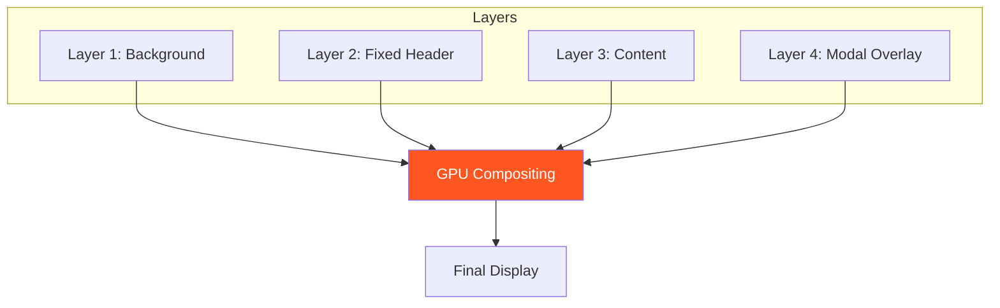

**Elements that get their own layer:**
- Elements with `transform` or `opacity` animations
- `position: fixed` elements
- `<video>` and `<canvas>`
- Elements with `will-change` property

---

## 3.3 Complete Rendering Pipeline

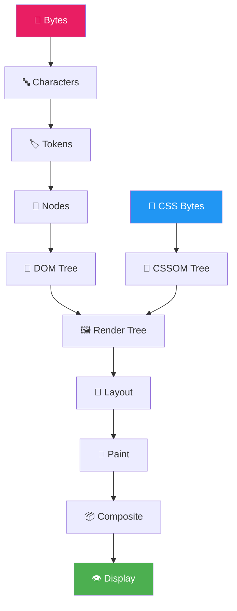

---

## 3.4 Render-Blocking Resources

### What Blocks Rendering?

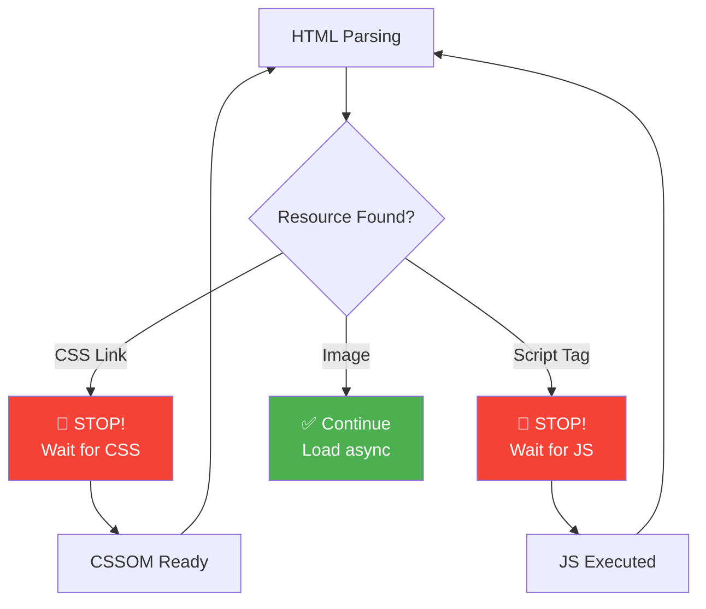

### CSS is Render-Blocking

```html
<!-- ❌ PROBLEM: CSS blocks rendering -->
<head>
    <link rel="stylesheet" href="all-styles.css"> <!-- 500KB! -->
    <!-- Nothing renders until this loads -->
</head>
```

```html
<!-- ✅ SOLUTION: Critical CSS inline, rest async -->
<head>
    <!-- Critical CSS inline (above-the-fold styles) -->
    <style>
        .hero { height: 100vh; background: blue; }
        .nav { position: fixed; top: 0; }
    </style>
    
    <!-- Non-critical CSS loaded async -->
    <link rel="preload" href="other-styles.css" as="style" 
          onload="this.onload=null;this.rel='stylesheet'">
    <noscript><link rel="stylesheet" href="other-styles.css"></noscript>
</head>
```

---

### JavaScript is Parser-Blocking

```html
<!-- ❌ PROBLEM: JS blocks HTML parsing -->
<head>
    <script src="huge-bundle.js"></script>
    <!-- HTML parsing STOPS until JS downloads and executes -->
</head>
```

**How different script loading works:**

```mermaid
gantt
    title Script Loading Comparison
    dateFormat X
    axisFormat %s
    
    section Normal
    HTML Parsing    :a1, 0, 2
    JS Download     :a2, 2, 4
    JS Execute      :a3, 4, 5
    Continue Parse  :a4, 5, 7
    
    section Async
    HTML Parsing    :b1, 0, 7
    JS Download     :b2, 0, 2
    JS Execute      :crit, b3, 2, 3
    
    section Defer
    HTML Parsing    :c1, 0, 5
    JS Download     :c2, 0, 2
    JS Execute      :c3, 5, 6
```

```html
<!-- ❌ Normal: Blocks parsing -->
<script src="app.js"></script>

<!-- ✅ Async: Download parallel, execute when ready -->
<script src="analytics.js" async></script>

<!-- ✅✅ Defer: Download parallel, execute after DOM ready -->
<script src="app.js" defer></script>
```

**When to use each:**

| Attribute | Download | Execute | Best For |
|-----------|----------|---------|----------|
| (none) | Blocks | Immediately | Rarely needed |
| `async` | Parallel | When ready | Analytics, ads |
| `defer` | Parallel | After DOM | App scripts |

---

## 3.5 Optimizing the Critical Rendering Path

### Strategy 1: Minimize Critical Resources

```html
<!-- ❌ BEFORE: 5 render-blocking resources -->
<head>
    <link rel="stylesheet" href="reset.css">
    <link rel="stylesheet" href="typography.css">
    <link rel="stylesheet" href="layout.css">
    <link rel="stylesheet" href="components.css">
    <link rel="stylesheet" href="utilities.css">
</head>

<!-- ✅ AFTER: 1 render-blocking resource -->
<head>
    <link rel="stylesheet" href="critical.min.css">
</head>
```

### Strategy 2: Minimize Critical Path Length

**Critical Path Length** = Number of round trips needed to render.

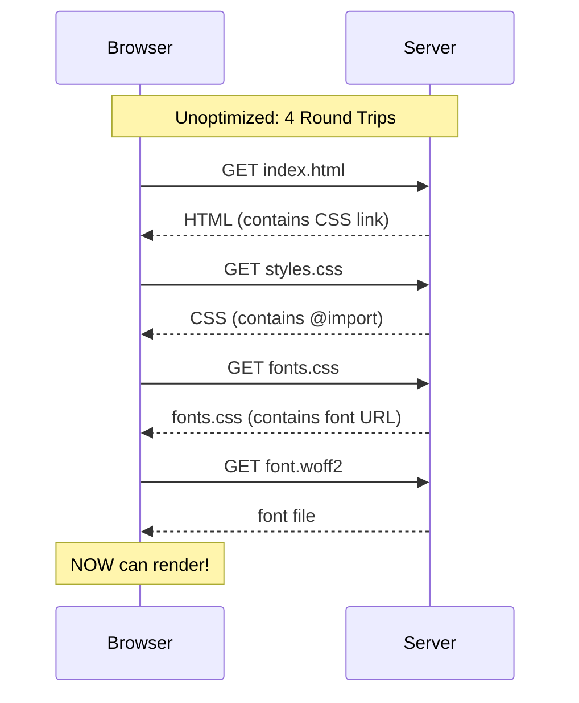

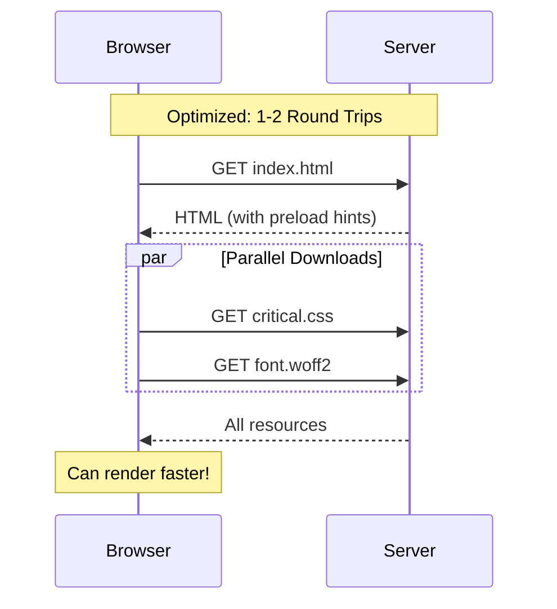

```html
<!-- ✅ Preload critical resources -->
<head>
    <link rel="preload" href="critical.css" as="style">
    <link rel="preload" href="font.woff2" as="font" type="font/woff2" crossorigin>
    <link rel="stylesheet" href="critical.css">
</head>
```

### Strategy 3: Minimize Critical Bytes

```html
<!-- ❌ BEFORE: 500KB of CSS -->
<head>
    <link rel="stylesheet" href="everything.css">
</head>

<!-- ✅ AFTER: 15KB critical CSS -->
<head>
    <style>
        /* Only above-the-fold styles - 15KB */
        .hero { /* ... */ }
        .nav { /* ... */ }
    </style>
    <link rel="stylesheet" href="rest.css" media="print" 
          onload="this.media='all'">
</head>
```

---

## 3.6 Visualizing the Critical Path

```
Unoptimized Critical Path:
┌─────────────────────────────────────────────────────────┐
│                                                         │
│  [HTML]─────►[CSS #1]─────►[CSS #2]─────►[JS]─────►🖼️  │
│        wait       wait         wait                     │
│                                                         │
│  Total Time: ████████████████████████████ (4+ seconds) │
└─────────────────────────────────────────────────────────┘

Optimized Critical Path:
┌─────────────────────────────────────────────────────────┐
│                                                         │
│  [HTML + Inline CSS]─────►🖼️                           │
│                                                         │
│  [Other CSS]────► (async, after paint)                 │
│  [JS defer]─────► (after DOM)                          │
│                                                         │
│  Total Time: ████████ (< 2 seconds)                    │
└─────────────────────────────────────────────────────────┘
```

---

## 3.7 CRP Checklist

```
✅ Critical Rendering Path Optimization Checklist:

□ Inline critical CSS (above-the-fold styles)
□ Load non-critical CSS asynchronously
□ Use 'defer' or 'async' for JavaScript
□ Move <script> tags to bottom of <body>
□ Preload critical resources (fonts, hero images)
□ Avoid CSS @import (use <link> instead)
□ Minimize/combine CSS files
□ Remove unused CSS
□ Minimize JavaScript bundle size
□ Use code splitting for large apps
```

---

## 3.8 Key Takeaways ✨

1. **CSS blocks rendering** → Inline critical CSS, async the rest
2. **JavaScript blocks parsing** → Use `defer` for main scripts
3. **Minimize round trips** → Preload critical resources
4. **Minimize bytes** → Only load what's needed for first paint
5. **DOM + CSSOM → Render Tree → Layout → Paint** is the path

> **Golden Rule:** Get your first paint as fast as possible, then progressively enhance!

---

*Continue to Section 4: HTML Optimization →*
