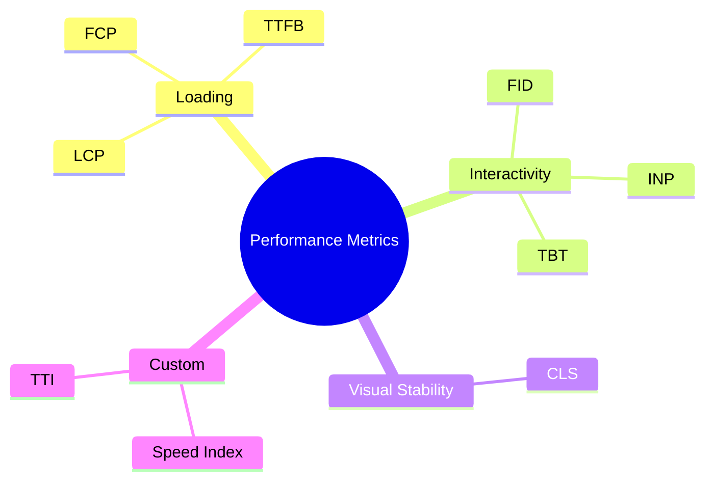
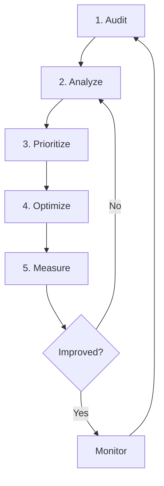
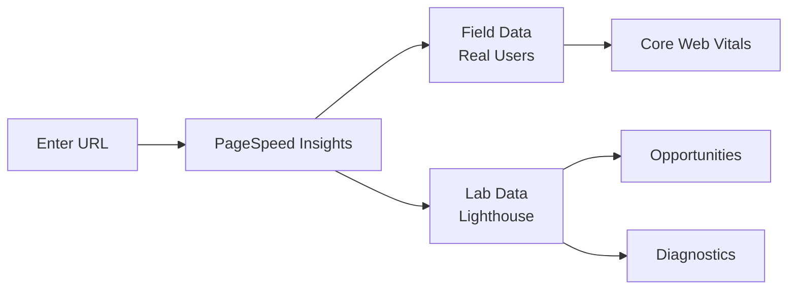
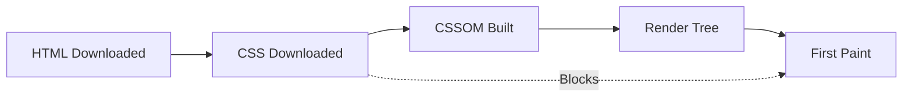
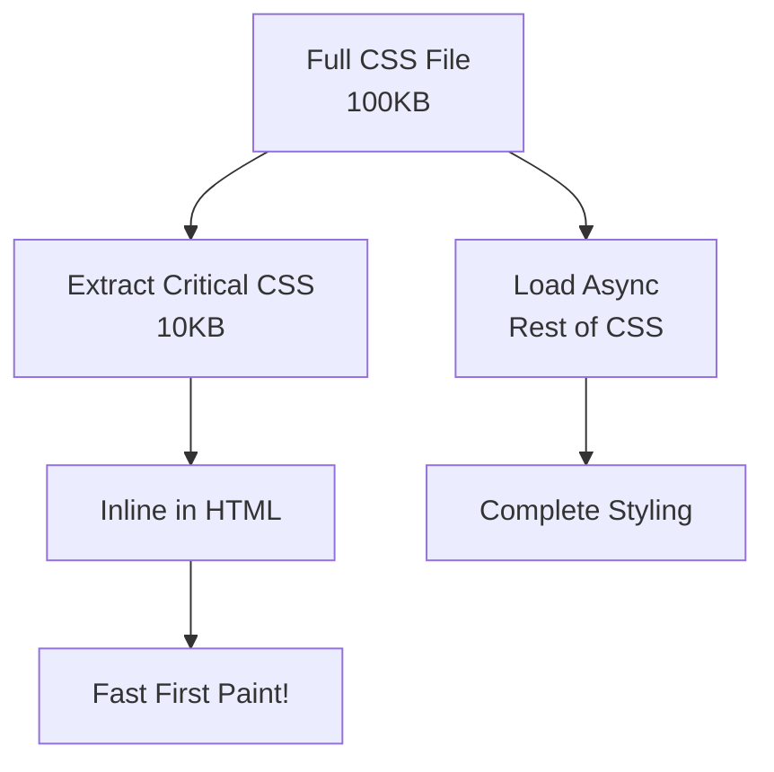
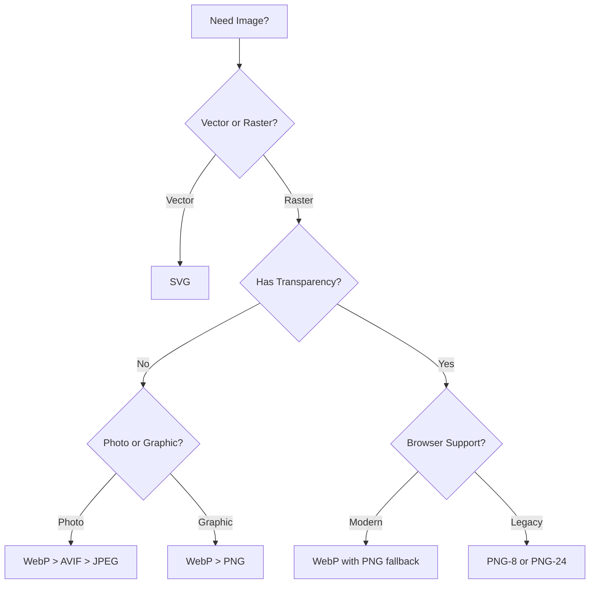
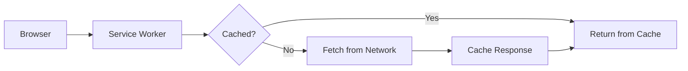
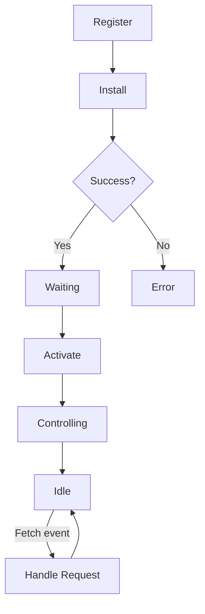
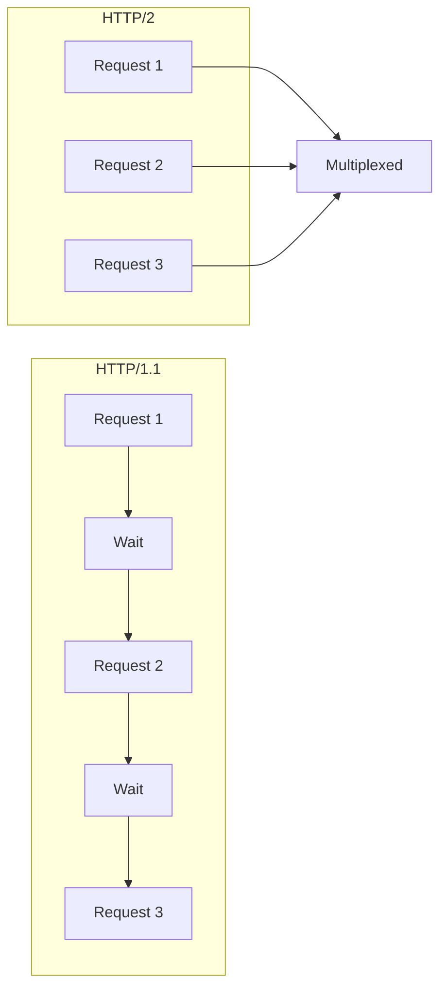

# 🚀 CAP785: Web Performance Optimization - Complete Guide

> **A comprehensive guide covering all course units, practicals, and techniques for building faster websites.**

---

## Table of Contents

1. [Unit I: Understanding & Assessing Web Performance](#unit-i-understanding--assessing-web-performance)
2. [Unit II: CSS Optimization & Critical CSS](#unit-ii-css-optimization--critical-css)
3. [Unit III: Image Optimization](#unit-iii-image-optimization)
4. [Unit IV: Fonts & JavaScript Optimization](#unit-iv-fonts--javascript-optimization)
5. [Unit V: Service Workers & Asset Delivery](#unit-v-service-workers--asset-delivery)
6. [Unit VI: HTTP/2 & Gulp Automation](#unit-vi-http2--gulp-automation)
7. [Practicals](#practicals)

---

## Course Outcomes

| CO | Description |
|----|-------------|
| **CO1** | Understand how to increase web performance using various techniques |
| **CO2** | Analyze websites for higher conversions and better user satisfaction |
| **CO3** | Evaluate the performance of web resources using various metrics |
| **CO4** | Construct websites for better user engagement and ranking |

---

# Unit I: Understanding & Assessing Web Performance

## 1.1 Introduction to Web Performance

### What is Web Performance?

Web performance is the **speed and efficiency** with which web pages are downloaded and displayed in the user's browser.

```
Why Performance Matters:

User Experience:        Business Impact:         SEO Impact:
├── First impressions   ├── Conversion rates     ├── Google ranking
├── Engagement          ├── Bounce rates         ├── Core Web Vitals
├── Retention           ├── Revenue              ├── Mobile-first indexing
└── Satisfaction        └── Customer loyalty     └── Crawl budget
```

### Key Performance Metrics



### Core Web Vitals

| Metric | Measures | Good | Needs Work | Poor |
|--------|----------|------|------------|------|
| **LCP** | Largest Contentful Paint | ≤ 2.5s | 2.5-4s | > 4s |
| **INP** | Interaction to Next Paint | ≤ 200ms | 200-500ms | > 500ms |
| **CLS** | Cumulative Layout Shift | ≤ 0.1 | 0.1-0.25 | > 0.25 |

---

## 1.2 Getting Up and Running

### Performance Optimization Workflow



### Setting Up Your Environment

```bash
# Essential tools to install
npm install -g lighthouse
npm install -g http-server
npm install -g pagespeed-insights

# Chrome DevTools - Built-in (F12)
# WebPageTest - Online tool
```

---

## 1.3 Auditing the Client's Website

### Comprehensive Audit Checklist

```
Pre-Audit Checklist:
├── [ ] Document current performance baseline
├── [ ] Identify target pages (homepage, product, checkout)
├── [ ] Note user demographics (devices, locations, networks)
├── [ ] Set performance budget goals
└── [ ] Gather stakeholder requirements

Audit Areas:
├── Loading Performance
│   ├── Time to First Byte (TTFB)
│   ├── First Contentful Paint (FCP)
│   └── Largest Contentful Paint (LCP)
├── Interactivity
│   ├── Input delay
│   └── JavaScript execution time
├── Visual Stability
│   └── Layout shifts
├── Resource Optimization
│   ├── Image sizes
│   ├── JavaScript bundles
│   └── CSS files
└── Network
    ├── Request count
    ├── Total page weight
    └── Caching headers
```

### Creating a Performance Budget

```javascript
// Example performance budget
const performanceBudget = {
    metrics: {
        LCP: 2500,           // ms
        FID: 100,            // ms
        CLS: 0.1,            // score
        TTI: 3500,           // ms
        SpeedIndex: 3000     // ms
    },
    resources: {
        totalSize: 500,      // KB
        javascript: 150,     // KB
        css: 50,             // KB
        images: 250,         // KB
        fonts: 50            // KB
    },
    counts: {
        requests: 50,
        scripts: 10,
        stylesheets: 3
    }
};
```

---

## 1.4 Google PageSpeed Insights

### What is PageSpeed Insights?

PageSpeed Insights (PSI) combines **real-world data** from Chrome User Experience Report (CrUX) with **lab data** from Lighthouse.



### Understanding PSI Results

```
┌─────────────────────────────────────────────────────────────┐
│  📊 FIELD DATA (Last 28 days - Real Users)                 │
├─────────────────────────────────────────────────────────────┤
│  FCP: 1.2s 🟢    LCP: 2.1s 🟢    CLS: 0.05 🟢              │
│  INP: 180ms 🟢   TTFB: 0.6s 🟢                              │
├─────────────────────────────────────────────────────────────┤
│  📱 Mobile Score: 78    💻 Desktop Score: 95                │
└─────────────────────────────────────────────────────────────┘

┌─────────────────────────────────────────────────────────────┐
│  ⚡ OPPORTUNITIES (Potential Savings)                       │
├─────────────────────────────────────────────────────────────┤
│  Serve images in next-gen formats ........... 1.2s         │
│  Eliminate render-blocking resources ........ 0.8s         │
│  Reduce unused JavaScript ................... 0.5s         │
│  Properly size images ....................... 0.3s         │
└─────────────────────────────────────────────────────────────┘
```

### Using PSI Programmatically

```javascript
// Using PageSpeed Insights API
const API_KEY = 'YOUR_API_KEY';
const url = 'https://example.com';

async function runPSI(url) {
    const apiUrl = `https://www.googleapis.com/pagespeedonline/v5/runPagespeed?url=${encodeURIComponent(url)}&key=${API_KEY}&strategy=mobile`;
    
    const response = await fetch(apiUrl);
    const data = await response.json();
    
    // Extract Core Web Vitals
    const metrics = data.loadingExperience.metrics;
    console.log('LCP:', metrics.LARGEST_CONTENTFUL_PAINT_MS);
    console.log('FID:', metrics.FIRST_INPUT_DELAY_MS);
    console.log('CLS:', metrics.CUMULATIVE_LAYOUT_SHIFT_SCORE);
    
    return data;
}
```

---

## 1.5 Browser-Based Assessment Tools

### Chrome DevTools Overview

```
Chrome DevTools Panels for Performance:

┌─────────────────────────────────────────────────────────────┐
│  Elements │ Console │ Sources │ Network │ Performance │ ... │
└─────────────────────────────────────────────────────────────┘
                               ↓           ↓
                         File loading  CPU profiling
                         Waterfall     Flamegraph
                         Timing        Long tasks
```

### Opening DevTools

```
Keyboard Shortcuts:
├── F12              → Open DevTools
├── Ctrl+Shift+I     → Open DevTools
├── Ctrl+Shift+J     → Open Console
├── Ctrl+Shift+C     → Inspect Element
└── Ctrl+Shift+P     → Command Palette
```

---

## 1.6 Inspecting Network Requests

### Network Tab Essentials

```
Network Waterfall Visualization:

File             │ 0ms   200ms  400ms  600ms  800ms  1000ms
─────────────────┼──────────────────────────────────────────
index.html       │ ██░░░░░░░░░░░░░░░░░░░░░░░░░░░░░░░░░░░░
styles.css       │    ████████░░░░░░░░░░░░░░░░░░░░░░░░░░░
bundle.js        │    ██████████████████░░░░░░░░░░░░░░░░░
hero.webp        │              ████████████░░░░░░░░░░░░░
font.woff2       │                 ██████████░░░░░░░░░░░░
analytics.js     │                       ██████░░░░░░░░░░

Legend: ██ = Active download  ░░ = Waiting
```

### Key Network Columns

| Column | What to Look For |
|--------|------------------|
| **Name** | Resource file names |
| **Status** | 200 (OK), 304 (Cached), 404 (Error) |
| **Type** | document, script, stylesheet, image |
| **Initiator** | What requested this resource |
| **Size** | Transfer size (look for > 100KB) |
| **Time** | Total load time |
| **Priority** | Highest, High, Medium, Low |

### Filtering Network Requests

```javascript
// Network tab filters:
// Type filters: [All] [Fetch/XHR] [JS] [CSS] [Img] [Media] [Font]

// Custom filters in Filter box:
// larger-than:100KB    → Files over 100KB
// -domain:cdn.com      → Exclude CDN requests
// status-code:404      → Find broken resources
// mime-type:font       → Only font files
// is:from-cache        → Cached resources
```

### Analyzing a Request

```
Request Details Panel:

┌─ Headers ─────────────────────────────────────────────────┐
│ General:                                                  │
│   Request URL: https://example.com/bundle.js              │
│   Request Method: GET                                     │
│   Status Code: 200 OK                                     │
│                                                           │
│ Response Headers:                                         │
│   content-encoding: br        ← Brotli compressed!        │
│   cache-control: max-age=31536000  ← 1 year cache         │
│   content-type: application/javascript                    │
│                                                           │
├─ Timing ──────────────────────────────────────────────────┤
│   Queueing:        0.5ms                                  │
│   DNS Lookup:      15ms    ← Domain resolution            │
│   Initial Connection: 25ms ← TCP handshake                │
│   SSL:             30ms    ← HTTPS negotiation            │
│   Request sent:    0.2ms                                  │
│   Waiting (TTFB):  120ms   ← Server processing            │
│   Content Download: 45ms   ← File transfer                │
│   ─────────────────────────                               │
│   Total:           235.7ms                                │
└───────────────────────────────────────────────────────────┘
```

---

## 1.7 Rendering Performance Auditing

### Performance Tab Recording

```
Steps to Record:
1. Open DevTools → Performance tab
2. Click ⚙️ → Enable "Screenshots" and "Web Vitals"
3. Click 🔴 Record (or Ctrl+E)
4. Refresh the page (Ctrl+R)
5. Wait for page to fully load
6. Click Stop
```

### Understanding the Flamegraph

```
Performance Recording Layout:

┌─ Frames ─────────────────────────────────────────────────┐
│ ░░░░░░░░░░░░░░░░░░░░░░░░░░░░░░░░░░░░░░░░░░░░░░░░░░░░░░  │
├─ Web Vitals ─────────────────────────────────────────────┤
│     ▲FCP      ▲LCP                     ▲CLS              │
├─ Main Thread ────────────────────────────────────────────┤
│ ████████ Parse HTML                                      │
│     ████ Evaluate Script (bundle.js)                     │
│         ██████████████████ [Long Task - 350ms!]          │
│                            ██ Recalculate Style          │
│                              ███ Layout                  │
│                                  █ Paint                 │
├─ Network ────────────────────────────────────────────────┤
│ ██ html  ████ css  ████████████ js  ██████ images        │
└──────────────────────────────────────────────────────────┘
```

### Identifying Performance Issues

```
Red Flags to Look For:

1. Long Tasks (> 50ms)
   └── Look for red corners on task blocks
   └── These block user interaction

2. Layout Thrashing
   └── Purple "Recalculate Style" repeatedly
   └── Caused by reading then writing DOM

3. Forced Reflow
   └── Reading layout after writing
   └── Example: element.offsetHeight after style change

4. Paint Storms
   └── Excessive green "Paint" blocks
   └── Often from animations or scroll handlers
```

---

## 1.8 Benchmarking JavaScript in Chrome

### Console Timing Methods

```javascript
// Method 1: console.time / console.timeEnd
console.time('arrayOperation');
const arr = Array(1000000).fill(0).map((_, i) => i * 2);
console.timeEnd('arrayOperation');
// Output: arrayOperation: 45.123ms

// Method 2: performance.now()
const start = performance.now();
heavyOperation();
const end = performance.now();
console.log(`Operation took ${end - start}ms`);

// Method 3: performance.mark and measure
performance.mark('start-process');
processData();
performance.mark('end-process');
performance.measure('data-processing', 'start-process', 'end-process');

const measures = performance.getEntriesByName('data-processing');
console.log(measures[0].duration);
```

### Profiling JavaScript

```
Performance Tab → Record → Analyze Call Tree:

┌─ Call Tree ──────────────────────────────────────────────┐
│ Total Time │ Self Time │ Function                        │
├────────────┼───────────┼─────────────────────────────────┤
│   450ms    │   120ms   │ processData                     │
│   200ms    │   200ms   │   ├── parseJSON                 │
│   100ms    │    50ms   │   ├── transformData             │
│    50ms    │    50ms   │   │   └── mapItems              │
│    30ms    │    30ms   │   └── sortResults               │
└────────────┴───────────┴─────────────────────────────────┘

Tip: Sort by "Self Time" to find the actual slow functions
```

---

## 1.9 Simulating and Monitoring Devices

### Device Simulation in DevTools

```
Enable Device Mode:
1. Open DevTools
2. Click 📱 Toggle Device Toolbar (Ctrl+Shift+M)
3. Select device from dropdown or set custom dimensions

Device Presets:
├── iPhone SE (375 x 667)
├── iPhone 12 Pro (390 x 844)
├── iPad Air (820 x 1180)
├── Samsung Galaxy S20 (360 x 800)
└── Custom dimensions...
```

### Network Throttling Profiles

```
Built-in Profiles:
├── No throttling     → Full speed
├── Fast 3G           → 1.5 Mbps, 40ms RTT
├── Slow 3G           → 750 Kbps, 100ms RTT
└── Offline           → No network

Creating Custom Profile (DevTools → Network → ⚙️):
┌─────────────────────────────────────────────────────────┐
│ Profile name: [Emerging Markets 2G]                     │
│                                                         │
│ Download: [280] Kbps  │ Upload: [256] Kbps              │
│ Latency: [800] ms                                       │
└─────────────────────────────────────────────────────────┘
```

### CPU Throttling

```
Performance Tab → ⚙️ → CPU:
├── No throttling
├── 4x slowdown    → Simulates mid-range mobile
└── 6x slowdown    → Simulates low-end mobile

Why CPU throttle?
└── Your dev machine is 4-10x faster than average user's phone
└── Test interactions and animations realistically
```

---

## 1.10 Creating Custom Network Throttling Profiles

### Common Network Conditions Worldwide

| Region | Typical Speed | Latency | Profile Settings |
|--------|--------------|---------|-----------------|
| Urban 4G | 12 Mbps | 50ms | Fast connection |
| Rural 4G | 4 Mbps | 100ms | Moderate |
| 3G | 1.5 Mbps | 300ms | Slow 3G preset |
| Emerging 2G | 280 Kbps | 800ms | Custom profile |
| Satellite | 1 Mbps | 600ms | Custom profile |

### Setting Up Realistic Test Conditions

```javascript
// Test script to verify mobile experience
async function testMobilePerformance() {
    // Enable throttling via Chrome DevTools Protocol (CDP)
    const client = await page.target().createCDPSession();
    
    // Simulate Slow 3G
    await client.send('Network.emulateNetworkConditions', {
        offline: false,
        downloadThroughput: 750 * 1024 / 8,  // 750 Kbps
        uploadThroughput: 250 * 1024 / 8,    // 250 Kbps
        latency: 100                          // 100ms RTT
    });
    
    // Simulate CPU throttling
    await client.send('Emulation.setCPUThrottlingRate', {
        rate: 4  // 4x slowdown
    });
    
    // Now navigate and measure
    const start = performance.now();
    await page.goto('https://example.com');
    console.log(`Load time: ${performance.now() - start}ms`);
}
```

---

## 1.11 Unit I Summary

### Key Concepts

```
Web Performance Fundamentals:

Assessment Flow:
├── 1. Baseline → Measure current state
├── 2. Audit → Identify issues
├── 3. Analyze → Prioritize fixes
├── 4. Optimize → Implement changes
└── 5. Monitor → Track improvements

Essential Tools:
├── Google PageSpeed Insights → Real + Lab data
├── Chrome DevTools Network → Request analysis
├── Chrome DevTools Performance → CPU profiling
├── Lighthouse → Comprehensive audits
└── WebPageTest → Detailed waterfalls

Key Metrics:
├── LCP ≤ 2.5s (Loading)
├── INP ≤ 200ms (Interactivity)
├── CLS ≤ 0.1 (Stability)
└── TTFB ≤ 800ms (Server)
```

---

# Unit II: CSS Optimization & Critical CSS

## 2.1 Introduction to CSS Optimization

### Why CSS Performance Matters

CSS is **render-blocking** by default. The browser won't paint anything until all CSS is downloaded and parsed.



### Common CSS Performance Issues

```
CSS Performance Problems:

1. Large CSS Files
   └── All CSS downloaded before first paint
   └── Solution: Split and load critical CSS first

2. Unused CSS
   └── Average site has 35-40% unused CSS
   └── Solution: Remove or tree-shake unused styles

3. Complex Selectors
   └── Browser matches selectors right-to-left
   └── Solution: Use simple, shallow selectors

4. Render-Blocking
   └── CSS blocks rendering by default
   └── Solution: Inline critical CSS, defer the rest
```

---

## 2.2 Mobile-First is User-First

### Mobile-First CSS Approach

```css
/* ❌ Desktop-First (Bad for mobile) */
.container {
    width: 1200px;
    padding: 40px;
}

@media (max-width: 768px) {
    .container {
        width: 100%;
        padding: 20px;
    }
}

/* ✅ Mobile-First (Better performance) */
.container {
    width: 100%;
    padding: 20px;
}

@media (min-width: 768px) {
    .container {
        width: 1200px;
        padding: 40px;
    }
}
```

### Why Mobile-First is Faster

```
Mobile-First Benefits:

1. Smaller Initial CSS
   └── Mobile styles are simpler, load faster
   
2. Progressive Enhancement
   └── Add complexity only when needed
   
3. Core Styles First
   └── Essential styles load before enhancements
   
4. Better Mobile Performance
   └── Mobile devices get only what they need
```

### Mobile-First Media Query Strategy

```css
/* Base styles - Mobile (< 576px) */
.card {
    padding: 1rem;
    font-size: 14px;
}

/* Small tablets (≥ 576px) */
@media (min-width: 576px) {
    .card {
        padding: 1.5rem;
        font-size: 15px;
    }
}

/* Tablets (≥ 768px) */
@media (min-width: 768px) {
    .card {
        padding: 2rem;
        font-size: 16px;
    }
}

/* Desktops (≥ 992px) */
@media (min-width: 992px) {
    .card {
        max-width: 800px;
        margin: 0 auto;
    }
}

/* Large screens (≥ 1200px) */
@media (min-width: 1200px) {
    .card {
        max-width: 1000px;
    }
}
```

---

## 2.3 Performance-Tuning Your CSS

### Selector Performance

```css
/* ❌ BAD: Overly complex selectors */
body div.container ul.nav li a.active span {
    color: blue;
}

header nav ul li:nth-child(2n+1) > a[href^="https"] {
    text-decoration: none;
}

/* ✅ GOOD: Simple, direct selectors */
.nav-link-active {
    color: blue;
}

.nav-external-link {
    text-decoration: none;
}
```

### Selector Specificity Guide

```
Specificity Calculation:
├── Inline styles       → 1,0,0,0
├── IDs (#id)          → 0,1,0,0
├── Classes, attributes → 0,0,1,0
└── Elements           → 0,0,0,1

Examples:
├── div                 → 0,0,0,1
├── .button            → 0,0,1,0
├── #header .nav       → 0,1,1,0
├── div.card:hover     → 0,0,2,1
└── style="..."        → 1,0,0,0

Keep specificity LOW for maintainability and performance!
```

### Reducing CSS File Size

```css
/* 1. Remove whitespace (minification) */
/* Before: 156 bytes */
.button {
    background-color: #007bff;
    padding: 10px 20px;
    border-radius: 4px;
}

/* After: 75 bytes (52% smaller) */
.button{background-color:#007bff;padding:10px 20px;border-radius:4px}

/* 2. Combine similar rules */
/* Before */
.btn-primary { background: blue; }
.btn-secondary { background: gray; }

/* After */
.btn-primary, .btn-secondary { /* shared styles */ }
.btn-primary { background: blue; }
.btn-secondary { background: gray; }

/* 3. Use shorthand properties */
/* Before */
.box {
    margin-top: 10px;
    margin-right: 20px;
    margin-bottom: 10px;
    margin-left: 20px;
}

/* After */
.box {
    margin: 10px 20px;
}
```

### Finding Unused CSS

```javascript
// Using Chrome DevTools Coverage
// 1. Press Ctrl+Shift+P
// 2. Type "Coverage" and select "Show Coverage"
// 3. Click 🔴 to record
// 4. Refresh page
// 5. See red (unused) vs green (used) per file

// Programmatic approach using PurgeCSS
// purgecss.config.js
module.exports = {
    content: ['./src/**/*.html', './src/**/*.js'],
    css: ['./src/styles.css'],
    output: './dist/styles.css'
};
```

---

## 2.4 Working with CSS Transitions

### Performant CSS Transitions

```css
/* Properties that are cheap to animate (GPU accelerated): */
.element {
    /* ✅ GOOD - Uses compositor thread */
    transform: translateX(100px);
    opacity: 0.5;
}

/* Properties that are expensive to animate: */
.element {
    /* ❌ BAD - Triggers layout/paint */
    left: 100px;      /* Triggers layout */
    width: 200px;     /* Triggers layout */
    background: red;  /* Triggers paint */
}
```

### Transition Performance Comparison

| Property | Layout | Paint | Composite | Performance |
|----------|--------|-------|-----------|-------------|
| `transform` | ❌ | ❌ | ✅ | 🟢 Excellent |
| `opacity` | ❌ | ❌ | ✅ | 🟢 Excellent |
| `filter` | ❌ | ✅ | ✅ | 🟡 Good |
| `background-color` | ❌ | ✅ | ✅ | 🟡 Good |
| `width/height` | ✅ | ✅ | ✅ | 🔴 Poor |
| `top/left` | ✅ | ✅ | ✅ | 🔴 Poor |

### Optimized Transition Examples

```css
/* ❌ BAD: Animating left causes layout thrashing */
.slide-in-bad {
    position: absolute;
    left: -100%;
    transition: left 0.3s ease;
}
.slide-in-bad.active {
    left: 0;
}

/* ✅ GOOD: Using transform for smooth animation */
.slide-in-good {
    transform: translateX(-100%);
    transition: transform 0.3s ease;
    will-change: transform; /* Hint for browser optimization */
}
.slide-in-good.active {
    transform: translateX(0);
}

/* ✅ Fade animation */
.fade {
    opacity: 0;
    transition: opacity 0.3s ease;
}
.fade.visible {
    opacity: 1;
}

/* ✅ Scale animation */
.zoom {
    transform: scale(0.8);
    transition: transform 0.2s ease;
}
.zoom:hover {
    transform: scale(1);
}
```

### The `will-change` Property

```css
/* Use sparingly - creates new compositor layer */
.animated-element {
    will-change: transform, opacity;
}

/* Remove after animation */
.animated-element.animation-done {
    will-change: auto;
}

/* 
WARNING: Don't overuse will-change!
- Creates GPU memory overhead
- Only use for complex animations
- Remove when animation completes
*/
```

---

## 2.5 Introduction to Critical CSS

### What is Critical CSS?

Critical CSS is the **minimum CSS required to render above-the-fold content**.



### Above-the-Fold Content

```
┌─────────────────────────────────────┐
│           Browser Window            │
├─────────────────────────────────────┤
│  ┌─────────────────────────────┐   │
│  │         Header/Nav           │   │  ← ABOVE THE FOLD
│  ├─────────────────────────────┤   │     (Critical CSS needed)
│  │                             │   │
│  │        Hero Section         │   │
│  │                             │   │
│  └─────────────────────────────┘   │
├ ─ ─ ─ ─ ─ FOLD LINE ─ ─ ─ ─ ─ ─ ─ ─┤
│  ┌─────────────────────────────┐   │  ← BELOW THE FOLD
│  │      Content Cards          │   │     (Can wait)
│  └─────────────────────────────┘   │
│  ┌─────────────────────────────┐   │
│  │         Footer              │   │
│  └─────────────────────────────┘   │
└─────────────────────────────────────┘
```

---

## 2.6 Implementing Critical CSS

### Manual Critical CSS Extraction

```html
<!DOCTYPE html>
<html>
<head>
    <!-- Critical CSS inlined -->
    <style>
        /* Only styles needed for above-the-fold */
        body {
            margin: 0;
            font-family: system-ui, sans-serif;
        }
        .header {
            background: #1a1a2e;
            color: white;
            padding: 1rem;
        }
        .hero {
            padding: 4rem 2rem;
            background: linear-gradient(#1a1a2e, #16213e);
            color: white;
        }
        .hero h1 {
            font-size: 2.5rem;
            margin: 0;
        }
    </style>
    
    <!-- Non-critical CSS loaded asynchronously -->
    <link rel="preload" href="styles.css" as="style" 
          onload="this.onload=null;this.rel='stylesheet'">
    <noscript><link rel="stylesheet" href="styles.css"></noscript>
</head>
<body>
    <header class="header">Navigation</header>
    <section class="hero">
        <h1>Welcome</h1>
    </section>
    <!-- Below fold content -->
</body>
</html>
```

### Automated Critical CSS with npm Tools

```bash
# Install critical CSS generator
npm install critical --save-dev
```

```javascript
// critical.config.js
const critical = require('critical');

critical.generate({
    // Source HTML file
    src: 'index.html',
    
    // Output file
    target: 'index-critical.html',
    
    // Viewport dimensions
    width: 1300,
    height: 900,
    
    // Inline the critical CSS
    inline: true,
    
    // Extract critical CSS from these stylesheets
    css: ['styles.css'],
    
    // Minify CSS
    minify: true
});
```

### Loading Non-Critical CSS

```html
<!-- Method 1: Media query swap -->
<link rel="stylesheet" href="non-critical.css" 
      media="print" onload="this.media='all'">

<!-- Method 2: Preload with rel swap -->
<link rel="preload" href="non-critical.css" as="style"
      onload="this.onload=null;this.rel='stylesheet'">
<noscript>
    <link rel="stylesheet" href="non-critical.css">
</noscript>

<!-- Method 3: JavaScript injection -->
<script>
    // Load CSS after page load
    window.addEventListener('load', function() {
        const link = document.createElement('link');
        link.rel = 'stylesheet';
        link.href = 'non-critical.css';
        document.head.appendChild(link);
    });
</script>
```

---

## 2.7 Weighing the Benefits

### Critical CSS Trade-offs

```
✅ BENEFITS:
├── Faster First Contentful Paint (FCP)
├── Better perceived performance
├── Improved Core Web Vitals
├── Higher Lighthouse scores
└── Better SEO rankings

❌ CHALLENGES:
├── Added build complexity
├── Duplicate CSS (inline + external)
├── Maintenance overhead
├── Cache inefficiency (inline CSS not cacheable)
└── Calculation complexity for dynamic pages
```

### When to Use Critical CSS

```
Use Critical CSS When:
├── ✅ LCP is poor (> 2.5s)
├── ✅ Large CSS bundles (> 100KB)
├── ✅ Render-blocking CSS issues in audits
├── ✅ Marketing/landing pages
└── ✅ First-time visitor experience is crucial

Skip Critical CSS When:
├── ❌ CSS is already small (< 20KB)
├── ❌ SPA with minimal initial CSS
├── ❌ Fully cached returning visitors
└── ❌ Build complexity is too costly
```

---

## 2.8 Making Maintainability Easier

### Automating Critical CSS in Build Pipeline

```javascript
// gulpfile.js
const gulp = require('gulp');
const critical = require('critical').stream;

gulp.task('critical', function() {
    return gulp.src('dist/*.html')
        .pipe(critical({
            base: 'dist/',
            inline: true,
            width: 1300,
            height: 900,
            css: ['dist/styles.css']
        }))
        .pipe(gulp.dest('dist'));
});
```

```javascript
// webpack.config.js with HtmlCriticalWebpackPlugin
const HtmlCriticalWebpackPlugin = require('html-critical-webpack-plugin');

module.exports = {
    plugins: [
        new HtmlCriticalWebpackPlugin({
            base: path.resolve(__dirname, 'dist'),
            src: 'index.html',
            dest: 'index.html',
            inline: true,
            minify: true,
            width: 1300,
            height: 900
        })
    ]
};
```

---

## 2.9 Considerations for Multi-Page Websites

### Different Pages, Different Critical CSS

```
Multi-Page Strategy:

/                    → home-critical.css
/products            → products-critical.css
/checkout            → checkout-critical.css
/blog/*              → blog-critical.css (reusable)

Approaches:
1. Generate per-page critical CSS
2. Use template-based critical CSS
3. Combine common critical styles
```

### Template-Based Critical CSS

```javascript
// Generate critical CSS for page templates
const templates = [
    { name: 'home', url: '/', viewport: { width: 1300, height: 900 } },
    { name: 'product', url: '/products/sample', viewport: { width: 1300, height: 900 } },
    { name: 'blog', url: '/blog/sample-post', viewport: { width: 1300, height: 900 } }
];

templates.forEach(async (template) => {
    const criticalCSS = await critical.generate({
        src: template.url,
        width: template.viewport.width,
        height: template.viewport.height
    });
    
    fs.writeFileSync(`critical-${template.name}.css`, criticalCSS);
});
```

---

## 2.10 Unit II Summary

### Key Concepts

```
CSS Optimization Summary:

Mobile-First:
├── Start with mobile styles
├── Add desktop styles via min-width queries
└── Progressive enhancement approach

Performance Tuning:
├── Simple selectors (class-based)
├── Avoid deep nesting
├── Remove unused CSS
├── Minify in production
└── Use shorthand properties

Transitions:
├── Animate transform and opacity (GPU accelerated)
├── Avoid animating layout properties
├── Use will-change sparingly
└── 60fps target for smooth animations

Critical CSS:
├── Extract above-the-fold styles
├── Inline critical CSS in <head>
├── Load rest asynchronously
├── Automate in build pipeline
└── Consider per-template for multi-page sites
```

---

*Continue to Unit III: Image Optimization →*

---

# Unit III: Image Optimization

## 3.1 Introduction to Image Delivery

### Why Image Optimization Matters

Images typically account for **50-70% of a webpage's total size**. Optimizing images is one of the most impactful performance improvements you can make.

```
Typical Page Weight Breakdown:

┌─────────────────────────────────────────────┐
│ ██████████████████████████████ Images 55%   │
│ ████████████ JavaScript 22%                 │
│ ████ CSS 7%                                 │
│ ███ Fonts 6%                                │
│ ██ HTML 4%                                  │
│ ██ Other 6%                                 │
└─────────────────────────────────────────────┘
```

### Image Optimization Goals

```
Optimization Objectives:
├── Reduce file size without visible quality loss
├── Serve appropriate size for device
├── Use modern, efficient formats
├── Load images only when needed
└── Prevent layout shifts
```

---

## 3.2 Understanding Image Types and Applications

### Image Format Comparison

| Format | Best For | Transparency | Animation | Compression |
|--------|----------|--------------|-----------|-------------|
| **JPEG** | Photos, gradients | ❌ | ❌ | Lossy |
| **PNG** | Graphics, text, transparency | ✅ | ❌ | Lossless |
| **GIF** | Simple animations | ✅ (1-bit) | ✅ | Lossless |
| **WebP** | Photos & graphics | ✅ | ✅ | Both |
| **AVIF** | Photos (best compression) | ✅ | ✅ | Lossy |
| **SVG** | Icons, logos, illustrations | ✅ | ✅ | Vector |

### Format Selection Guide



### JPEG Optimization

```javascript
// Quality settings guide for JPEG
const jpegQuality = {
    hero: 85,      // High quality for above-fold
    product: 80,   // Good balance
    thumbnail: 70, // Lower quality acceptable
    background: 60 // Background images can be lower
};

// Using sharp for optimization
const sharp = require('sharp');

sharp('input.jpg')
    .resize(800, 600)
    .jpeg({ quality: 80, progressive: true })
    .toFile('output.jpg');
```

### PNG Optimization

```bash
# Using pngquant for lossy PNG compression
pngquant --quality=65-80 image.png

# Using optipng for lossless compression
optipng -o7 image.png

# Typical savings: 40-70% size reduction
```

### WebP Benefits

```
WebP vs JPEG/PNG:
├── 25-35% smaller than JPEG at same quality
├── 26% smaller than PNG (lossless)
├── Supports transparency (like PNG)
├── Supports animation (like GIF)
└── 96%+ browser support (2024)
```

---

## 3.3 Image Delivery in CSS

### Background Images

```css
/* Basic background image */
.hero {
    background-image: url('hero.jpg');
    background-size: cover;
    background-position: center;
}

/* Responsive background with media queries */
.hero {
    background-image: url('hero-mobile.jpg');
}

@media (min-width: 768px) {
    .hero {
        background-image: url('hero-tablet.jpg');
    }
}

@media (min-width: 1200px) {
    .hero {
        background-image: url('hero-desktop.jpg');
    }
}
```

### Using image-set() for Modern CSS

```css
/* Modern approach with format fallbacks */
.hero {
    background-image: url('hero.jpg'); /* Fallback */
    background-image: image-set(
        url('hero.avif') type('image/avif'),
        url('hero.webp') type('image/webp'),
        url('hero.jpg') type('image/jpeg')
    );
}

/* Resolution switching */
.logo {
    background-image: image-set(
        url('logo-1x.png') 1x,
        url('logo-2x.png') 2x,
        url('logo-3x.png') 3x
    );
}
```

### Optimizing CSS Background Images

```css
/* ❌ BAD: Large image for all screens */
.banner {
    background-image: url('banner-2000px.jpg');
}

/* ✅ GOOD: Appropriately sized + modern format */
.banner {
    /* Mobile first - small image */
    background-image: url('banner-400.webp');
    background-size: cover;
}

@media (min-width: 768px) {
    .banner {
        background-image: url('banner-800.webp');
    }
}

@media (min-width: 1200px) {
    .banner {
        background-image: url('banner-1600.webp');
    }
}
```

---

## 3.4 Image Delivery in HTML

### The `` Tag Basics

```html
<!-- ❌ BAD: No dimensions, causes layout shift -->


<!-- ✅ GOOD: Dimensions prevent CLS -->


<!-- ✅ BEST: Modern attributes -->

```

### Responsive Images with srcset

```html
<!-- Resolution switching (same image, different sizes) -->


<!-- 
Explanation:
- srcset: Lists available images with their widths
- sizes: Tells browser how big image will display
- Browser calculates which image to download
-->
```

### The `<picture>` Element

```html
<!-- Art direction + format fallbacks -->
<picture>
    <!-- AVIF for browsers that support it -->
    <source type="image/avif"
            srcset="image.avif 1x, image@2x.avif 2x">
    
    <!-- WebP fallback -->
    <source type="image/webp"
            srcset="image.webp 1x, image@2x.webp 2x">
    
    <!-- Different crop for mobile (art direction) -->
    <source media="(max-width: 768px)"
            srcset="image-mobile.jpg">
    
    <!-- Default fallback -->
    
</picture>
```

### Responsive Images Decision Tree

```
Which approach to use?

Same image, different sizes?
└── Use srcset with sizes attribute

Different images for different viewports?
└── Use <picture> with media queries

Multiple format support?
└── Use <picture> with type attribute

All of the above?
└── Combine all techniques in <picture>
```

---

## 3.5 Using Image Sprites

### What are Image Sprites?

Combine multiple small images into one file to reduce HTTP requests.

```
Individual Images (❌ 10 HTTP requests):
icon-home.png    icon-search.png   icon-cart.png
icon-user.png    icon-menu.png     icon-close.png
icon-arrow.png   icon-star.png     icon-heart.png
icon-share.png

Sprite Sheet (✅ 1 HTTP request):
┌─────────────────────────────────────────────┐
│ 🏠 | 🔍 | 🛒 | 👤 | ☰ | ✕ | → | ⭐ | ❤️ | 📤 │
└─────────────────────────────────────────────┘
```

### Creating a Sprite Sheet

```css
/* Sprite sheet setup */
.icon {
    background-image: url('sprites.png');
    background-repeat: no-repeat;
    display: inline-block;
    width: 24px;
    height: 24px;
}

/* Individual icon positions */
.icon-home   { background-position: 0 0; }
.icon-search { background-position: -24px 0; }
.icon-cart   { background-position: -48px 0; }
.icon-user   { background-position: -72px 0; }
.icon-menu   { background-position: -96px 0; }

/* Usage in HTML */
/* <span class="icon icon-home"></span> */
```

### Automated Sprite Generation

```javascript
// Using gulp.spritesmith
const gulp = require('gulp');
const spritesmith = require('gulp.spritesmith');

gulp.task('sprite', function() {
    const spriteData = gulp.src('icons/*.png')
        .pipe(spritesmith({
            imgName: 'sprite.png',
            cssName: 'sprite.css',
            padding: 2
        }));
    
    spriteData.img.pipe(gulp.dest('dist/images/'));
    spriteData.css.pipe(gulp.dest('dist/css/'));
});
```

### When to Use Sprites (2024 Perspective)

```
Use Sprites When:
├── Many small icons (> 5-10)
├── HTTP/1.1 server (limited connections)
├── Icons used on multiple pages

Consider Alternatives:
├── HTTP/2 (multiplexing makes sprites less valuable)
├── SVG icons (scalable, styleable)
├── Icon fonts (Font Awesome, etc.)
├── Inline SVG (no requests)
```

---

## 3.6 Reducing Images

### Image Compression Tools

| Tool | Type | Best For |
|------|------|----------|
| **Squoosh** | Online | Quick manual optimization |
| **ImageOptim** | Desktop | Batch processing (Mac) |
| **Sharp** | Node.js | Build pipeline |
| **ImageMagick** | CLI | Server-side |
| **TinyPNG** | API | Automated workflows |

### Using Sharp for Batch Processing

```javascript
const sharp = require('sharp');
const fs = require('fs');
const path = require('path');

async function optimizeImages(inputDir, outputDir) {
    const files = fs.readdirSync(inputDir);
    
    for (const file of files) {
        const inputPath = path.join(inputDir, file);
        const ext = path.extname(file).toLowerCase();
        
        if (['.jpg', '.jpeg', '.png'].includes(ext)) {
            // Generate WebP version
            await sharp(inputPath)
                .resize(1200, null, { withoutEnlargement: true })
                .webp({ quality: 80 })
                .toFile(path.join(outputDir, file.replace(ext, '.webp')));
            
            // Optimize original format
            if (ext === '.jpg' || ext === '.jpeg') {
                await sharp(inputPath)
                    .resize(1200, null, { withoutEnlargement: true })
                    .jpeg({ quality: 80, progressive: true })
                    .toFile(path.join(outputDir, file));
            }
        }
    }
}

optimizeImages('./src/images', './dist/images');
```

---

## 3.7 Encoding Images with WebP

### Converting to WebP

```bash
# Using cwebp (Google's tool)
cwebp -q 80 input.jpg -o output.webp

# Batch convert with loop
for file in *.jpg; do
    cwebp -q 80 "$file" -o "${file%.jpg}.webp"
done
```

```javascript
// Using Sharp in Node.js
const sharp = require('sharp');

// JPEG to WebP
await sharp('photo.jpg')
    .webp({ quality: 80 })
    .toFile('photo.webp');

// PNG to WebP (lossless)
await sharp('graphic.png')
    .webp({ lossless: true })
    .toFile('graphic.webp');

// With resize
await sharp('large.jpg')
    .resize(800, 600)
    .webp({ quality: 75 })
    .toFile('optimized.webp');
```

### WebP with Fallback

```html
<picture>
    <source srcset="image.webp" type="image/webp">
    <source srcset="image.jpg" type="image/jpeg">
    
</picture>
```

---

## 3.8 Lazy Loading Images

### Native Lazy Loading

```html
<!-- Native browser lazy loading -->


<!-- Do NOT lazy load above-the-fold images -->

```

### Intersection Observer API

```javascript
// Custom lazy loading with Intersection Observer
document.addEventListener('DOMContentLoaded', function() {
    const lazyImages = document.querySelectorAll('img[data-src]');
    
    const imageObserver = new IntersectionObserver((entries, observer) => {
        entries.forEach(entry => {
            if (entry.isIntersecting) {
                const img = entry.target;
                img.src = img.dataset.src;
                img.removeAttribute('data-src');
                observer.unobserve(img);
            }
        });
    }, {
        rootMargin: '50px 0px', // Load 50px before visible
        threshold: 0.01
    });
    
    lazyImages.forEach(img => imageObserver.observe(img));
});
```

```html
<!-- HTML for custom lazy loading -->

```

### Lazy Loading Best Practices

```
Lazy Loading Rules:

DO:
├── ✅ Lazy load below-the-fold images
├── ✅ Use native loading="lazy" when possible
├── ✅ Provide width/height to prevent CLS
├── ✅ Use placeholder images or skeleton screens
└── ✅ Set appropriate rootMargin for early loading

DON'T:
├── ❌ Lazy load LCP image (hero, banner)
├── ❌ Lazy load first viewport images
├── ❌ Use lazy loading without dimensions
└── ❌ Over-optimize (browser handles most cases)
```

---

## 3.9 Unit III Summary

### Key Concepts

```
Image Optimization Summary:

Format Selection:
├── Photos → WebP > AVIF > JPEG
├── Graphics → WebP > PNG
├── Icons → SVG (vector)
└── Animations → WebP > GIF

Delivery Techniques:
├── srcset/sizes → Responsive images
├── <picture> → Art direction + format fallback
├── Sprites → Combine small icons (HTTP/1.1)
└── Lazy loading → Defer below-fold images

Compression:
├── Use modern formats (WebP, AVIF)
├── Appropriate quality (70-85 for photos)
├── Resize to actual display size
└── Automate in build pipeline

Performance Tips:
├── Always specify width/height
├── Use fetchpriority="high" for LCP
├── loading="lazy" for below-fold
└── decoding="async" for non-critical
```

---

# Unit IV: Fonts & JavaScript Optimization

## 4.1 Using Fonts Wisely

### Web Font Performance Impact

```
Font Loading Timeline:

Text invisible ─────────────> Text visible
        │                         │
        ▼                         ▼
   ┌────────────────────────────────────┐
   │ HTML  │ CSS │ Font Download │ Paint │
   └────────────────────────────────────┘
                    ↑
        FOIT (Flash of Invisible Text)
        or
        FOUT (Flash of Unstyled Text)
```

### Font Loading Strategies

| Strategy | Behavior | Use Case |
|----------|----------|----------|
| **FOIT** | Hide text until font loads | Brand-critical fonts |
| **FOUT** | Show fallback, swap when ready | Content-focused sites |
| **FOFT** | Load regular first, then variants | Complex typography |

### font-display Property

```css
@font-face {
    font-family: 'CustomFont';
    src: url('custom-font.woff2') format('woff2');
    font-display: swap; /* Recommended for most cases */
}

/*
font-display values:
├── auto      → Browser decides (often FOIT)
├── block     → FOIT with 3s timeout
├── swap      → FOUT immediately (recommended)
├── fallback  → Short FOIT (100ms), then fallback
└── optional  → Very short FOIT, may skip font
*/
```

---

## 4.2 Compressing EOT and TTF Font Formats

### Font Format Comparison

| Format | Size | Browser Support | Recommendation |
|--------|------|-----------------|----------------|
| **WOFF2** | Smallest | 97%+ | ✅ Primary format |
| **WOFF** | Small | 99%+ | ✅ Fallback |
| **TTF** | Large | 99%+ | Legacy only |
| **EOT** | Large | IE only | Deprecated |

### Converting Font Formats

```bash
# Using woff2_compress
woff2_compress font.ttf
# Creates font.woff2

# Using fonttools (Python)
pip install fonttools brotli
pyftsubset font.ttf --output-file=font.woff2 --flavor=woff2
```

### Modern Font Stack

```css
/* Optimal font-face declaration */
@font-face {
    font-family: 'CustomFont';
    src: url('font.woff2') format('woff2'),
         url('font.woff') format('woff');
    font-weight: 400;
    font-style: normal;
    font-display: swap;
}

/* System font fallback stack */
body {
    font-family: 'CustomFont', 
                 system-ui, 
                 -apple-system, 
                 BlinkMacSystemFont, 
                 'Segoe UI', 
                 Roboto, 
                 sans-serif;
}
```

---

## 4.3 Subsetting Fonts

### What is Font Subsetting?

Remove unused characters from font files to reduce size dramatically.

```
Full Font: 250KB (all glyphs)
        ↓
Subset: 25KB (only used characters)

Savings: 90%!
```

### Using Google Fonts Subsetting

```html
<!-- Google Fonts with text parameter -->
<link href="https://fonts.googleapis.com/css2?family=Roboto&text=Hello%20World" rel="stylesheet">

<!-- Only characters needed for specific text -->

<!-- Latin subset only -->
<link href="https://fonts.googleapis.com/css2?family=Roboto&display=swap&subset=latin" rel="stylesheet">
```

### Creating Custom Subsets

```bash
# Using pyftsubset (fonttools)
pyftsubset font.ttf \
    --output-file=font-subset.woff2 \
    --flavor=woff2 \
    --layout-features='kern,liga' \
    --unicodes="U+0000-00FF,U+0131,U+0152-0153,U+02BB-02BC,U+02C6,U+02DA,U+02DC,U+2000-206F,U+2074,U+20AC,U+2122,U+2191,U+2193,U+2212,U+2215,U+FEFF,U+FFFD"

# Latin Extended subset (~95% of websites)
```

### Subset Strategies

```
Subsetting Approaches:

1. Character-based
   └── Only include specific characters used

2. Unicode Range-based
   └── Latin, Latin Extended, Cyrillic, etc.

3. Feature-based
   └── Include ligatures, kerning as needed

4. Weight-based
   └── Only weights actually used (400, 700)
```

```css
/* Using unicode-range for on-demand loading */
@font-face {
    font-family: 'CustomFont';
    src: url('font-latin.woff2') format('woff2');
    unicode-range: U+0000-00FF; /* Latin */
}

@font-face {
    font-family: 'CustomFont';
    src: url('font-cyrillic.woff2') format('woff2');
    unicode-range: U+0400-04FF; /* Cyrillic */
}
/* Browser only downloads what's needed! */
```

---

## 4.4 Optimizing the Loading of Fonts

### Preloading Critical Fonts

```html
<!-- Preload primary font for faster LCP -->
<link rel="preload" 
      href="/fonts/main.woff2" 
      as="font" 
      type="font/woff2" 
      crossorigin>

<!-- Only preload fonts used above-the-fold -->
```

### Font Loading API

```javascript
// Check if font is loaded
document.fonts.ready.then(() => {
    console.log('All fonts loaded!');
    document.body.classList.add('fonts-loaded');
});

// Load font programmatically
const font = new FontFace('CustomFont', 'url(/fonts/custom.woff2)');

font.load().then(loadedFont => {
    document.fonts.add(loadedFont);
    document.body.classList.add('custom-font-loaded');
}).catch(err => {
    console.error('Font loading failed:', err);
});
```

### Complete Font Loading Strategy

```html
<head>
    <!-- Preload critical font -->
    <link rel="preload" href="/fonts/main.woff2" as="font" type="font/woff2" crossorigin>
    
    <style>
        /* Critical CSS with fallback fonts */
        body {
            font-family: 'MainFont', system-ui, sans-serif;
        }
        
        @font-face {
            font-family: 'MainFont';
            src: url('/fonts/main.woff2') format('woff2');
            font-display: swap;
        }
    </style>
</head>
```

---

## 4.5 Affecting Script-Loading Behavior

### Script Loading Methods

```html
<!-- Default: Blocks parsing -->
<script src="app.js"></script>

<!-- Async: Downloads in parallel, executes when ready -->
<script src="analytics.js" async></script>

<!-- Defer: Downloads in parallel, executes after HTML parsed -->
<script src="app.js" defer></script>

<!-- Module: Deferred by default -->
<script type="module" src="app.js"></script>
```

### Visual Comparison

```
HTML Parsing Timeline:

Default (blocking):
HTML ─────█████ JS ─────█████─────────────────
          ↑stop        ↑resume

Async:
HTML ─────────────────────────────────────────
     ████ JS ████─────────────────────────────
          ↑executes when downloaded (can interrupt)

Defer:
HTML ─────────────────────────────────────────→ done
     ████ JS ████                        █████
                                         ↑executes after HTML
```

### Best Practices for Script Loading

```html
<head>
    <!-- Critical CSS inline -->
    <style>/* critical styles */</style>
    
    <!-- Preload critical JavaScript -->
    <link rel="preload" href="critical.js" as="script">
</head>
<body>
    <!-- Content -->
    
    <!-- Main app script - deferred -->
    <script src="app.js" defer></script>
    
    <!-- Analytics - async (non-blocking) -->
    <script src="analytics.js" async></script>
    
    <!-- Third-party widgets - lazy loaded -->
    <script>
        // Load chat widget after page load
        window.addEventListener('load', () => {
            const script = document.createElement('script');
            script.src = 'chat-widget.js';
            document.body.appendChild(script);
        });
    </script>
</body>
```

---

## 4.6 Using Leaner jQuery-Compatible Alternatives

### jQuery Alternatives Comparison

| Library | Size (minified) | Size (gzipped) | Compatibility |
|---------|-----------------|----------------|---------------|
| jQuery | 87KB | 30KB | Full |
| Zepto.js | 10KB | 4KB | Partial |
| Cash | 6KB | 2KB | Common APIs |
| Umbrella JS | 8KB | 3KB | DOM-focused |
| **Vanilla JS** | 0KB | 0KB | Native APIs |

### Replacing Common jQuery Patterns

```javascript
// jQuery → Vanilla JS equivalents

// Selecting elements
$('.class')           →  document.querySelectorAll('.class')
$('#id')              →  document.getElementById('id')
$('div')              →  document.querySelectorAll('div')

// Event handling
$('.btn').click(fn)   →  document.querySelector('.btn').addEventListener('click', fn)
$(document).ready(fn) →  document.addEventListener('DOMContentLoaded', fn)

// DOM manipulation
$('.item').addClass('active')    →  el.classList.add('active')
$('.item').removeClass('active') →  el.classList.remove('active')
$('.item').toggleClass('active') →  el.classList.toggle('active')
$('.item').hide()                →  el.style.display = 'none'
$('.item').show()                →  el.style.display = ''

// AJAX
$.ajax({url, success})  →  fetch(url).then(r => r.json()).then(success)
$.get(url)              →  fetch(url)
$.post(url, data)       →  fetch(url, {method: 'POST', body: JSON.stringify(data)})
```

---

## 4.7 Getting By Without jQuery

### Modern JavaScript Equivalents

```javascript
// DOM Ready
document.addEventListener('DOMContentLoaded', () => {
    // Your code here
});

// Selecting elements
const items = document.querySelectorAll('.item');
const button = document.querySelector('#submit');

// Iterating
items.forEach(item => {
    item.classList.add('processed');
});

// Event delegation
document.addEventListener('click', (e) => {
    if (e.target.matches('.delete-btn')) {
        e.target.closest('.item').remove();
    }
});

// Creating elements
const div = document.createElement('div');
div.className = 'card';
div.innerHTML = '<h2>Title</h2><p>Content</p>';
document.body.appendChild(div);

// Fetch API
async function loadData() {
    try {
        const response = await fetch('/api/data');
        const data = await response.json();
        return data;
    } catch (error) {
        console.error('Error:', error);
    }
}
```

### Utility Helper Functions

```javascript
// Create your own mini-library
const $ = (selector) => document.querySelector(selector);
const $$ = (selector) => document.querySelectorAll(selector);

const on = (el, event, fn) => el.addEventListener(event, fn);
const off = (el, event, fn) => el.removeEventListener(event, fn);

const addClass = (el, cls) => el.classList.add(cls);
const removeClass = (el, cls) => el.classList.remove(cls);
const toggleClass = (el, cls) => el.classList.toggle(cls);

// Usage
on($('#btn'), 'click', () => {
    toggleClass($('.menu'), 'active');
});
```

---

## 4.8 Animating with requestAnimationFrame

### Why requestAnimationFrame?

```
setTimeout/setInterval vs requestAnimationFrame:

setTimeout (❌ inefficient):
├── Runs on arbitrary interval
├── Continues in background tabs
├── Can cause "jank" if timing off
└── Not synced to display refresh

requestAnimationFrame (✅ optimal):
├── Synced to display refresh rate (60fps)
├── Pauses in background tabs
├── Browser-optimized
└── Smooth animations guaranteed
```

### Basic requestAnimationFrame Usage

```javascript
// Simple animation loop
function animate() {
    // Update animation state
    updatePosition();
    render();
    
    // Request next frame
    requestAnimationFrame(animate);
}

// Start animation
requestAnimationFrame(animate);
```

### Practical Animation Example

```javascript
// Smooth scroll animation
function smoothScrollTo(targetY, duration = 500) {
    const startY = window.scrollY;
    const distance = targetY - startY;
    let startTime = null;
    
    function step(currentTime) {
        if (!startTime) startTime = currentTime;
        const elapsed = currentTime - startTime;
        const progress = Math.min(elapsed / duration, 1);
        
        // Easing function (ease-out)
        const easeOut = 1 - Math.pow(1 - progress, 3);
        
        window.scrollTo(0, startY + distance * easeOut);
        
        if (progress < 1) {
            requestAnimationFrame(step);
        }
    }
    
    requestAnimationFrame(step);
}

// Usage
document.querySelector('.scroll-btn').addEventListener('click', () => {
    const target = document.querySelector('#section').offsetTop;
    smoothScrollTo(target, 800);
});
```

### Element Animation Example

```javascript
// Animate element position
function animateElement(element, from, to, duration) {
    let startTime = null;
    
    function update(currentTime) {
        if (!startTime) startTime = currentTime;
        const elapsed = currentTime - startTime;
        const progress = Math.min(elapsed / duration, 1);
        
        // Linear interpolation
        const current = from + (to - from) * progress;
        element.style.transform = `translateX(${current}px)`;
        
        if (progress < 1) {
            requestAnimationFrame(update);
        }
    }
    
    requestAnimationFrame(update);
}

// Slide element from left
const box = document.querySelector('.box');
animateElement(box, -100, 0, 500);
```

### Animation Best Practices

```javascript
// Cancel animation when needed
let animationId;

function startAnimation() {
    function animate() {
        // Animation logic
        animationId = requestAnimationFrame(animate);
    }
    animationId = requestAnimationFrame(animate);
}

function stopAnimation() {
    cancelAnimationFrame(animationId);
}

// Throttle to reduce work per frame
let ticking = false;

window.addEventListener('scroll', () => {
    if (!ticking) {
        requestAnimationFrame(() => {
            // Handle scroll
            updateParallax();
            ticking = false;
        });
        ticking = true;
    }
});
```

---

## 4.9 Unit IV Summary

### Key Concepts

```
Font Optimization Summary:

Format Priority:
├── WOFF2 (primary) - best compression
├── WOFF (fallback) - wide support
└── Skip EOT/TTF in modern projects

Loading Strategy:
├── font-display: swap (recommended)
├── Preload critical fonts
├── Subset to reduce size
└── Use unicode-range for large character sets

JavaScript Optimization Summary:

Loading Methods:
├── defer → Main app scripts
├── async → Independent scripts (analytics)
├── module → Modern ES modules
└── Lazy load → Third-party widgets

jQuery Alternatives:
├── Vanilla JS for most cases
├── Cash/Zepto for jQuery syntax
└── Fetch API replaces $.ajax

Animation:
├── requestAnimationFrame > setTimeout
├── Sync with display refresh
├── Pauses in background
└── Use for smooth 60fps animations
```

---

*Continue to Unit V: Service Workers & Asset Delivery →*

---

# Unit V: Service Workers & Asset Delivery

## 5.1 Introduction to Service Workers

### What is a Service Worker?

A service worker is a **JavaScript file that runs in the background**, separate from your web page. It acts as a programmable proxy between your app and the network.



### Service Worker Capabilities

```
What Service Workers Can Do:
├── ✅ Intercept network requests
├── ✅ Cache assets for offline use
├── ✅ Send push notifications
├── ✅ Background sync
├── ✅ Handle fetch events
└── ✅ Improve performance

What They Cannot Do:
├── ❌ Access the DOM directly
├── ❌ Use localStorage
├── ❌ Run on HTTP (requires HTTPS)
└── ❌ Work in all browsers (IE)
```

### Service Worker Lifecycle



---

## 5.2 Writing Your First Service Worker

### Step 1: Register the Service Worker

```javascript
// main.js (in your app)
if ('serviceWorker' in navigator) {
    window.addEventListener('load', async () => {
        try {
            const registration = await navigator.serviceWorker.register('/sw.js');
            console.log('SW registered:', registration.scope);
        } catch (error) {
            console.error('SW registration failed:', error);
        }
    });
}
```

### Step 2: Install Event (Cache Assets)

```javascript
// sw.js
const CACHE_NAME = 'my-app-v1';
const ASSETS_TO_CACHE = [
    '/',
    '/index.html',
    '/styles/main.css',
    '/scripts/app.js',
    '/images/logo.png',
    '/offline.html'
];

self.addEventListener('install', (event) => {
    event.waitUntil(
        caches.open(CACHE_NAME)
            .then((cache) => {
                console.log('Caching assets...');
                return cache.addAll(ASSETS_TO_CACHE);
            })
            .then(() => {
                // Skip waiting to activate immediately
                return self.skipWaiting();
            })
    );
});
```

### Step 3: Activate Event (Clean Old Caches)

```javascript
// sw.js
self.addEventListener('activate', (event) => {
    event.waitUntil(
        caches.keys()
            .then((cacheNames) => {
                return Promise.all(
                    cacheNames
                        .filter((name) => name !== CACHE_NAME)
                        .map((name) => caches.delete(name))
                );
            })
            .then(() => {
                // Take control of all pages immediately
                return self.clients.claim();
            })
    );
});
```

### Step 4: Fetch Event (Serve Cached Content)

```javascript
// sw.js
self.addEventListener('fetch', (event) => {
    event.respondWith(
        caches.match(event.request)
            .then((cachedResponse) => {
                // Return cached version or fetch from network
                return cachedResponse || fetch(event.request);
            })
            .catch(() => {
                // Fallback for offline
                if (event.request.mode === 'navigate') {
                    return caches.match('/offline.html');
                }
            })
    );
});
```

---

## 5.3 Caching Strategies

### Common Caching Strategies

| Strategy | Description | Best For |
|----------|-------------|----------|
| **Cache First** | Check cache, then network | Static assets, fonts |
| **Network First** | Check network, fallback to cache | API data, dynamic content |
| **Stale While Revalidate** | Return cache, update in background | Balance freshness/speed |
| **Cache Only** | Only serve from cache | Offline-first apps |
| **Network Only** | Always fetch from network | Real-time data |

### Cache First Implementation

```javascript
// Best for: CSS, JS, images, fonts
self.addEventListener('fetch', (event) => {
    event.respondWith(
        caches.match(event.request)
            .then((cached) => cached || fetch(event.request))
    );
});
```

### Network First Implementation

```javascript
// Best for: API calls, frequently updated content
self.addEventListener('fetch', (event) => {
    event.respondWith(
        fetch(event.request)
            .then((response) => {
                // Clone and cache the response
                const clone = response.clone();
                caches.open(CACHE_NAME)
                    .then((cache) => cache.put(event.request, clone));
                return response;
            })
            .catch(() => caches.match(event.request))
    );
});
```

### Stale While Revalidate

```javascript
// Best for: News sites, social feeds
self.addEventListener('fetch', (event) => {
    event.respondWith(
        caches.open(CACHE_NAME).then((cache) => {
            return cache.match(event.request).then((cachedResponse) => {
                const fetchPromise = fetch(event.request).then((networkResponse) => {
                    cache.put(event.request, networkResponse.clone());
                    return networkResponse;
                });
                return cachedResponse || fetchPromise;
            });
        })
    );
});
```

---

## 5.4 Updating Your Service Worker

### Versioning Your Cache

```javascript
// Increment version when updating assets
const CACHE_VERSION = 'v2';
const CACHE_NAME = `my-app-${CACHE_VERSION}`;

// Clean up old versions in activate event
self.addEventListener('activate', (event) => {
    event.waitUntil(
        caches.keys().then((names) => {
            return Promise.all(
                names
                    .filter((name) => name.startsWith('my-app-') && name !== CACHE_NAME)
                    .map((name) => caches.delete(name))
            );
        })
    );
});
```

### Prompting Users to Update

```javascript
// In your main app
navigator.serviceWorker.addEventListener('controllerchange', () => {
    // New service worker has taken control
    if (confirm('New version available! Reload to update?')) {
        window.location.reload();
    }
});
```

---

## 5.5 Compressing Assets

### Gzip vs Brotli Compression

| Compression | Size Reduction | Browser Support | Speed |
|-------------|---------------|-----------------|-------|
| None | 0% | 100% | Fastest |
| **Gzip** | 70-80% | 99%+ | Fast |
| **Brotli** | 80-90% | 96%+ | Slower (better) |

### Server Configuration

```nginx
# Nginx - Enable Brotli and Gzip
brotli on;
brotli_types text/html text/css application/javascript application/json;
brotli_comp_level 6;

gzip on;
gzip_types text/html text/css application/javascript application/json;
gzip_comp_level 6;
```

```apache
# Apache - Enable Gzip
<IfModule mod_deflate.c>
    AddOutputFilterByType DEFLATE text/html text/css application/javascript
</IfModule>
```

### Pre-compressing Assets

```bash
# Pre-compress with gzip
gzip -k -9 bundle.js
# Creates bundle.js.gz

# Pre-compress with brotli
brotli -k bundle.js
# Creates bundle.js.br
```

---

## 5.6 Caching Assets

### HTTP Cache Headers

```
Cache-Control Directives:

├── max-age=31536000    → Cache for 1 year
├── no-cache            → Revalidate before using
├── no-store            → Never cache
├── public              → Can be cached by CDN
├── private             → Only browser can cache
├── immutable           → Never changes (good for versioned files)
└── stale-while-revalidate=60 → Serve stale for 60s while updating
```

### Optimal Cache Headers by File Type

```nginx
# Static assets with hash in filename (immutable)
location ~* \.(js|css|woff2|png|jpg|webp)$ {
    add_header Cache-Control "public, max-age=31536000, immutable";
}

# HTML files (always revalidate)
location ~* \.html$ {
    add_header Cache-Control "no-cache";
}

# API responses (short cache with revalidation)
location /api/ {
    add_header Cache-Control "private, max-age=60, stale-while-revalidate=300";
}
```

### Cache-Busting with File Hashing

```html
<!-- Without hash: browser may serve stale version -->
<link rel="stylesheet" href="styles.css">

<!-- With hash: new hash = new file = fresh download -->
<link rel="stylesheet" href="styles.a3f5c2d.css">
```

```javascript
// Webpack config for content hashing
module.exports = {
    output: {
        filename: '[name].[contenthash].js'
    }
};
```

---

## 5.7 Using CDN Assets

### What is a CDN?

**Content Delivery Network** - globally distributed servers that cache and serve your content from locations closest to users.

```
Without CDN:
User (Tokyo) ────────────────> Origin Server (New York)
                              Latency: 200ms

With CDN:
User (Tokyo) ──> CDN Edge (Tokyo) ──> Origin (if not cached)
                Latency: 20ms
```

### Popular CDNs

| CDN | Best For | Pricing |
|-----|----------|---------|
| **Cloudflare** | General use, security | Free tier available |
| **AWS CloudFront** | AWS ecosystem | Pay-per-use |
| **Fastly** | Edge computing | Premium |
| **Akamai** | Enterprise | Premium |
| **Vercel Edge** | Next.js apps | Bundled |

### CDN Best Practices

```
CDN Optimization Tips:
├── Use consistent URLs for caching
├── Set proper Cache-Control headers
├── Purge cache when updating content
├── Use edge locations near your users
├── Enable compression at edge
└── Consider edge computing for dynamic content
```

---

## 5.8 Using Resource Hints

### Resource Hint Types

```html
<!-- DNS Prefetch: Resolve DNS early -->
<link rel="dns-prefetch" href="//fonts.googleapis.com">

<!-- Preconnect: DNS + TCP + TLS handshake -->
<link rel="preconnect" href="https://api.example.com">

<!-- Prefetch: Low-priority fetch for future navigation -->
<link rel="prefetch" href="/next-page.html">

<!-- Preload: High-priority fetch for current page -->
<link rel="preload" href="/critical.css" as="style">
<link rel="preload" href="/hero.webp" as="image">
<link rel="preload" href="/font.woff2" as="font" crossorigin>
```

### When to Use Each Hint

| Hint | Priority | Use Case |
|------|----------|----------|
| `dns-prefetch` | Low | Third-party domains you'll use |
| `preconnect` | Medium | Critical third-party resources |
| `prefetch` | Low | Resources for likely next page |
| `preload` | High | Critical resources for this page |
| `modulepreload` | High | ES modules needed soon |

### Resource Hints Example

```html
<head>
    <!-- Preconnect to critical third-parties -->
    <link rel="preconnect" href="https://fonts.googleapis.com">
    <link rel="preconnect" href="https://fonts.gstatic.com" crossorigin>
    
    <!-- Preload critical assets -->
    <link rel="preload" href="/fonts/main.woff2" as="font" type="font/woff2" crossorigin>
    <link rel="preload" href="/styles/critical.css" as="style">
    <link rel="preload" href="/hero.webp" as="image">
    
    <!-- Prefetch likely next page -->
    <link rel="prefetch" href="/products.html">
    
    <!-- DNS prefetch for analytics -->
    <link rel="dns-prefetch" href="//www.google-analytics.com">
</head>
```

---

## 5.9 Unit V Summary

### Key Concepts

```
Service Workers:
├── Run in background
├── Intercept network requests
├── Enable offline functionality
├── Cache strategies (Cache First, Network First, SWR)
└── Version and update carefully

Asset Compression:
├── Brotli (best compression, 96% support)
├── Gzip (good compression, 99% support)
├── Pre-compress for static hosting
└── Enable at server/CDN level

Caching:
├── Long cache for versioned assets (1 year)
├── Short/no cache for HTML
├── Use content hashing for cache busting
└── Leverage CDN for global distribution

Resource Hints:
├── preconnect → Critical third-parties
├── preload → Critical current-page assets
├── prefetch → Future page resources
└── dns-prefetch → Third-party domains
```

---

# Unit VI: HTTP/2 & Gulp Automation

## 6.1 Need for HTTP/2

### HTTP/1.1 Limitations

```
HTTP/1.1 Problems:
├── Head-of-line blocking (1 request at a time per connection)
├── Limited parallel connections (6-8 per domain)
├── No header compression
├── No request prioritization
└── Workarounds needed (domain sharding, sprites, concatenation)
```

### HTTP/2 Benefits



### HTTP/2 vs HTTP/1.1 Comparison

| Feature | HTTP/1.1 | HTTP/2 |
|---------|----------|--------|
| Connections | Multiple | Single |
| Multiplexing | ❌ | ✅ |
| Header Compression | ❌ | ✅ (HPACK) |
| Server Push | ❌ | ✅ |
| Binary Protocol | ❌ | ✅ |
| Stream Priority | ❌ | ✅ |

---

## 6.2 Optimization Techniques for HTTP/2

### What Changes with HTTP/2

```
HTTP/1.1 Best Practices      →  HTTP/2 Changes
────────────────────────────────────────────────
Domain sharding              →  Unnecessary (harmful)
Image sprites                →  Less valuable
CSS/JS concatenation         →  Less necessary
Cookie-free domains          →  Less important
Inlining small resources     →  Still useful for critical path
```

### HTTP/2 Optimization Tips

```
Best Practices for HTTP/2:
├── Single origin (no sharding)
├── Smaller, modular files
├── Proper caching headers
├── Prioritize critical resources
├── Use preload/prefetch hints
└── Consider server push for critical assets
```

---

## 6.3 Sending Assets with Server Push

### What is Server Push?

Server push allows the server to **proactively send** resources before the browser requests them.

```
Traditional:
Browser ──> Request HTML
Server  ──> Send HTML
Browser ──> Parse, Request CSS
Server  ──> Send CSS
Browser ──> Parse, Request JS
Server  ──> Send JS

With Server Push:
Browser ──> Request HTML
Server  ──> Send HTML + Push CSS + Push JS (all at once!)
```

### Implementing Server Push

```nginx
# Nginx HTTP/2 Server Push
location / {
    http2_push /styles/critical.css;
    http2_push /scripts/app.js;
    http2_push /images/hero.webp;
}
```

```javascript
// Node.js/Express with spdy or http2
const http2 = require('http2');

server.on('stream', (stream, headers) => {
    if (headers[':path'] === '/') {
        // Push critical assets
        stream.pushStream({ ':path': '/styles.css' }, (err, pushStream) => {
            pushStream.respond({ ':status': 200 });
            pushStream.end(cssContent);
        });
    }
});
```

### Server Push Considerations

```
When to Use Server Push:
├── ✅ Critical CSS
├── ✅ Key JavaScript
├── ✅ Hero images
└── ✅ Critical fonts

When NOT to Use:
├── ❌ Already cached resources
├── ❌ Large files
├── ❌ Non-critical resources
└── ❌ Third-party resources

Note: Use 103 Early Hints as modern alternative
```

---

## 6.4 Optimizing for Both HTTP/1 and HTTP/2

### Detection and Conditional Optimization

```javascript
// Detect HTTP version (server-side)
function isHTTP2(req) {
    return req.httpVersion === '2.0';
}

// Serve different strategies
app.get('/', (req, res) => {
    if (isHTTP2(req)) {
        // HTTP/2: Separate files, server push
        res.push('/critical.css');
        res.push('/app.js');
    }
    res.sendFile('index.html');
});
```

### Progressive Enhancement Strategy

```
Optimization Strategy:
├── Use HTTP/2 as primary
├── Keep individual files (no concatenation)
├── Use preload hints (works for both)
├── Maintain proper caching (works for both)
└── Test on both protocols
```

---

## 6.5 Introduction to Gulp

### What is Gulp?

Gulp is a **task runner** that automates repetitive development tasks using JavaScript.

```
What Gulp Can Automate:
├── Minify CSS/JS
├── Compile Sass/Less
├── Optimize images
├── Watch for file changes
├── Live reload browser
├── Generate sprites
├── Run tests
└── Deploy to servers
```

### Installing Gulp

```bash
# Install Gulp globally and locally
npm install -g gulp-cli
npm install --save-dev gulp
```

---

## 6.6 Laying Down the Foundations

### Basic Gulp Setup

```javascript
// gulpfile.js
const gulp = require('gulp');

// Define a simple task
gulp.task('hello', function(done) {
    console.log('Hello, Gulp!');
    done();
});

// Run with: gulp hello
```

### Gulp 4 Modern Syntax

```javascript
// gulpfile.js (ES6 style)
const { src, dest, series, parallel, watch } = require('gulp');

// Task function
function copyHTML() {
    return src('src/*.html')
        .pipe(dest('dist/'));
}

// Export tasks
exports.html = copyHTML;
exports.default = copyHTML;
```

---

## 6.7 Writing Gulp Tasks

### Common Gulp Tasks

```javascript
const { src, dest, series, parallel, watch } = require('gulp');
const cleanCSS = require('gulp-clean-css');
const uglify = require('gulp-uglify');
const htmlmin = require('gulp-htmlmin');
const imagemin = require('gulp-imagemin');

// Minify CSS
function minifyCSS() {
    return src('src/css/*.css')
        .pipe(cleanCSS({ compatibility: 'ie11' }))
        .pipe(dest('dist/css'));
}

// Minify JavaScript
function minifyJS() {
    return src('src/js/*.js')
        .pipe(uglify())
        .pipe(dest('dist/js'));
}

// Minify HTML
function minifyHTML() {
    return src('src/*.html')
        .pipe(htmlmin({ collapseWhitespace: true }))
        .pipe(dest('dist'));
}

// Optimize Images
function optimizeImages() {
    return src('src/images/*')
        .pipe(imagemin())
        .pipe(dest('dist/images'));
}

// Watch for changes
function watchFiles() {
    watch('src/css/*.css', minifyCSS);
    watch('src/js/*.js', minifyJS);
    watch('src/*.html', minifyHTML);
}

// Export tasks
exports.css = minifyCSS;
exports.js = minifyJS;
exports.html = minifyHTML;
exports.images = optimizeImages;
exports.watch = watchFiles;

// Build all (parallel for speed)
exports.build = parallel(minifyCSS, minifyJS, minifyHTML, optimizeImages);
exports.default = series(exports.build, watchFiles);
```

---

## 6.8 Working with Gulp Plugins

### Essential Gulp Plugins

| Plugin | Purpose | Install |
|--------|---------|---------|
| `gulp-clean-css` | Minify CSS | `npm i gulp-clean-css` |
| `gulp-uglify` | Minify JS | `npm i gulp-uglify` |
| `gulp-htmlmin` | Minify HTML | `npm i gulp-htmlmin` |
| `gulp-imagemin` | Optimize images | `npm i gulp-imagemin` |
| `gulp-sass` | Compile Sass | `npm i gulp-sass sass` |
| `gulp-concat` | Concatenate files | `npm i gulp-concat` |
| `gulp-rename` | Rename files | `npm i gulp-rename` |
| `gulp-sourcemaps` | Generate sourcemaps | `npm i gulp-sourcemaps` |
| `browser-sync` | Live reload | `npm i browser-sync` |

### Complete Gulp Pipeline

```javascript
const { src, dest, series, parallel, watch } = require('gulp');
const sass = require('gulp-sass')(require('sass'));
const cleanCSS = require('gulp-clean-css');
const uglify = require('gulp-uglify');
const rename = require('gulp-rename');
const sourcemaps = require('gulp-sourcemaps');
const browserSync = require('browser-sync').create();

// Compile and minify Sass
function styles() {
    return src('src/scss/**/*.scss')
        .pipe(sourcemaps.init())
        .pipe(sass().on('error', sass.logError))
        .pipe(cleanCSS())
        .pipe(rename({ suffix: '.min' }))
        .pipe(sourcemaps.write('.'))
        .pipe(dest('dist/css'))
        .pipe(browserSync.stream());
}

// Minify JavaScript
function scripts() {
    return src('src/js/**/*.js')
        .pipe(sourcemaps.init())
        .pipe(uglify())
        .pipe(rename({ suffix: '.min' }))
        .pipe(sourcemaps.write('.'))
        .pipe(dest('dist/js'))
        .pipe(browserSync.stream());
}

// Serve with live reload
function serve() {
    browserSync.init({
        server: './dist'
    });
    
    watch('src/scss/**/*.scss', styles);
    watch('src/js/**/*.js', scripts);
    watch('src/*.html').on('change', browserSync.reload);
}

exports.styles = styles;
exports.scripts = scripts;
exports.serve = serve;
exports.build = parallel(styles, scripts);
exports.default = series(exports.build, serve);
```

---

## 6.9 Unit VI Summary

### Key Concepts

```
HTTP/2:
├── Multiplexed connections (faster)
├── Header compression
├── Server push (proactive delivery)
├── Fewer optimization workarounds needed
└── Still use proper caching and compression

Gulp Automation:
├── Task runner for build processes
├── Plugins for every optimization task
├── Watch mode for development
├── Series (sequential) vs Parallel tasks
└── Integrates with browser-sync for live reload

Build Pipeline:
├── Compile (Sass → CSS)
├── Minify (CSS, JS, HTML)
├── Optimize (Images)
├── Sourcemaps (Debugging)
└── Watch + Live Reload (Dev)
```

---

# Practicals

## Practical 1: Minifying Assets

### Objective

Reduce file sizes by removing unnecessary characters from CSS and JavaScript.

### Using Gulp

```javascript
// Install dependencies
// npm install gulp gulp-clean-css gulp-uglify gulp-htmlmin

const { src, dest, parallel } = require('gulp');
const cleanCSS = require('gulp-clean-css');
const uglify = require('gulp-uglify');
const htmlmin = require('gulp-htmlmin');

function minifyCSS() {
    return src('src/css/*.css')
        .pipe(cleanCSS())
        .pipe(dest('dist/css'));
}

function minifyJS() {
    return src('src/js/*.js')
        .pipe(uglify())
        .pipe(dest('dist/js'));
}

function minifyHTML() {
    return src('src/*.html')
        .pipe(htmlmin({ 
            collapseWhitespace: true,
            removeComments: true 
        }))
        .pipe(dest('dist'));
}

exports.minify = parallel(minifyCSS, minifyJS, minifyHTML);
```

### Command Line Tools

```bash
# CSS Minification
npm install -g clean-css-cli
cleancss -o style.min.css style.css

# JavaScript Minification
npm install -g uglify-js
uglifyjs app.js -o app.min.js -c -m

# HTML Minification
npm install -g html-minifier
html-minifier --collapse-whitespace index.html -o index.min.html
```

---

## Practical 2: Installing Node.js and Git

### Installing Node.js

```bash
# Windows: Download from nodejs.org
# Or use winget:
winget install OpenJS.NodeJS.LTS

# macOS: Using Homebrew
brew install node

# Linux: Using nvm (recommended)
curl -o- https://raw.githubusercontent.com/nvm-sh/nvm/v0.39.0/install.sh | bash
nvm install --lts

# Verify installation
node --version
npm --version
```

### Installing Git

```bash
# Windows
winget install Git.Git

# macOS
brew install git

# Linux
sudo apt install git  # Debian/Ubuntu
sudo dnf install git  # Fedora

# Verify
git --version

# Configure Git
git config --global user.name "Your Name"
git config --global user.email "your@email.com"
```

---

## Practical 3: Benchmarking JavaScript in Chrome

### Using Console Timing

```javascript
// Open DevTools Console and run:

// Method 1: console.time
console.time('loop');
for (let i = 0; i < 1000000; i++) {
    Math.sqrt(i);
}
console.timeEnd('loop');

// Method 2: performance.now
const start = performance.now();
// Code to benchmark
const end = performance.now();
console.log(`Execution time: ${end - start}ms`);

// Method 3: Performance marks
performance.mark('start');
// Code to benchmark
performance.mark('end');
performance.measure('My Operation', 'start', 'end');
console.log(performance.getEntriesByType('measure'));
```

---

## Practical 4: Working with SVG Images

### Inline SVG

```html
<!-- Inline SVG (most flexible) -->
<svg width="100" height="100" viewBox="0 0 100 100">
    <circle cx="50" cy="50" r="40" fill="#007bff"/>
</svg>

<!-- SVG as image -->


<!-- SVG as background -->
<style>
.icon {
    background-image: url('icon.svg');
    width: 24px;
    height: 24px;
}
</style>
```

### Optimizing SVG

```bash
# Using SVGO
npm install -g svgo
svgo input.svg -o output.svg

# Or use SVGO config
# svgo.config.js
module.exports = {
    plugins: [
        'removeDoctype',
        'removeComments',
        'removeMetadata'
    ]
};
```

---

## Practical 5: Media Queries for Display Targeting

```css
/* Mobile First Approach */

/* Base styles (mobile) */
.container {
    width: 100%;
    padding: 1rem;
}

/* Tablet (≥768px) */
@media (min-width: 768px) {
    .container {
        max-width: 720px;
        margin: 0 auto;
    }
}

/* Desktop (≥1024px) */
@media (min-width: 1024px) {
    .container {
        max-width: 960px;
    }
}

/* Large screens (≥1200px) */
@media (min-width: 1200px) {
    .container {
        max-width: 1140px;
    }
}

/* High DPI displays */
@media (-webkit-min-device-pixel-ratio: 2), (min-resolution: 192dpi) {
    .logo {
        background-image: url('logo@2x.png');
        background-size: 100px 50px;
    }
}
```

---

## Practical 6: Image Sprites

```css
/* Sprite sheet usage */
.icon {
    background-image: url('sprites.png');
    background-repeat: no-repeat;
    display: inline-block;
    width: 32px;
    height: 32px;
}

.icon-home   { background-position: 0 0; }
.icon-search { background-position: -32px 0; }
.icon-cart   { background-position: -64px 0; }
.icon-user   { background-position: -96px 0; }
```

---

## Practical 7: Font Subsetting

```bash
# Using fonttools
pip install fonttools brotli

# Subset to Latin characters only
pyftsubset font.ttf \
    --output-file=font-latin.woff2 \
    --flavor=woff2 \
    --unicodes="U+0000-00FF"

# Subset to specific text
pyftsubset font.ttf \
    --output-file=font-custom.woff2 \
    --flavor=woff2 \
    --text="ABCDEFGHIJKLMNOPQRSTUVWXYZabcdefghijklmnopqrstuvwxyz0123456789"
```

---

## Practical 8: requestAnimationFrame Animation

```javascript
// Smooth scroll using requestAnimationFrame
function smoothScroll(targetY, duration = 500) {
    const startY = window.scrollY;
    const diff = targetY - startY;
    let startTime = null;

    function step(timestamp) {
        if (!startTime) startTime = timestamp;
        const progress = Math.min((timestamp - startTime) / duration, 1);
        
        // Easing function
        const ease = progress < 0.5
            ? 2 * progress * progress
            : 1 - Math.pow(-2 * progress + 2, 2) / 2;
        
        window.scrollTo(0, startY + diff * ease);
        
        if (progress < 1) {
            requestAnimationFrame(step);
        }
    }

    requestAnimationFrame(step);
}

// Usage
document.querySelector('button').addEventListener('click', () => {
    smoothScroll(document.querySelector('#target').offsetTop);
});
```

---

## Practical 9: Creating a Service Worker

```javascript
// sw.js - Complete Service Worker
const CACHE_NAME = 'app-v1';
const ASSETS = [
    '/',
    '/index.html',
    '/styles.css',
    '/app.js',
    '/offline.html'
];

// Install
self.addEventListener('install', (e) => {
    e.waitUntil(
        caches.open(CACHE_NAME)
            .then(cache => cache.addAll(ASSETS))
            .then(() => self.skipWaiting())
    );
});

// Activate
self.addEventListener('activate', (e) => {
    e.waitUntil(
        caches.keys().then(names => 
            Promise.all(
                names.filter(n => n !== CACHE_NAME)
                    .map(n => caches.delete(n))
            )
        ).then(() => self.clients.claim())
    );
});

// Fetch
self.addEventListener('fetch', (e) => {
    e.respondWith(
        caches.match(e.request)
            .then(cached => cached || fetch(e.request))
            .catch(() => caches.match('/offline.html'))
    );
});
```

---

## Practical 10: Caching Assets

```javascript
// Service worker caching strategies

// Cache First (for static assets)
async function cacheFirst(request) {
    const cached = await caches.match(request);
    return cached || fetch(request);
}

// Network First (for dynamic content)
async function networkFirst(request) {
    try {
        const response = await fetch(request);
        const cache = await caches.open(CACHE_NAME);
        cache.put(request, response.clone());
        return response;
    } catch {
        return caches.match(request);
    }
}

// Stale While Revalidate
async function staleWhileRevalidate(request) {
    const cache = await caches.open(CACHE_NAME);
    const cached = await cache.match(request);
    
    const fetchPromise = fetch(request).then(response => {
        cache.put(request, response.clone());
        return response;
    });
    
    return cached || fetchPromise;
}
```

---

## Practical 11: Server Push (HTTP/2)

```nginx
# Nginx configuration for HTTP/2 Server Push
server {
    listen 443 ssl http2;
    
    location = /index.html {
        http2_push /css/styles.css;
        http2_push /js/app.js;
        http2_push /images/hero.webp;
    }
}
```

---

## Practical 12: Creating Gulp Tasks

```javascript
// gulpfile.js - Complete build pipeline
const { src, dest, series, parallel, watch } = require('gulp');
const sass = require('gulp-sass')(require('sass'));
const cleanCSS = require('gulp-clean-css');
const uglify = require('gulp-uglify');
const imagemin = require('gulp-imagemin');
const del = require('del');

// Clean dist folder
function clean() {
    return del(['dist']);
}

// Compile Sass and minify
function styles() {
    return src('src/scss/**/*.scss')
        .pipe(sass())
        .pipe(cleanCSS())
        .pipe(dest('dist/css'));
}

// Minify JavaScript
function scripts() {
    return src('src/js/**/*.js')
        .pipe(uglify())
        .pipe(dest('dist/js'));
}

// Optimize images
function images() {
    return src('src/images/**/*')
        .pipe(imagemin())
        .pipe(dest('dist/images'));
}

// Copy HTML
function html() {
    return src('src/*.html')
        .pipe(dest('dist'));
}

// Watch for changes
function watchFiles() {
    watch('src/scss/**/*.scss', styles);
    watch('src/js/**/*.js', scripts);
    watch('src/images/**/*', images);
    watch('src/*.html', html);
}

// Export tasks
exports.clean = clean;
exports.styles = styles;
exports.scripts = scripts;
exports.images = images;
exports.watch = watchFiles;

exports.build = series(clean, parallel(styles, scripts, images, html));
exports.default = series(exports.build, watchFiles);
```

---

# Course Summary

## What We Covered

| Unit | Topics |
|------|--------|
| **I** | Web performance concepts, PageSpeed Insights, DevTools |
| **II** | CSS optimization, mobile-first, critical CSS |
| **III** | Image formats, responsive images, sprites, lazy loading |
| **IV** | Font optimization, subsetting, JavaScript loading |
| **V** | Service workers, caching strategies, CDN, resource hints |
| **VI** | HTTP/2, server push, Gulp automation |

## Key Takeaways

```
Performance Optimization Summary:

Measure First:
├── Use Lighthouse for audits
├── Monitor Core Web Vitals
├── Test on real devices and networks
└── Set performance budgets

Optimize Loading:
├── Compress and minify assets
├── Use modern image formats (WebP)
├── Lazy load below-fold content
├── Preload critical resources

Optimize Delivery:
├── Use CDN for global distribution
├── Enable HTTP/2
├── Implement proper caching
└── Use service workers for offline

Automate Everything:
├── Build pipeline with Gulp/Webpack
├── Continuous integration
├── Automated testing
└── Performance monitoring
```

---

## References

1. **Website Optimization: An Hour a Day** by Rich Page, Sybex
2. **High Performance Web Sites** by Steve Souders, O'Reilly
3. **Web Performance Daybook** by Stoyan Stefanov, O'Reilly
4. **Web Performance in Action** by Jeremy Wagner, Manning Publications

---

*End of CAP785 Web Performance Optimization Guide*
