# 🚀 Complete Web Performance Optimization Guide

> **A comprehensive, beginner-friendly guide to making websites lightning-fast.**

---

## Table of Contents

1. [Introduction & Core Web Vitals](#section-1-introduction--core-web-vitals)
2. [Performance Measurement Tools](#section-2-performance-measurement-tools)
3. [Critical Rendering Path](#section-3-critical-rendering-path)
4. [HTML Optimization](#section-4-html-optimization)
5. [CSS Optimization](#section-5-css-optimization)
6. [JavaScript Optimization](#section-6-javascript-optimization)
7. [Image Optimization](#section-7-image-optimization)
8. [Font Optimization](#section-8-font-optimization)
9. [Caching & Network Optimization](#section-9-caching--network-optimization)
10. [Finding & Fixing Performance Issues](#section-10-finding--fixing-performance-issues)
11. [Advanced Techniques & Best Practices](#section-11-advanced-techniques--best-practices)

---

# Section 1: Introduction & Core Web Vitals

## 1.1 What is Web Performance Optimization?

**Web Performance Optimization (WPO)** is the practice of making websites load faster and run smoother. Think of it like tuning a car engine – you're making everything work as efficiently as possible.

### Why Should You Care?

```
🐌 Slow Website = 😠 Frustrated Users = 💸 Lost Revenue
⚡ Fast Website = 😊 Happy Users = 📈 Better Business
```

**Real Impact of Performance:**

| Load Time | Bounce Rate Increase |
|-----------|---------------------|
| 1-3 seconds | 32% |
| 1-5 seconds | 90% |
| 1-6 seconds | 106% |
| 1-10 seconds | 123% |

> **Key Insight:** Every second counts! Amazon found that every 100ms of latency cost them 1% in sales.

### The Three Pillars of Web Performance

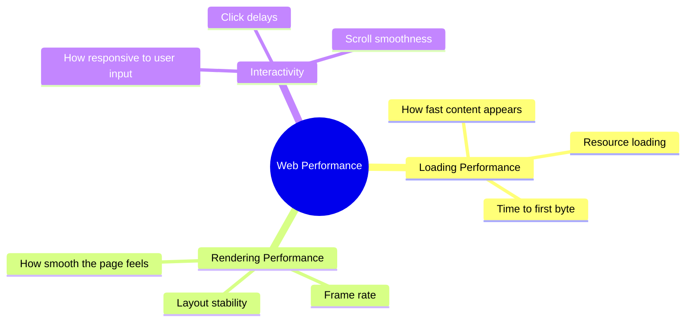

---

## 1.2 Core Web Vitals Explained

**Core Web Vitals** are Google's official metrics for measuring user experience. They directly affect your SEO ranking!

### The Big Three (Core Web Vitals)

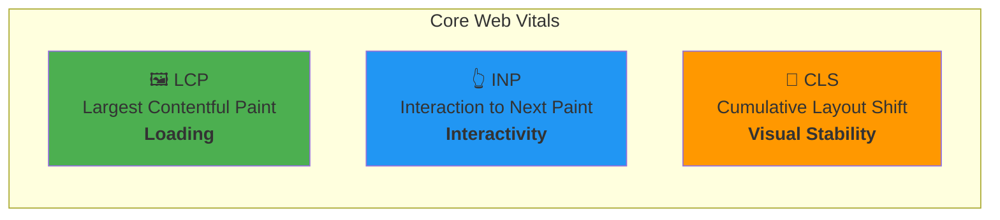

---

### 1.2.1 LCP (Largest Contentful Paint) 🖼️

**What it measures:** How long it takes for the BIGGEST visible content element to appear on screen.

**Target:** Under **2.5 seconds**

```
Timeline:
|-------- Page Load --------|
[0s]----[1s]----[2s]----[3s]----[4s]
    🟢      🟢      🟡      🔴
   Good    Good   Needs   Poor
                  Work
```

**What counts as LCP element?**

- Large images
- Video poster images
- Background images (via CSS)
- Large text blocks

**Example - What triggers LCP:**

```html
<!-- This hero image is likely your LCP element -->
<section class="hero">
    
    <h1>Welcome to Our Amazing Website</h1>
</section>
```

**How to improve LCP:**

```html
<!-- ❌ BAD: Slow LCP -->


<!-- ✅ GOOD: Optimized for fast LCP -->

```

```css
/* ❌ BAD: LCP image loaded via CSS (slower) */
.hero {
    background-image: url('hero.jpg');
}

/* ✅ GOOD: Use  tag for LCP images instead */
```

---

### 1.2.2 INP (Interaction to Next Paint) 👆

**What it measures:** How quickly your page responds when users click, tap, or type.

> **Note:** INP replaced FID (First Input Delay) in March 2024 as a Core Web Vital.

**Target:** Under **200 milliseconds**

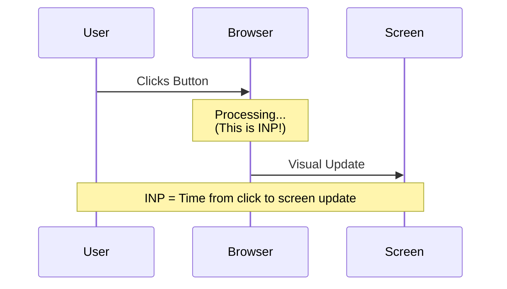

**Score Breakdown:**

| INP Score | Rating |
|-----------|--------|
| ≤ 200ms | 🟢 Good |
| 200-500ms | 🟡 Needs Improvement |
| > 500ms | 🔴 Poor |

**Example - Good vs Bad Interactivity:**

```javascript
// ❌ BAD: Blocks the main thread, causes high INP
button.addEventListener('click', () => {
    // Huge computation that takes 500ms
    for (let i = 0; i < 10000000; i++) {
        heavyCalculation(i);
    }
    updateUI();
});

// ✅ GOOD: Break up work, keeps INP low
button.addEventListener('click', async () => {
    // Show immediate feedback
    button.textContent = 'Processing...';
    
    // Defer heavy work
    await scheduler.yield(); // Let browser breathe
    
    // Do work in chunks
    for (let i = 0; i < 100; i++) {
        await processChunk(i);
        await scheduler.yield();
    }
    updateUI();
});
```

---

### 1.2.3 CLS (Cumulative Layout Shift) 📐

**What it measures:** How much the page content unexpectedly moves around while loading.

**Target:** Under **0.1**

**Visual Example of Layout Shift:**

```
BEFORE SHIFT:              AFTER SHIFT (BAD!):
┌──────────────────┐       ┌──────────────────┐
│     Header       │       │     Header       │
├──────────────────┤       ├──────────────────┤
│                  │       │   [AD LOADED]    │ ← Pushed content down!
│  Article Text    │       ├──────────────────┤
│  you're reading  │       │                  │
│                  │       │  Article Text    │
│                  │       │  you're reading  │
└──────────────────┘       └──────────────────┘

User was about to click here ↑ but content moved!
```

**Common Causes & Fixes:**

```html
<!-- ❌ BAD: No dimensions, causes layout shift -->


<!-- ✅ GOOD: Always specify dimensions -->

```

```css
/* ❌ BAD: Dynamic content without reserved space */
.ad-container {
    /* No height specified, shifts content when ad loads */
}

/* ✅ GOOD: Reserve space for dynamic content */
.ad-container {
    min-height: 250px; /* Reserve expected ad height */
    aspect-ratio: 16 / 9; /* Or use aspect-ratio */
}
```

---

## 1.3 Other Important Metrics

### FCP (First Contentful Paint) 🎨

**What it measures:** When the first piece of content appears (text, image, anything).

```
|-------- Page Load Timeline --------|
[0s]                              [3s]
  │                                 │
  │  BLANK → │█ FCP → ███████ LCP  │
  │          │                      │
  └──────────┴──────────────────────┘
             ↑
        First content appears here
```

**Target:** Under **1.8 seconds**

---

### TTFB (Time to First Byte) 📡

**What it measures:** How long until the browser receives the FIRST byte of data from the server.

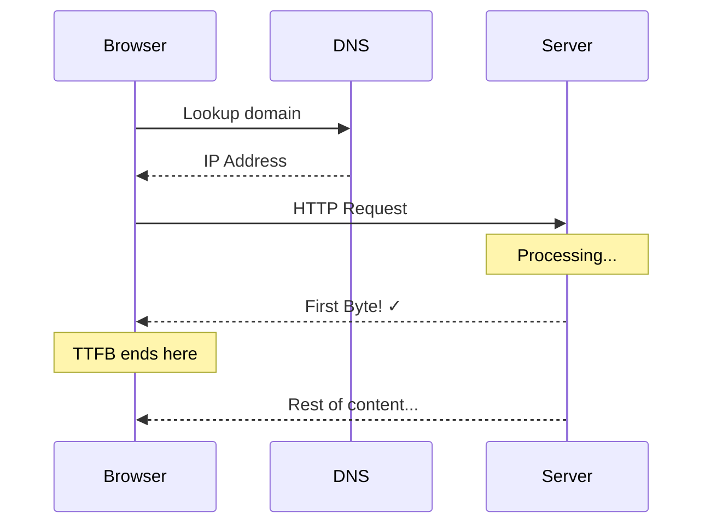

**Target:** Under **800 milliseconds**

**What affects TTFB:**

- Server location (use CDN!)
- Server processing time
- Database queries
- Network latency

---

## 1.4 Complete Performance Metrics Timeline

```mermaid
gantt
    title Page Load Timeline
    dateFormat X
    axisFormat %s
    
    section Server
    TTFB           :ttfb, 0, 800
    
    section Rendering
    FCP            :fcp, 800, 1800
    LCP            :lcp, 1800, 2500
    
    section Interaction
    Page Interactive :done, 2500, 3000
    INP Measured    :active, 3000, 5000
    
    section Stability
    CLS Monitored   :crit, 0, 5000
```

---

## 1.5 Quick Reference: All Metrics at a Glance

| Metric | Measures | Good | Needs Work | Poor |
|--------|----------|------|------------|------|
| **LCP** | Loading | ≤ 2.5s | 2.5-4s | > 4s |
| **INP** | Interactivity | ≤ 200ms | 200-500ms | > 500ms |
| **CLS** | Stability | ≤ 0.1 | 0.1-0.25 | > 0.25 |
| **FCP** | First Paint | ≤ 1.8s | 1.8-3s | > 3s |
| **TTFB** | Server Response | ≤ 800ms | 800-1800ms | > 1800ms |

---

## 1.6 Key Takeaways ✨

1. **LCP** = Make the biggest element load fast (optimize hero images!)
2. **INP** = Keep JavaScript work small and chunked
3. **CLS** = Always set image/ad dimensions
4. **FCP** = Get SOMETHING on screen quickly
5. **TTFB** = Use fast servers and CDNs

> **Remember:** Core Web Vitals affect your Google ranking. Optimize them to rank higher!

---

# Section 2: Performance Measurement Tools

## 2.1 Overview: Your Performance Toolkit

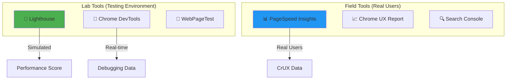

**Lab vs Field Data:**

- **Lab Data:** Tests run on a controlled machine (good for debugging)
- **Field Data:** Data from real users (shows actual experience)

---

## 2.2 Lighthouse: Complete Guide

### What is Lighthouse?

Lighthouse is Google's official auditing tool built into Chrome. It gives you a performance score and tells you exactly what to fix.

### How to Run Lighthouse

**Method 1: Chrome DevTools (Recommended)**

```
Step 1: Open Chrome
Step 2: Press F12 (or Ctrl+Shift+I) to open DevTools
Step 3: Go to "Lighthouse" tab
Step 4: Select categories (Performance, SEO, etc.)
Step 5: Click "Analyze page load"
```

**Method 2: Command Line**

```bash
# Install Lighthouse globally
npm install -g lighthouse

# Run audit
lighthouse https://example.com --output html --output-path report.html

# Run with specific settings
lighthouse https://example.com --preset=desktop --output json
```

**Method 3: PageSpeed Insights**
Just paste your URL at [pagespeed.web.dev](https://pagespeed.web.dev)

---

### Understanding Lighthouse Scores

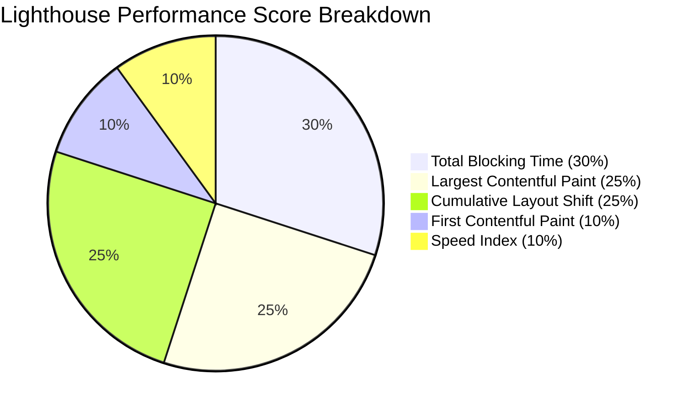

**Score Ranges:**

| Score | Color | Meaning |
|-------|-------|---------|
| 90-100 | 🟢 Green | Excellent |
| 50-89 | 🟠 Orange | Needs Improvement |
| 0-49 | 🔴 Red | Poor |

---

### Reading Lighthouse Results

**1. Opportunities Section** - Things to fix for faster loading:

```
┌─────────────────────────────────────────────────────────┐
│ ⚠️ OPPORTUNITY                          │ SAVINGS      │
├─────────────────────────────────────────────────────────┤
│ Serve images in next-gen formats        │ 1.2s         │
│ Eliminate render-blocking resources     │ 0.8s         │
│ Reduce unused JavaScript                │ 0.5s         │
│ Properly size images                    │ 0.3s         │
└─────────────────────────────────────────────────────────┘
```

**2. Diagnostics Section** - Additional insights:

```
┌─────────────────────────────────────────────────────────┐
│ ℹ️ DIAGNOSTIC                                           │
├─────────────────────────────────────────────────────────┤
│ Avoid enormous network payloads (5.2 MB total)         │
│ Serve static assets with efficient cache policy        │
│ Avoid long main-thread tasks (3 tasks > 50ms)          │
│ Minimize third-party usage (500ms blocked)             │
└─────────────────────────────────────────────────────────┘
```

---

### Lighthouse Auditing Workflow

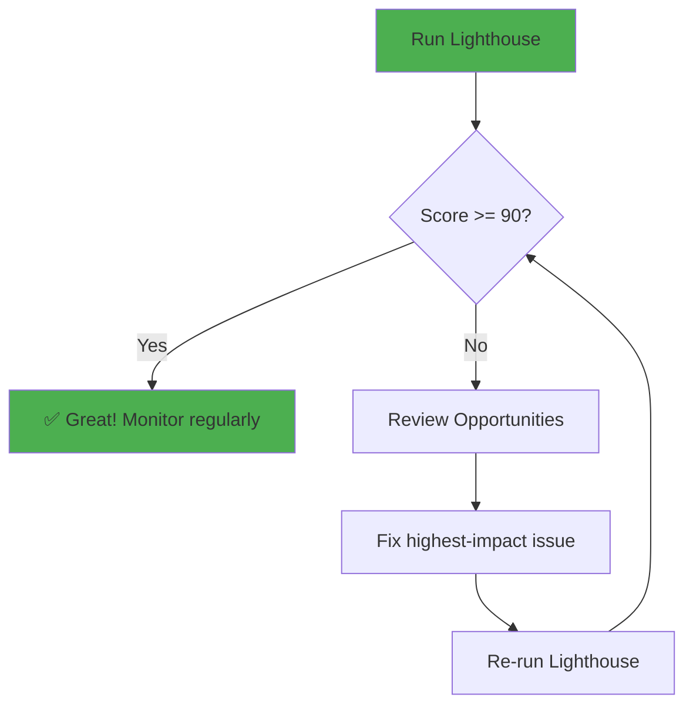

---

## 2.3 Chrome DevTools: Network Tab

The Network tab shows every file your page loads. This is where you find heavy, slow, or blocking resources.

### Opening Network Tab

```
1. Press F12 to open DevTools
2. Click "Network" tab
3. Refresh the page (Ctrl+R)
4. Watch all requests appear!
```

### Understanding the Waterfall

```
Network Waterfall Visualization:

┌─ File Name ────────┬─ Waterfall ──────────────────────────┐
│                    │ 0ms    500ms   1000ms  1500ms  2000ms│
├────────────────────┼──────────────────────────────────────┤
│ index.html         │ ██░░░░░░░░░░░░░░░░░░░░░░░░░░░░░░░░   │
│ styles.css         │    ███████░░░░░░░░░░░░░░░░░░░░░░░░   │ ← Blocks rendering!
│ bundle.js          │    ████████████░░░░░░░░░░░░░░░░░░░   │ ← Blocks parsing!
│ hero.jpg           │           ██████████████░░░░░░░░░░   │
│ font.woff2         │              ████████░░░░░░░░░░░░░   │
│ analytics.js       │                   ██████░░░░░░░░░░   │
└────────────────────┴──────────────────────────────────────┘

Legend:
██ = Downloading
░░ = Waiting/Idle
```

### Key Network Tab Columns

| Column | What It Shows | Look For |
|--------|--------------|----------|
| **Name** | File name | Large files |
| **Status** | HTTP code | 404 errors |
| **Type** | File type | Heavy JS |
| **Size** | File size | > 500KB files |
| **Time** | Load time | > 500ms files |
| **Waterfall** | Timeline | Long bars |

### Finding Heavy Files

```
Quick Filters in Network Tab:

[All] [Fetch/XHR] [JS] [CSS] [Img] [Media] [Font] [Doc]

1. Click "JS" to see only JavaScript files
2. Click "Size" column header to sort by size
3. Look for files > 100KB
4. Click file to see details in sidebar
```

**Identifying Problem Files:**

```javascript
// Questions to ask for each large file:

// 1. Is this file necessary?
//    - Remove unused libraries

// 2. Can it be smaller?
//    - Minify, compress, split

// 3. Can it load later?  
//    - Use async/defer, lazy load

// 4. Is it blocking rendering?
//    - Move to bottom, defer
```

---

### Network Tab: Throttling

Test your site on slow connections:

```
DevTools → Network Tab → No throttling ▼

Options:
├── No throttling (default)
├── Fast 3G (562.5 kbps, 150ms latency)
├── Slow 3G (376 kbps, 2000ms latency)  ← Test with this!
└── Offline
```

---

## 2.4 Chrome DevTools: Performance Tab

The Performance tab records everything that happens during page load.

### Recording a Performance Profile

```
Steps:
1. Open DevTools → Performance tab
2. Click 🔴 Record button
3. Refresh the page
4. Stop recording after page loads
5. Analyze the flamegraph
```

### Understanding the Flamegraph

```
Performance Flamegraph Structure:

┌─ Frames ────────────────────────────────────────────────┐
│ ░░░░░░░░░░░░░░░░░░░░░░░░░░░░░░░░░░░░░░░░░░░░░░░░░░░░░░ │
├─ Main Thread ───────────────────────────────────────────┤
│ ████████ Parse HTML                                     │
│     ████ Evaluate Script (bundle.js)  ← Long task!     │
│         ██ Compile Script                              │
│     ████████████████ Evaluate Script  ← Very long task!│
│                      ██ Recalculate Style              │
│                        ███ Layout                      │
│                            █ Paint                     │
├─ Network ───────────────────────────────────────────────┤
│ ██ html  ████ css  ████████ js  ████████ images        │
└─────────────────────────────────────────────────────────┘
```

### Identifying Long Tasks

**What's a Long Task?**
Any task taking more than 50ms blocks the main thread.

```
Long Task Example in Performance Tab:

┌─────────────────────────────────────────────────────────┐
│ Main Thread                                             │
│                                                         │
│ ██████████████████████ [Red corner = Long Task!]       │
│ ↑                                                       │
│ This script took 350ms - BLOCKING user interaction!    │
└─────────────────────────────────────────────────────────┘
```

**Finding Long Tasks:**

```javascript
// Look for these in Performance tab:
// - Red triangles in the corners (long tasks)
// - Tall flame chart bars (heavy functions)
// - Purple bars during idle time (blocking)
```

---

## 2.5 Chrome DevTools: Coverage Tab

Find unused CSS and JavaScript!

### Using Coverage Tool

```
Steps:
1. Press Ctrl+Shift+P (Command palette)
2. Type "coverage" and select "Show Coverage"
3. Click 🔴 to start recording
4. Refresh the page
5. See unused code highlighted in RED
```

### Reading Coverage Results

```
Coverage Results:

┌─ URL ──────────────────────┬─ Unused Bytes ─┬─ Usage ─┐
│ styles.css                 │ 45.2 KB        │  ███░░  │ 60% used
│ bundle.js                  │ 120.5 KB       │  ██░░░  │ 40% used  ← Problem!
│ vendor.js                  │ 80.3 KB        │  █░░░░  │ 20% used  ← Big problem!
└────────────────────────────┴────────────────┴─────────┘

Click a file to see line-by-line usage:
- 🟢 Green = Used code (keep it)
- 🔴 Red = Unused code (remove it!)
```

---

## 2.6 PageSpeed Insights

### What Makes It Special?

PageSpeed Insights shows **real user data** (CrUX) + **lab data** (Lighthouse).

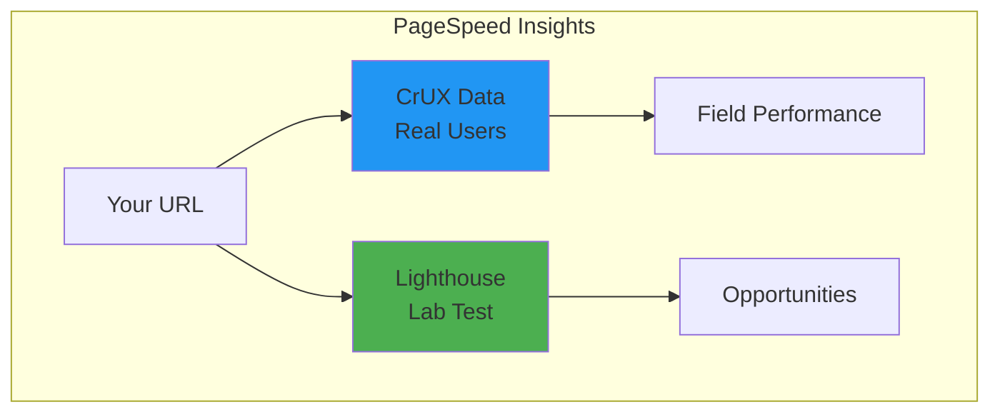

### Reading PSI Results

```
┌─────────────────────────────────────────────────────────┐
│  📊 FIELD DATA (Real Users - Last 28 days)             │
├─────────────────────────────────────────────────────────┤
│  FCP: 1.2s 🟢   LCP: 2.1s 🟢   CLS: 0.05 🟢           │
│  INP: 180ms 🟢  TTFB: 0.6s 🟢                          │
├─────────────────────────────────────────────────────────┤
│  📱 Mobile: 78  💻 Desktop: 95                         │
└─────────────────────────────────────────────────────────┘
                           ↓
┌─────────────────────────────────────────────────────────┐
│  🔬 LAB DATA (Simulated Test)                          │
├─────────────────────────────────────────────────────────┤
│  Performance Score: 72                                  │
│  See Opportunities & Diagnostics below...              │
└─────────────────────────────────────────────────────────┘
```

---

## 2.7 WebPageTest

### Why Use WebPageTest?

- Test from real locations worldwide
- Test on real devices
- Video comparison
- Detailed waterfall charts

### WebPageTest Results

```
Visual Progress Timeline:

0.0s   0.5s   1.0s   1.5s   2.0s   2.5s   3.0s
  │      │      │      │      │      │      │
  ▼      ▼      ▼      ▼      ▼      ▼      ▼
[___] [░░░] [▓▓▓] [███] [███] [███] [███]
Blank  TTFB   FCP   Loading...        LCP

Start Render: 0.8s
First Contentful Paint: 1.1s
Largest Contentful Paint: 2.3s
```

---

## 2.8 Tool Comparison & When to Use Each

| Tool | Best For | Data Type |
|------|----------|-----------|
| **Lighthouse** | Quick audits, debugging | Lab |
| **Network Tab** | Finding slow/heavy files | Lab |
| **Performance Tab** | Finding JavaScript bottlenecks | Lab |
| **Coverage Tab** | Finding unused code | Lab |
| **PageSpeed Insights** | Real user data + quick test | Field + Lab |
| **WebPageTest** | Deep analysis, comparisons | Lab |

---

## 2.9 Key Takeaways ✨

1. **Lighthouse first** – Run it for an overall health check
2. **Network tab** – Find heavy and blocking files
3. **Performance tab** – Find slow JavaScript
4. **Coverage tab** – Find unused CSS/JS
5. **PageSpeed Insights** – See real user experience
6. **Always test on slow connections** – Enable throttling!

---

# Section 3: Critical Rendering Path

## 3.1 What is the Critical Rendering Path?

The **Critical Rendering Path (CRP)** is the sequence of steps the browser takes to convert your HTML, CSS, and JavaScript into pixels on the screen.

> **Think of it like this:** You give the browser a recipe (code), and it follows steps to cook (render) the final dish (webpage).

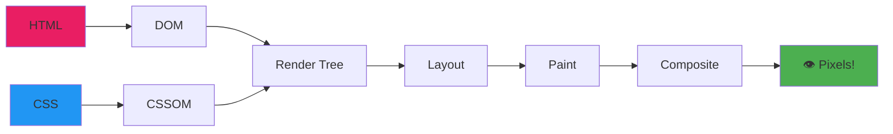

---

## 3.2 Step-by-Step: How Browsers Render Pages

### Step 1: Parse HTML → Build DOM

The browser reads HTML and creates a **Document Object Model (DOM)** tree.

```html
<!-- HTML Code -->
<html>
  <head>
    <title>My Page</title>
  </head>
  <body>
    <div class="container">
      <h1>Hello World</h1>
      <p>Welcome!</p>
    </div>
  </body>
</html>
```

```
DOM Tree Visualization:

                  Document
                     │
                   <html>
                   /    \
              <head>    <body>
                │          │
             <title>   <div.container>
                │        /      \
            "My Page"  <h1>      <p>
                        │         │
                   "Hello"    "Welcome!"
```

**Key Points:**

- DOM construction is **incremental** (starts immediately)
- Each HTML tag becomes a **node**
- Nodes form a **tree structure**

---

### Step 2: Parse CSS → Build CSSOM

The browser reads CSS and creates a **CSS Object Model (CSSOM)** tree.

```css
/* CSS Code */
body {
    font-family: Arial;
}
.container {
    max-width: 800px;
    margin: 0 auto;
}
h1 {
    color: blue;
    font-size: 32px;
}
p {
    color: gray;
}
```

```
CSSOM Tree Visualization:

                    body
           font-family: Arial
                    │
              .container
          max-width: 800px
           margin: 0 auto
               /       \
             h1          p
        color: blue   color: gray
       font-size: 32px
```

> ⚠️ **Important:** CSS is **render-blocking!** The browser won't paint anything until CSSOM is complete.

---

### Step 3: Combine DOM + CSSOM → Render Tree

The browser combines DOM and CSSOM to create the **Render Tree** – only visible elements!

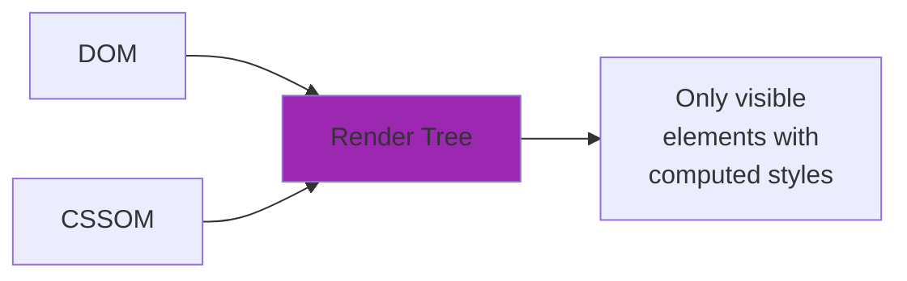

**What's NOT in the Render Tree:**

- `<head>` and its contents
- `<script>` tags
- Elements with `display: none`
- Hidden elements

```html
<!-- DOM has all of these... -->
<head><title>Hi</title></head>        <!-- Not in Render Tree -->
<body>
    <div style="display: none">X</div> <!-- Not in Render Tree -->
    <h1>Hello</h1>                      <!-- IN Render Tree! -->
    <p>World</p>                        <!-- IN Render Tree! -->
</body>
```

---

### Step 4: Layout (Reflow)

The browser calculates the **exact position and size** of every element.

```
Layout Calculation:

┌─ Viewport (1200px wide) ────────────────────────────────┐
│                                                         │
│  ┌─ .container (800px, centered) ─────────────────────┐ │
│  │                                                    │ │
│  │  ┌─ h1 (full width, 40px tall) ──────────────────┐ │ │
│  │  │ Hello World                                    │ │ │
│  │  └────────────────────────────────────────────────┘ │ │
│  │                                                    │ │
│  │  ┌─ p (full width, 20px tall) ───────────────────┐ │ │
│  │  │ Welcome!                                       │ │ │
│  │  └────────────────────────────────────────────────┘ │ │
│  │                                                    │ │
│  └────────────────────────────────────────────────────┘ │
│                                                         │
└─────────────────────────────────────────────────────────┘
```

**Layout is triggered by:**

- Initial page load
- Window resize
- DOM changes (adding/removing elements)
- CSS changes affecting size/position

---

### Step 5: Paint

The browser fills in **pixels** – colors, text, images, borders, shadows.

```
Paint Layers:

Layer 1: Background colors
Layer 2: Background images
Layer 3: Borders
Layer 4: Text
Layer 5: Outlines
```

---

### Step 6: Composite

For complex pages, the browser divides content into **layers** and combines them.

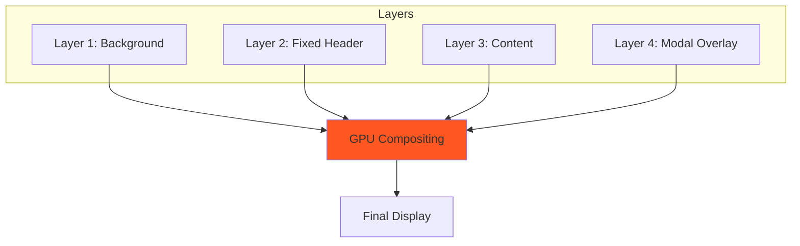

**Elements that get their own layer:**

- Elements with `transform` or `opacity` animations
- `position: fixed` elements
- `<video>` and `<canvas>`
- Elements with `will-change` property

---

## 3.3 Complete Rendering Pipeline

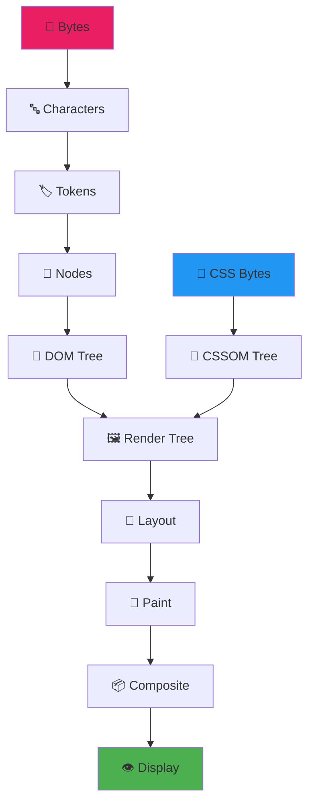

---

## 3.4 Render-Blocking Resources

### What Blocks Rendering?

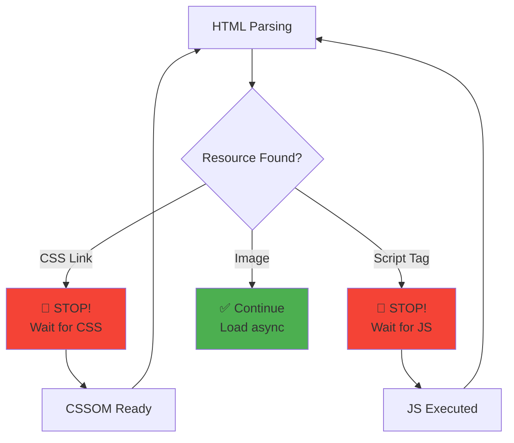

### CSS is Render-Blocking

```html
<!-- ❌ PROBLEM: CSS blocks rendering -->
<head>
    <link rel="stylesheet" href="all-styles.css"> <!-- 500KB! -->
    <!-- Nothing renders until this loads -->
</head>
```

```html
<!-- ✅ SOLUTION: Critical CSS inline, rest async -->
<head>
    <!-- Critical CSS inline (above-the-fold styles) -->
    <style>
        .hero { height: 100vh; background: blue; }
        .nav { position: fixed; top: 0; }
    </style>
    
    <!-- Non-critical CSS loaded async -->
    <link rel="preload" href="other-styles.css" as="style" 
          onload="this.onload=null;this.rel='stylesheet'">
    <noscript><link rel="stylesheet" href="other-styles.css"></noscript>
</head>
```

---

### JavaScript is Parser-Blocking

```html
<!-- ❌ PROBLEM: JS blocks HTML parsing -->
<head>
    <script src="huge-bundle.js"></script>
    <!-- HTML parsing STOPS until JS downloads and executes -->
</head>
```

**How different script loading works:**

```mermaid
gantt
    title Script Loading Comparison
    dateFormat X
    axisFormat %s
    
    section Normal
    HTML Parsing    :a1, 0, 2
    JS Download     :a2, 2, 4
    JS Execute      :a3, 4, 5
    Continue Parse  :a4, 5, 7
    
    section Async
    HTML Parsing    :b1, 0, 7
    JS Download     :b2, 0, 2
    JS Execute      :crit, b3, 2, 3
    
    section Defer
    HTML Parsing    :c1, 0, 5
    JS Download     :c2, 0, 2
    JS Execute      :c3, 5, 6
```

```html
<!-- ❌ Normal: Blocks parsing -->
<script src="app.js"></script>

<!-- ✅ Async: Download parallel, execute when ready -->
<script src="analytics.js" async></script>

<!-- ✅✅ Defer: Download parallel, execute after DOM ready -->
<script src="app.js" defer></script>
```

**When to use each:**

| Attribute | Download | Execute | Best For |
|-----------|----------|---------|----------|
| (none) | Blocks | Immediately | Rarely needed |
| `async` | Parallel | When ready | Analytics, ads |
| `defer` | Parallel | After DOM | App scripts |

---

## 3.5 Optimizing the Critical Rendering Path

### Strategy 1: Minimize Critical Resources

```html
<!-- ❌ BEFORE: 5 render-blocking resources -->
<head>
    <link rel="stylesheet" href="reset.css">
    <link rel="stylesheet" href="typography.css">
    <link rel="stylesheet" href="layout.css">
    <link rel="stylesheet" href="components.css">
    <link rel="stylesheet" href="utilities.css">
</head>

<!-- ✅ AFTER: 1 render-blocking resource -->
<head>
    <link rel="stylesheet" href="critical.min.css">
</head>
```

### Strategy 2: Minimize Critical Path Length

**Critical Path Length** = Number of round trips needed to render.

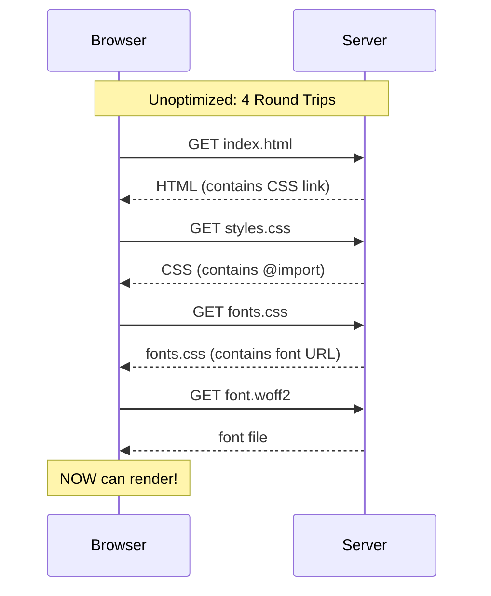

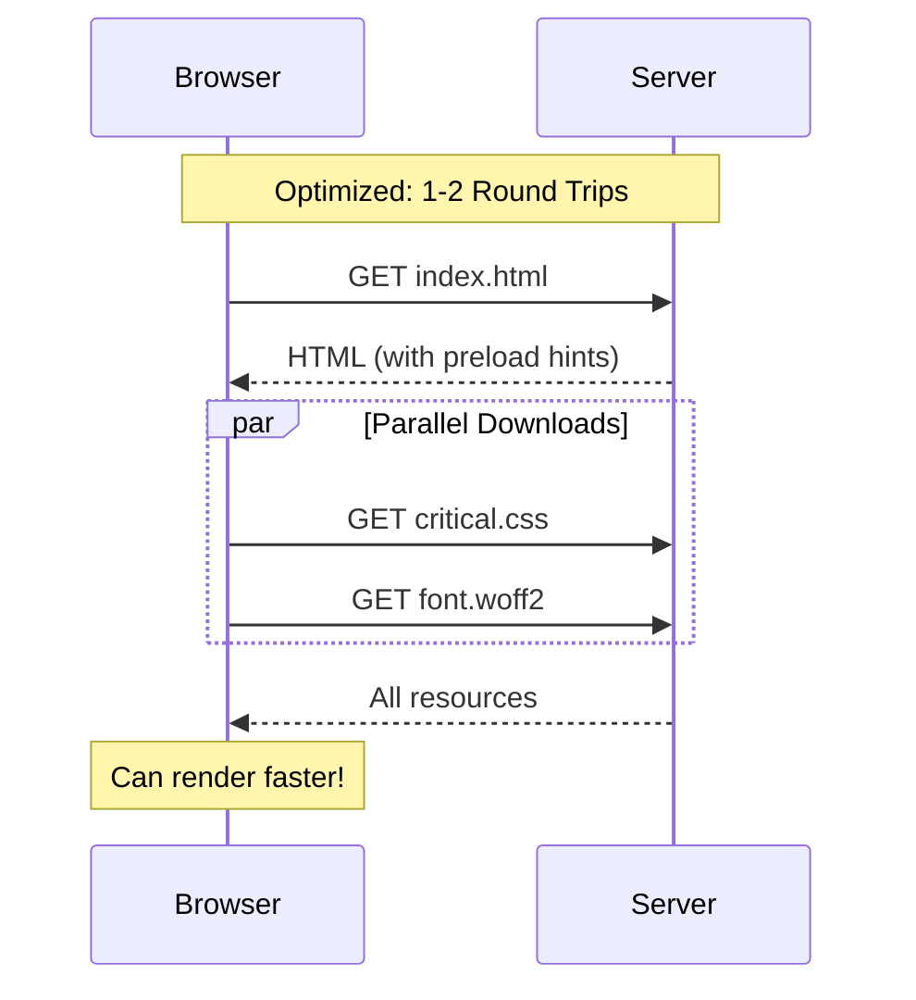

```html
<!-- ✅ Preload critical resources -->
<head>
    <link rel="preload" href="critical.css" as="style">
    <link rel="preload" href="font.woff2" as="font" type="font/woff2" crossorigin>
    <link rel="stylesheet" href="critical.css">
</head>
```

### Strategy 3: Minimize Critical Bytes

```html
<!-- ❌ BEFORE: 500KB of CSS -->
<head>
    <link rel="stylesheet" href="everything.css">
</head>

<!-- ✅ AFTER: 15KB critical CSS -->
<head>
    <style>
        /* Only above-the-fold styles - 15KB */
        .hero { /* ... */ }
        .nav { /* ... */ }
    </style>
    <link rel="stylesheet" href="rest.css" media="print" 
          onload="this.media='all'">
</head>
```

---

## 3.6 Visualizing the Critical Path

```
Unoptimized Critical Path:
┌─────────────────────────────────────────────────────────┐
│                                                         │
│  [HTML]─────►[CSS #1]─────►[CSS #2]─────►[JS]─────►🖼️  │
│        wait       wait         wait                     │
│                                                         │
│  Total Time: ████████████████████████████ (4+ seconds) │
└─────────────────────────────────────────────────────────┘

Optimized Critical Path:
┌─────────────────────────────────────────────────────────┐
│                                                         │
│  [HTML + Inline CSS]─────►🖼️                           │
│                                                         │
│  [Other CSS]────► (async, after paint)                 │
│  [JS defer]─────► (after DOM)                          │
│                                                         │
│  Total Time: ████████ (< 2 seconds)                    │
└─────────────────────────────────────────────────────────┘
```

---

## 3.7 CRP Checklist

```
✅ Critical Rendering Path Optimization Checklist:

□ Inline critical CSS (above-the-fold styles)
□ Load non-critical CSS asynchronously
□ Use 'defer' or 'async' for JavaScript
□ Move <script> tags to bottom of <body>
□ Preload critical resources (fonts, hero images)
□ Avoid CSS @import (use <link> instead)
□ Minimize/combine CSS files
□ Remove unused CSS
□ Minimize JavaScript bundle size
□ Use code splitting for large apps
```

---

## 3.8 Key Takeaways ✨

1. **CSS blocks rendering** → Inline critical CSS, async the rest
2. **JavaScript blocks parsing** → Use `defer` for main scripts
3. **Minimize round trips** → Preload critical resources
4. **Minimize bytes** → Only load what's needed for first paint
5. **DOM + CSSOM → Render Tree → Layout → Paint** is the path

> **Golden Rule:** Get your first paint as fast as possible, then progressively enhance!

---

# Section 4: HTML Optimization

## 4.1 Why HTML Optimization Matters

HTML is the **foundation** of your webpage. Optimized HTML means:

- Faster parsing by the browser
- Better accessibility and SEO
- Smoother integration with CSS and JavaScript

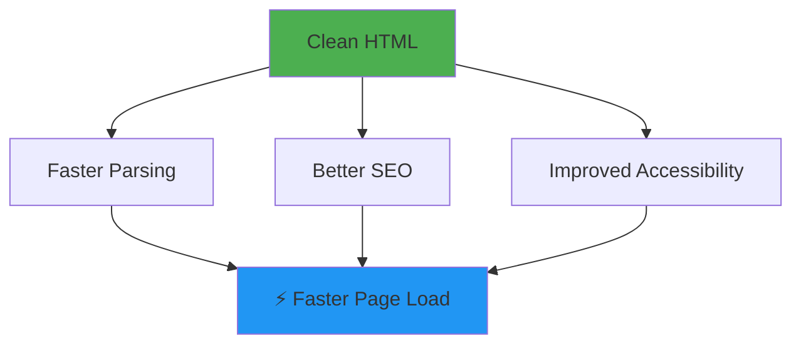

---

## 4.2 Semantic HTML for Performance

**Semantic HTML** uses meaningful tags that tell browsers AND search engines what content means.

### Why Semantic HTML is Faster

1. **Browser optimizations** – Browsers know how to handle `<nav>`, `<main>`, `<article>` efficiently
2. **Less CSS needed** – Semantic elements have default styling
3. **Better parsing** – Clear document structure

```html
<!-- ❌ BAD: Non-semantic (slower, harder to parse) -->
<div class="header">
    <div class="nav">
        <div class="nav-item">Home</div>
        <div class="nav-item">About</div>
    </div>
</div>
<div class="main-content">
    <div class="article">
        <div class="title">My Article</div>
        <div class="text">Content here...</div>
    </div>
</div>
<div class="footer">
    <div class="copyright">© 2024</div>
</div>
```

```html
<!-- ✅ GOOD: Semantic (faster, meaningful) -->
<header>
    <nav>
        <a href="/">Home</a>
        <a href="/about">About</a>
    </nav>
</header>
<main>
    <article>
        <h1>My Article</h1>
        <p>Content here...</p>
    </article>
</main>
<footer>
    <small>© 2024</small>
</footer>
```

### Semantic Elements Cheat Sheet

| Element | Use For |
|---------|---------|
| `<header>` | Page or section header |
| `<nav>` | Navigation links |
| `<main>` | Main content (one per page!) |
| `<article>` | Self-contained content |
| `<section>` | Grouped related content |
| `<aside>` | Sidebar content |
| `<footer>` | Page or section footer |
| `<figure>` | Images with captions |
| `<time>` | Dates and times |

---

## 4.3 Resource Hints: Preload, Prefetch, Preconnect

Resource hints tell the browser to **prepare resources ahead of time**.

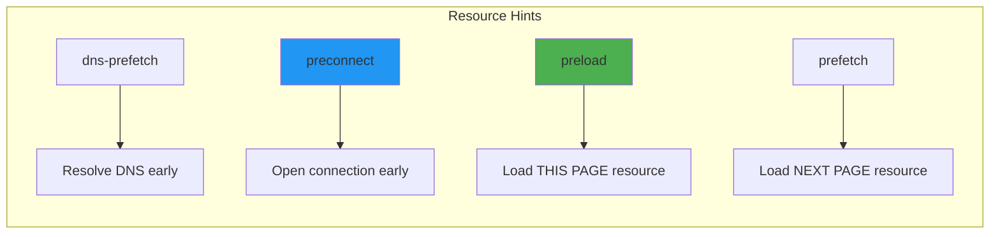

---

### 4.3.1 Preload (High Priority - Current Page)

Use `preload` for resources needed **immediately on this page**.

```html
<head>
    <!-- Preload critical CSS -->
    <link rel="preload" href="critical.css" as="style">
    
    <!-- Preload hero image (likely LCP element) -->
    <link rel="preload" href="hero.webp" as="image">
    
    <!-- Preload critical font -->
    <link rel="preload" href="font.woff2" as="font" type="font/woff2" crossorigin>
    
    <!-- Preload main JavaScript -->
    <link rel="preload" href="app.js" as="script">
</head>
```

**The `as` attribute is required:**

| `as` Value | Resource Type |
|------------|---------------|
| `style` | CSS files |
| `script` | JavaScript files |
| `font` | Font files |
| `image` | Images |
| `fetch` | API requests |

> ⚠️ **Warning:** Only preload what you'll actually use immediately. Over-preloading wastes bandwidth!

---

### 4.3.2 Prefetch (Low Priority - Next Page)

Use `prefetch` for resources needed on **future pages**.

```html
<head>
    <!-- User will likely click "About" page next -->
    <link rel="prefetch" href="/about.html">
    
    <!-- Prefetch JavaScript for next page -->
    <link rel="prefetch" href="/about.js" as="script">
</head>
```

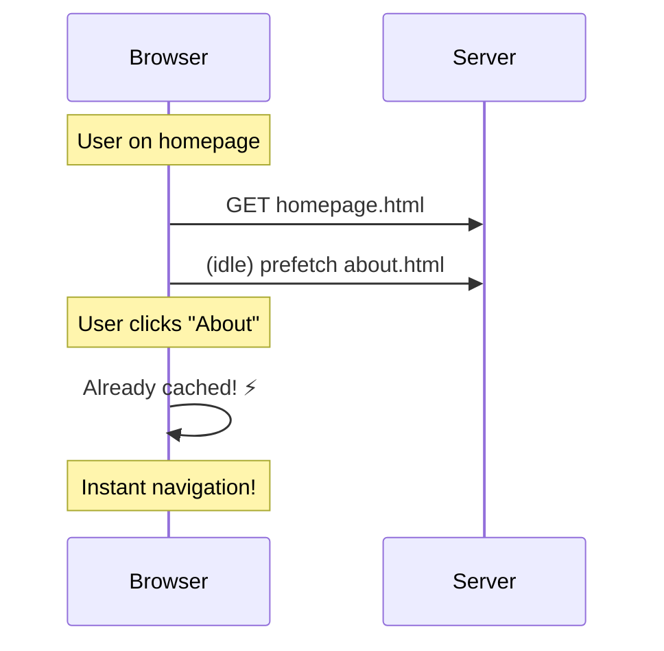

---

### 4.3.3 Preconnect (Establish Connection Early)

Use `preconnect` to establish connections to third-party domains **before you need them**.

```html
<head>
    <!-- Preconnect to CDN -->
    <link rel="preconnect" href="https://cdn.example.com">
    
    <!-- Preconnect to Google Fonts -->
    <link rel="preconnect" href="https://fonts.googleapis.com">
    <link rel="preconnect" href="https://fonts.gstatic.com" crossorigin>
    
    <!-- Preconnect to API server -->
    <link rel="preconnect" href="https://api.example.com">
</head>
```

**What preconnect does:**

```
Normal Connection:                    With Preconnect:
                                     
[DNS]→[TCP]→[TLS]→[Request]          [DNS+TCP+TLS done early]
████████████████████████             ░░░░░░░░░░░░████
     ~300ms wasted                        0ms wait!
```

---

### 4.3.4 DNS-Prefetch (Lightest Hint)

Use `dns-prefetch` when you only need to **resolve the domain**.

```html
<head>
    <!-- Just resolve DNS, don't open connection -->
    <link rel="dns-prefetch" href="https://analytics.example.com">
</head>
```

> **Use dns-prefetch when:** You're not sure you'll use the domain, but might. It's cheap!

---

### 4.3.5 Resource Hints Summary

| Hint | When to Use | Priority | Example |
|------|-------------|----------|---------|
| `preload` | Critical resources for THIS page | High | Hero image, main font |
| `prefetch` | Resources for NEXT page | Low | Next page's JS |
| `preconnect` | Third-party domains you'll use | Medium | Google Fonts, CDN |
| `dns-prefetch` | Domains you might use | Lowest | Analytics |

---

## 4.4 Lazy Loading: Native HTML Approach

### Image Lazy Loading

The `loading="lazy"` attribute defers loading images until they're near the viewport.

```html
<!-- ❌ BAD: All images load immediately -->


<!-- ... 50 more images loading at once! -->

<!-- ✅ GOOD: Lazy load below-the-fold images -->
  <!-- Above fold: load immediately -->
  <!-- Below fold: lazy load -->


```

```mermaid
sequenceDiagram
    participant Browser
    participant Server
    
    Note over Browser: Page Load
    Browser->>Server: GET hero.jpg (eager)
    Note over Browser: Hero image loads
    
    Note over Browser: User scrolls...
    Browser->>Browser: Image approaching viewport
    Browser->>Server: GET image1.jpg (lazy)
    Note over Browser: Image loads just in time!
```

### Iframe Lazy Loading

```html
<!-- Lazy load embedded videos and maps -->
<iframe 
    src="https://www.youtube.com/embed/xyz" 
    loading="lazy"
    title="Video title">
</iframe>

<iframe 
    src="https://maps.google.com/..." 
    loading="lazy"
    title="Location map">
</iframe>
```

> **Important:** Don't lazy load LCP images! Your hero/main image should use `loading="eager"` (or omit the attribute).

---

## 4.5 The `fetchpriority` Attribute

Tell the browser which resources are **most important**.

```html
<!-- High priority: LCP element -->


<!-- Low priority: Below-the-fold images -->


<!-- High priority script -->
<script src="critical.js" fetchpriority="high"></script>

<!-- Low priority script -->
<script src="analytics.js" fetchpriority="low"></script>
```

**Priority values:**

| Value | When to Use |
|-------|-------------|
| `high` | LCP image, critical above-fold content |
| `low` | Below-fold images, non-critical resources |
| `auto` | Default (browser decides) |

---

## 4.6 Optimizing the Document Head

The `<head>` section should be lean and optimized.

```html
<!DOCTYPE html>
<html lang="en">
<head>
    <!-- 1. Character encoding FIRST (within first 1024 bytes) -->
    <meta charset="UTF-8">
    
    <!-- 2. Viewport for responsive design -->
    <meta name="viewport" content="width=device-width, initial-scale=1.0">
    
    <!-- 3. Preconnect to critical origins -->
    <link rel="preconnect" href="https://fonts.googleapis.com">
    <link rel="preconnect" href="https://fonts.gstatic.com" crossorigin>
    
    <!-- 4. Preload critical resources -->
    <link rel="preload" href="critical.css" as="style">
    <link rel="preload" href="font.woff2" as="font" type="font/woff2" crossorigin>
    
    <!-- 5. Critical CSS (inline) -->
    <style>
        /* Minimal above-the-fold styles */
        :root { --primary: #007bff; }
        body { margin: 0; font-family: system-ui; }
        .hero { min-height: 100vh; }
    </style>
    
    <!-- 6. Non-critical CSS (async) -->
    <link rel="stylesheet" href="styles.css" media="print" onload="this.media='all'">
    
    <!-- 7. Title and meta (for SEO) -->
    <title>Page Title</title>
    <meta name="description" content="Page description">
    
    <!-- 8. Deferred JavaScript -->
    <script src="app.js" defer></script>
</head>
```

---

## 4.7 Avoiding Common HTML Mistakes

### Mistake 1: Missing Image Dimensions

```html
<!-- ❌ BAD: Causes layout shift (CLS) -->


<!-- ✅ GOOD: Dimensions prevent layout shift -->

```

### Mistake 2: Blocking Scripts in Head

```html
<!-- ❌ BAD: Blocks parsing -->
<head>
    <script src="huge-library.js"></script>
</head>

<!-- ✅ GOOD: Non-blocking -->
<head>
    <script src="huge-library.js" defer></script>
</head>
```

### Mistake 3: Too Many HTTP Requests

```html
<!-- ❌ BAD: 5 separate requests -->
<link rel="stylesheet" href="reset.css">
<link rel="stylesheet" href="grid.css">
<link rel="stylesheet" href="buttons.css">
<link rel="stylesheet" href="forms.css">
<link rel="stylesheet" href="utilities.css">

<!-- ✅ GOOD: 1 combined, minified request -->
<link rel="stylesheet" href="styles.min.css">
```

### Mistake 4: Not Using Responsive Images

```html
<!-- ❌ BAD: Same large image for all devices -->


<!-- ✅ GOOD: Responsive images -->

```

---

## 4.8 HTML Optimization Checklist

```
✅ HTML Optimization Checklist:

□ Use semantic HTML elements
□ Add width/height to all images
□ Use loading="lazy" for below-fold images
□ Use fetchpriority="high" for LCP image
□ Preload critical resources (fonts, hero image)
□ Preconnect to third-party domains
□ Inline critical CSS
□ Defer non-critical JavaScript
□ Minimize HTTP requests
□ Use responsive images with srcset
```

---

## 4.9 Key Takeaways ✨

1. **Semantic HTML** improves parsing speed and SEO
2. **Preload** critical resources, **prefetch** next-page resources
3. **Lazy load** images below the fold
4. **Always set dimensions** on images to prevent layout shifts
5. Structure your `<head>` for optimal loading order

---

# Section 5: CSS Optimization

## 5.1 Why CSS Performance Matters

CSS is **render-blocking** – the browser won't paint anything until CSS is parsed. Slow CSS = slow first paint!

```mermaid
graph LR
    A[HTML Parsed] --> B{CSS Ready?}
    B -->|No| C[⏳ Wait...]
    B -->|Yes| D[🎨 Render!]
    C --> B
    
    style C fill:#F44336
    style D fill:#4CAF50
```

**Impact of CSS on Performance:**

| Problem | Effect on Metrics |
|---------|------------------|
| Large CSS file | Slower FCP, LCP |
| Unused CSS | Wasted bandwidth |
| Complex selectors | Slower style calculation |
| Layout-triggering properties | Lower frame rate |

---

## 5.2 Critical CSS: The #1 CSS Optimization

**Critical CSS** is the minimum CSS needed to render above-the-fold content.

### The Problem

```
Traditional Loading:
[Download 500KB CSS] → [Parse all] → [Render]
████████████████████████████████████ (slow!)
```

### The Solution

```
Optimized Loading:
[Inline 15KB critical CSS] → [Render!] → [Load rest async]
████████ → 🎨 → ░░░░░░░░░░░░░░░░░░░░░
(fast first paint!)
```

### Implementing Critical CSS

```html
<!DOCTYPE html>
<html>
<head>
    <!-- Step 1: Inline critical CSS -->
    <style>
        /* Only above-the-fold styles (~15KB max) */
        * { margin: 0; padding: 0; box-sizing: border-box; }
        
        body {
            font-family: system-ui, sans-serif;
            line-height: 1.6;
        }
        
        .header {
            background: linear-gradient(135deg, #667eea, #764ba2);
            color: white;
            padding: 1rem 2rem;
            position: fixed;
            width: 100%;
            top: 0;
            z-index: 100;
        }
        
        .hero {
            min-height: 100vh;
            display: flex;
            align-items: center;
            justify-content: center;
            padding-top: 60px;
        }
        
        .hero h1 {
            font-size: clamp(2rem, 5vw, 4rem);
            text-align: center;
        }
    </style>
    
    <!-- Step 2: Load rest of CSS asynchronously -->
    <link rel="preload" href="styles.css" as="style" 
          onload="this.onload=null;this.rel='stylesheet'">
    <noscript>
        <link rel="stylesheet" href="styles.css">
    </noscript>
</head>
```

### Tools to Extract Critical CSS

```bash
# Using critical (npm package)
npm install -g critical

# Extract critical CSS
critical index.html --base ./ --inline --minify > index-critical.html

# Or with penthouse
npm install -g penthouse
penthouse https://example.com styles.css > critical.css
```

---

## 5.3 CSS Minification

**Minification** removes unnecessary characters from CSS.

### Before Minification (2.5KB)

```css
/* Main navigation styles */
.navigation {
    display: flex;
    justify-content: space-between;
    align-items: center;
    padding: 1rem 2rem;
    background-color: #ffffff;
    box-shadow: 0 2px 4px rgba(0, 0, 0, 0.1);
}

.navigation .logo {
    font-size: 1.5rem;
    font-weight: 700;
    color: #333333;
}

.navigation .menu {
    display: flex;
    gap: 2rem;
    list-style: none;
}
```

### After Minification (1.2KB - 52% smaller!)

```css
.navigation{display:flex;justify-content:space-between;align-items:center;padding:1rem 2rem;background-color:#fff;box-shadow:0 2px 4px rgba(0,0,0,.1)}.navigation .logo{font-size:1.5rem;font-weight:700;color:#333}.navigation .menu{display:flex;gap:2rem;list-style:none}
```

### Minification Tools

```bash
# Using cssnano (most popular)
npm install cssnano postcss-cli

# Create postcss.config.js
# module.exports = { plugins: [require('cssnano')] }

# Run minification
npx postcss styles.css -o styles.min.css

# Using clean-css
npm install -g clean-css-cli
cleancss -o styles.min.css styles.css
```

---

## 5.4 Removing Unused CSS

Most websites only use 20-40% of their CSS!

```mermaid
pie title Typical CSS Usage
    "Used CSS" : 30
    "Unused CSS" : 70
```

### Finding Unused CSS with Chrome DevTools

```
Steps:
1. Open DevTools (F12)
2. Press Ctrl+Shift+P
3. Type "Coverage" → Show Coverage
4. Click 🔴 Record
5. Refresh page and interact
6. See unused CSS in RED
```

### Removing Unused CSS with PurgeCSS

```bash
# Install PurgeCSS
npm install purgecss

# Create purgecss.config.js
```

```javascript
// purgecss.config.js
module.exports = {
    content: ['./src/**/*.html', './src/**/*.js'],
    css: ['./src/styles.css'],
    output: './dist/',
    
    // Don't remove these classes (dynamic classes)
    safelist: [
        'active',
        'is-open',
        'modal-open',
        /^data-/
    ]
};
```

```bash
# Run PurgeCSS
npx purgecss --config purgecss.config.js
```

### Before vs After PurgeCSS

```
Before: styles.css (245KB)
After:  styles.css (32KB)
Savings: 87%! 🎉
```

---

## 5.5 Efficient CSS Selectors

The browser reads selectors **right to left**. Complex selectors = slower matching.

### Selector Performance (Fastest to Slowest)

```css
/* 🟢 FASTEST: ID selector */
#header { }

/* 🟢 FAST: Class selector */
.header { }

/* 🟡 MEDIUM: Tag selector */
header { }

/* 🟡 MEDIUM: Attribute selector */
[type="text"] { }

/* 🔴 SLOW: Descendant selector (deep) */
.page .content .article .text p { }

/* 🔴 SLOW: Universal selector */
* { }

/* 🔴 SLOWEST: Complex pseudo-selectors */
div:nth-child(3n+1):not(.special) { }
```

### Optimizing Selectors

```css
/* ❌ BAD: Browser must check every <a> to see if it's in .nav in .header */
.header .nav ul li a { }

/* ✅ GOOD: Direct class - instant match */
.nav-link { }
```

```css
/* ❌ BAD: Overly specific, hard to override */
body div.container main article.post h2.title { }

/* ✅ GOOD: Simple and specific enough */
.post-title { }
```

### BEM Naming Convention

BEM (Block Element Modifier) creates efficient, flat selectors:

```css
/* BEM Structure */
.block { }
.block__element { }
.block--modifier { }

/* Example */
.card { }
.card__title { }
.card__image { }
.card--featured { }
.card--compact { }
```

```html
<article class="card card--featured">
    
    <h2 class="card__title">Title</h2>
</article>
```

---

## 5.6 CSS Containment

CSS Containment tells the browser **what parts of the page are independent**, so it can optimize rendering.

```css
/* The browser doesn't need to recalculate 
   outside elements when this changes */
.card {
    contain: layout style paint;
}

/* Shorthand for maximum containment */
.widget {
    contain: strict;
}

/* Content-aware containment (respects intrinsic size) */
.sidebar {
    contain: content;
}
```

### Containment Values

| Value | What It Contains |
|-------|-----------------|
| `layout` | Size and position |
| `style` | CSS counters and quotes |
| `paint` | Nothing paints outside |
| `size` | Size doesn't depend on children |
| `content` | `layout` + `style` + `paint` |
| `strict` | `layout` + `style` + `paint` + `size` |

---

## 5.7 Conditional CSS Loading with Media Queries

Load CSS only when needed!

```html
<!-- Only load on screens (not print) -->
<link rel="stylesheet" href="screen.css" media="screen">

<!-- Only load for print -->
<link rel="stylesheet" href="print.css" media="print">

<!-- Only load for large screens -->
<link rel="stylesheet" href="desktop.css" media="(min-width: 1024px)">

<!-- Only load for mobile -->
<link rel="stylesheet" href="mobile.css" media="(max-width: 768px)">

<!-- Only load if user prefers dark mode -->
<link rel="stylesheet" href="dark.css" media="(prefers-color-scheme: dark)">
```

> **Note:** Non-matching media queries load with **low priority**, so they don't block rendering!

---

## 5.8 Avoiding Layout Thrashing

**Layout thrashing** happens when JavaScript repeatedly reads and writes layout properties.

```javascript
// ❌ BAD: Layout thrashing (read-write-read-write)
const elements = document.querySelectorAll('.item');
elements.forEach(el => {
    const height = el.offsetHeight;  // READ (forces layout)
    el.style.height = height + 10 + 'px';  // WRITE (invalidates layout)
    // Next iteration: READ again (forces NEW layout)
});

// ✅ GOOD: Batch reads, then batch writes
const elements = document.querySelectorAll('.item');

// Batch all reads first
const heights = Array.from(elements).map(el => el.offsetHeight);

// Then batch all writes
elements.forEach((el, i) => {
    el.style.height = heights[i] + 10 + 'px';
});
```

### Properties That Trigger Layout

Avoid reading these in loops:

```
offsetTop, offsetLeft, offsetWidth, offsetHeight
scrollTop, scrollLeft, scrollWidth, scrollHeight
clientTop, clientLeft, clientWidth, clientHeight
getComputedStyle()
getBoundingClientRect()
```

---

## 5.9 `will-change` Property

Tell the browser to prepare for a change (creates a new compositor layer).

```css
/* ✅ Good: Preparing for animation */
.animated-element {
    will-change: transform;
}

/* After animation completes, remove it */
.animated-element.done {
    will-change: auto;
}
```

```css
/* ❌ BAD: Don't overuse! */
* {
    will-change: transform, opacity; /* Creates too many layers! */
}

/* ❌ BAD: Don't use for non-animating elements */
.static-element {
    will-change: transform; /* Waste of memory */
}
```

---

## 5.10 Modern CSS Performance Features

### CSS Layers (`@layer`)

Control specificity and organize CSS:

```css
/* Define layer order */
@layer reset, base, components, utilities;

/* Lower layers are overridden by higher layers */
@layer reset {
    * { margin: 0; padding: 0; }
}

@layer base {
    body { font-family: system-ui; }
}

@layer components {
    .btn { padding: 0.5rem 1rem; }
}

@layer utilities {
    .mt-4 { margin-top: 1rem; }  /* Always wins! */
}
```

### Container Queries

Style based on container size (not viewport):

```css
.card-container {
    container-type: inline-size;
}

@container (min-width: 400px) {
    .card {
        display: flex;
        gap: 1rem;
    }
}
```

---

## 5.11 CSS Optimization Checklist

```
✅ CSS Optimization Checklist:

□ Inline critical CSS (above-the-fold)
□ Load non-critical CSS asynchronously
□ Minify all CSS files
□ Remove unused CSS with PurgeCSS
□ Use simple, flat selectors (BEM)
□ Avoid deep descendant selectors
□ Use CSS containment for components
□ Use media queries for conditional loading
□ Avoid layout thrashing in JS
□ Use will-change sparingly
□ Compress CSS files (gzip/brotli)
```

---

## 5.12 Key Takeaways ✨

1. **Critical CSS inline** is the biggest win
2. **Remove unused CSS** – most sites waste 60%+ of CSS
3. **Keep selectors simple** – avoid deep nesting
4. **Minify and compress** everything
5. **Use containment** to help the browser optimize

---

# Section 6: JavaScript Optimization

## 6.1 Why JavaScript is the Performance Killer

JavaScript is often the **biggest performance bottleneck** because:

1. It must be **downloaded** (network time)
2. It must be **parsed** (CPU time)
3. It must be **compiled** (CPU time)
4. It must be **executed** (CPU time)
5. It **blocks the main thread** during execution

```mermaid
graph TD
    A[Download JS] --> B[Parse]
    B --> C[Compile]
    C --> D[Execute]
    D --> E[DOM Ready]
    
    A -->|Network| F[⏱️ 500ms]
    B -->|CPU| G[⏱️ 200ms]
    C -->|CPU| H[⏱️ 100ms]
    D -->|CPU| I[⏱️ 300ms]
    
    style A fill:#FF5722
    style D fill:#F44336
```

**The Cost of JavaScript:**

| Bundle Size | Parse Time | Impact |
|-------------|------------|--------|
| 100KB | ~50ms | Minimal |
| 500KB | ~250ms | Noticeable |
| 1MB | ~500ms | Problematic |
| 2MB+ | ~1000ms+ | Critical issue |

---

## 6.2 Script Loading: async vs defer

The most important JavaScript optimization is **how you load it**.

### Visual Comparison

```mermaid
gantt
    title Script Loading Strategies
    dateFormat X
    axisFormat %s
    
    section Normal Script
    HTML Parse :a1, 0, 2
    Block :crit, a2, 2, 4
    Script Exec :a3, 4, 5
    Resume HTML :a4, 5, 7
    
    section Async Script
    HTML Parse :b1, 0, 7
    Download :b2, 0, 2
    Script Exec :crit, b3, 2, 3
    
    section Defer Script
    HTML Parse :c1, 0, 5
    Download :c2, 0, 2
    Script Exec :c3, 5, 6
```

### Code Examples

```html
<!-- ❌ Normal: Blocks HTML parsing -->
<script src="app.js"></script>

<!-- ✅ Async: Download parallel, execute ASAP (interrupts parsing) -->
<script src="analytics.js" async></script>

<!-- ✅✅ Defer: Download parallel, execute AFTER DOM ready (best for most scripts) -->
<script src="app.js" defer></script>
```

### When to Use Each

| Attribute | Order | Execute When | Best For |
|-----------|-------|--------------|----------|
| None | In order | Immediately | Critical inline scripts |
| `async` | Any order | When ready | Analytics, ads, independent scripts |
| `defer` | In order | After DOM | App code, libraries, most scripts |

```html
<!-- Typical optimized setup -->
<head>
    <!-- Critical third-party: async (independent, no order needed) -->
    <script src="https://analytics.com/script.js" async></script>
    
    <!-- Your app scripts: defer (need DOM, need order) -->
    <script src="vendor.js" defer></script>
    <script src="app.js" defer></script>
</head>
```

---

## 6.3 Code Splitting

**Code splitting** breaks your bundle into smaller chunks that load on demand.

```mermaid
graph LR
    A[bundle.js<br/>500KB] --> B[main.js<br/>100KB]
    A --> C[dashboard.js<br/>150KB]
    A --> D[settings.js<br/>80KB]
    A --> E[reports.js<br/>170KB]
    
    B --> F[Load immediately]
    C --> G[Load when needed]
    D --> G
    E --> G
    
    style A fill:#F44336
    style B fill:#4CAF50
```

### Dynamic Imports (Lazy Loading)

```javascript
// ❌ BAD: Load everything upfront
import Dashboard from './Dashboard';
import Settings from './Settings';
import Reports from './Reports';

// ✅ GOOD: Load on demand
async function loadDashboard() {
    const { Dashboard } = await import('./Dashboard.js');
    return Dashboard;
}

// Only loads when user clicks
document.getElementById('dashboardBtn').onclick = async () => {
    const Dashboard = await loadDashboard();
    new Dashboard().render();
};
```

### Route-Based Code Splitting (React Example)

```javascript
import { lazy, Suspense } from 'react';

// Lazy load route components
const Dashboard = lazy(() => import('./pages/Dashboard'));
const Settings = lazy(() => import('./pages/Settings'));
const Reports = lazy(() => import('./pages/Reports'));

function App() {
    return (
        <Suspense fallback={<div>Loading...</div>}>
            <Routes>
                <Route path="/dashboard" element={<Dashboard />} />
                <Route path="/settings" element={<Settings />} />
                <Route path="/reports" element={<Reports />} />
            </Routes>
        </Suspense>
    );
}
```

---

## 6.4 Tree Shaking

**Tree shaking** removes unused code from your bundles.

```javascript
// utils.js - Library with many functions
export function formatDate(date) { /*...*/ }
export function formatCurrency(amount) { /*...*/ }
export function formatPhone(phone) { /*...*/ }
export function formatAddress(addr) { /*...*/ }
export function formatName(name) { /*...*/ }
// ... 50 more functions

// app.js - Only uses ONE function
import { formatDate } from './utils.js';

console.log(formatDate(new Date()));
```

```
Without Tree Shaking:          With Tree Shaking:
┌────────────────────┐         ┌────────────────────┐
│ formatDate ✓       │         │ formatDate ✓       │
│ formatCurrency ✗   │         └────────────────────┘
│ formatPhone ✗      │         
│ formatAddress ✗    │         Bundle: 2KB (only what's used!)
│ formatName ✗       │
│ ... 50 more ✗      │
└────────────────────┘
Bundle: 50KB (everything!)
```

### Enabling Tree Shaking

```javascript
// package.json - Mark package as side-effect free
{
    "name": "my-library",
    "sideEffects": false
}

// Or specify which files have side effects
{
    "sideEffects": [
        "*.css",
        "./src/polyfills.js"
    ]
}
```

### Import Only What You Need

```javascript
// ❌ BAD: Imports entire library
import _ from 'lodash';
_.debounce(fn, 300);

// ✅ GOOD: Import only the function
import debounce from 'lodash/debounce';
debounce(fn, 300);

// ✅✅ BEST: Use lodash-es for tree shaking
import { debounce } from 'lodash-es';
debounce(fn, 300);
```

---

## 6.5 Minification and Compression

### Minification (Build Time)

```javascript
// Before minification (readable - 1.2KB)
function calculateTotalPrice(items, taxRate) {
    let subtotal = 0;
    
    for (let i = 0; i < items.length; i++) {
        const item = items[i];
        subtotal += item.price * item.quantity;
    }
    
    const tax = subtotal * taxRate;
    const total = subtotal + tax;
    
    return {
        subtotal: subtotal,
        tax: tax,
        total: total
    };
}

// After minification (machine-readable - 180 bytes)
function calculateTotalPrice(t,e){let a=0;for(let l=0;l<t.length;l++){const n=t[l];a+=n.price*n.quantity}const r=a*e;return{subtotal:a,tax:r,total:a+r}}
```

### Compression (Server Time)

| Format | Compression | Browser Support |
|--------|-------------|-----------------|
| None | 0% | All |
| Gzip | ~70% | All |
| Brotli | ~80% | Modern browsers |

```
Original:    500KB
Gzip:        150KB (70% smaller)
Brotli:      100KB (80% smaller)
```

---

## 6.6 Avoiding Long Tasks

**Long tasks** (>50ms) block the main thread and hurt INP.

```mermaid
graph LR
    A[User Click] --> B{Main Thread Busy?}
    B -->|Yes, Long Task| C[😤 Wait 300ms...]
    B -->|No| D[😊 Instant response!]
    C --> E[Finally responds]
    D --> E
    
    style C fill:#F44336
    style D fill:#4CAF50
```

### Breaking Up Long Tasks

```javascript
// ❌ BAD: One long task (blocks for 500ms)
function processAllItems(items) {
    items.forEach(item => {
        heavyProcessing(item);  // 5ms each × 100 items = 500ms!
    });
}

// ✅ GOOD: Break into chunks with yields
async function processAllItems(items) {
    const CHUNK_SIZE = 10;
    
    for (let i = 0; i < items.length; i += CHUNK_SIZE) {
        const chunk = items.slice(i, i + CHUNK_SIZE);
        
        chunk.forEach(item => heavyProcessing(item));
        
        // Yield to main thread
        await scheduler.yield?.() || 
              new Promise(r => setTimeout(r, 0));
    }
}
```

### Using `requestIdleCallback`

```javascript
// Process work during idle periods
function processInBackground(items) {
    let index = 0;
    
    function processNext(deadline) {
        // Process while we have time
        while (index < items.length && deadline.timeRemaining() > 5) {
            heavyProcessing(items[index]);
            index++;
        }
        
        // More items? Schedule next idle callback
        if (index < items.length) {
            requestIdleCallback(processNext);
        }
    }
    
    requestIdleCallback(processNext);
}
```

### Using Web Workers

Move heavy computation off the main thread entirely:

```javascript
// main.js
const worker = new Worker('worker.js');

worker.postMessage({ items: largeDataSet });

worker.onmessage = (e) => {
    console.log('Result:', e.data);
};

// worker.js
self.onmessage = (e) => {
    const { items } = e.data;
    
    // Heavy processing happens here (doesn't block main thread!)
    const result = items.map(item => heavyProcessing(item));
    
    self.postMessage(result);
};
```

---

## 6.7 Bundle Analysis

Find what's making your bundles big!

### Using webpack-bundle-analyzer

```bash
# Install
npm install webpack-bundle-analyzer --save-dev

# Add to webpack.config.js
const BundleAnalyzerPlugin = require('webpack-bundle-analyzer').BundleAnalyzerPlugin;

module.exports = {
    plugins: [
        new BundleAnalyzerPlugin()
    ]
};

# Run build and see visualization
npm run build
```

### Using source-map-explorer

```bash
# Install
npm install source-map-explorer --save-dev

# Analyze
npx source-map-explorer dist/main.js
```

### What to Look For

```
Bundle Analysis Visualization:

┌─────────────────────────────────────────────────────────┐
│                          main.js (500KB)                │
├─────────────────────────────────────────────────────────┤
│                                                         │
│  ┌───────────────────────────┐  ┌───────────────────┐  │
│  │       moment.js           │  │      lodash       │  │
│  │        (200KB)            │  │      (80KB)       │  │
│  │                           │  │                   │  │
│  │  🔴 PROBLEMATIC!          │  │  🟡 Consider      │  │
│  │  Use date-fns instead     │  │  lodash-es        │  │
│  └───────────────────────────┘  └───────────────────┘  │
│                                                         │
│  ┌─────────────┐  ┌─────────────┐  ┌─────────────────┐ │
│  │  Your Code  │  │   React     │  │    Others       │ │
│  │   (50KB)    │  │   (40KB)    │  │    (130KB)      │ │
│  │      ✓      │  │      ✓      │  │                 │ │
│  └─────────────┘  └─────────────┘  └─────────────────┘ │
│                                                         │
└─────────────────────────────────────────────────────────┘
```

### Common Heavy Libraries and Alternatives

| Heavy Library | Size | Lighter Alternative | Size |
|--------------|------|---------------------|------|
| Moment.js | 232KB | date-fns | 32KB |
| Lodash | 72KB | lodash-es (tree-shakeable) | ~2KB used |
| jQuery | 87KB | Vanilla JS | 0KB |
| Axios | 13KB | fetch API | 0KB |

---

## 6.8 Third-Party Script Management

Third-party scripts are often the **biggest performance problem**.

### Audit Third-Party Scripts

```javascript
// Check how much third-party JS you're loading
// Run in DevTools Console:

const scripts = document.querySelectorAll('script[src]');
const thirdParty = Array.from(scripts).filter(s => 
    !s.src.includes(location.hostname)
);
console.table(thirdParty.map(s => ({ src: s.src })));
```

### Loading Strategies

```html
<!-- ❌ BAD: Blocking third-party -->
<script src="https://slow-analytics.com/script.js"></script>

<!-- ✅ GOOD: Async third-party -->
<script src="https://analytics.com/script.js" async></script>

<!-- ✅✅ BETTER: Load after page is interactive -->
<script>
    window.addEventListener('load', () => {
        const script = document.createElement('script');
        script.src = 'https://analytics.com/script.js';
        document.body.appendChild(script);
    });
</script>

<!-- ✅✅✅ BEST: Load on user interaction (for chat widgets, etc.) -->
<script>
    document.addEventListener('mousemove', function loadChat() {
        const script = document.createElement('script');
        script.src = 'https://chat-widget.com/script.js';
        document.body.appendChild(script);
        document.removeEventListener('mousemove', loadChat);
    }, { once: true });
</script>
```

### Using Facades for Heavy Embeds

```html
<!-- ❌ BAD: YouTube embed loads 1MB+ immediately -->
<iframe src="https://youtube.com/embed/xyz" 
        width="560" height="315"></iframe>

<!-- ✅ GOOD: Facade pattern - load on click -->
<div class="youtube-facade" 
     data-video-id="xyz"
     onclick="loadYouTube(this)">
    
    <button class="play-button">▶ Play</button>
</div>

<script>
function loadYouTube(el) {
    const videoId = el.dataset.videoId;
    const iframe = document.createElement('iframe');
    iframe.src = `https://youtube.com/embed/${videoId}?autoplay=1`;
    iframe.width = 560;
    iframe.height = 315;
    iframe.allow = 'autoplay';
    el.replaceWith(iframe);
}
</script>
```

---

## 6.9 Efficient DOM Manipulation

### Batch DOM Updates

```javascript
// ❌ BAD: Multiple reflows
const list = document.getElementById('list');
items.forEach(item => {
    const li = document.createElement('li');
    li.textContent = item;
    list.appendChild(li);  // Reflow on each append!
});

// ✅ GOOD: Single reflow with DocumentFragment
const list = document.getElementById('list');
const fragment = document.createDocumentFragment();

items.forEach(item => {
    const li = document.createElement('li');
    li.textContent = item;
    fragment.appendChild(li);  // No reflow yet
});

list.appendChild(fragment);  // One reflow!
```

### Use `textContent` Instead of `innerHTML`

```javascript
// ❌ Slower: innerHTML requires parsing
element.innerHTML = 'Hello, World!';

// ✅ Faster: textContent is direct
element.textContent = 'Hello, World!';
```

### Cache DOM Queries

```javascript
// ❌ BAD: Query DOM repeatedly
function updateUI() {
    document.getElementById('count').textContent = count;  // Query
    document.getElementById('count').classList.add('updated');  // Query again!
}

// ✅ GOOD: Cache the reference
const countEl = document.getElementById('count');
function updateUI() {
    countEl.textContent = count;
    countEl.classList.add('updated');
}
```

---

## 6.10 JavaScript Performance Checklist

```
✅ JavaScript Optimization Checklist:

□ Use defer for app scripts, async for analytics
□ Implement code splitting for routes/features
□ Enable tree shaking (ES modules, sideEffects: false)
□ Minify all JavaScript
□ Enable gzip/brotli compression
□ Break up long tasks (< 50ms each)
□ Use Web Workers for heavy computation
□ Analyze bundles regularly
□ Audit third-party scripts
□ Use facades for heavy embeds
□ Batch DOM updates
□ Cache DOM references
□ Lazy load below-fold functionality
```

---

## 6.11 Key Takeaways ✨

1. **`defer` is your friend** – Use it for most scripts
2. **Code split aggressively** – Only load what's needed
3. **Tree shake everything** – Use ES modules
4. **Watch your bundle size** – Use bundle analyzer regularly
5. **Third-party scripts are dangerous** – Load them carefully
6. **Keep tasks short** – Break up work < 50ms

---

# Section 7: Image Optimization

## 7.1 Why Images Are Critical

Images typically account for **50-70% of a webpage's total size**. They're often the biggest opportunity for optimization!

```mermaid
pie title Typical Webpage Weight
    "Images" : 60
    "JavaScript" : 25
    "CSS" : 5
    "HTML" : 3
    "Fonts" : 5
    "Other" : 2
```

**Impact of Unoptimized Images:**

| Problem | Effect |
|---------|--------|
| Large file size | Slow LCP, high bandwidth |
| Wrong format | Wasted bytes |
| No lazy loading | Slow initial load |
| Missing dimensions | Layout shift (CLS) |
| No responsive images | Mobile bandwidth waste |

---

## 7.2 Image Format Selection

Choosing the right format can cut image size by 50-80%!

### Format Comparison

| Format | Best For | Compression | Transparency | Animation |
|--------|----------|-------------|--------------|-----------|
| **JPEG** | Photos | Lossy | ❌ | ❌ |
| **PNG** | Graphics, icons | Lossless | ✅ | ❌ |
| **WebP** | Everything | Both | ✅ | ✅ |
| **AVIF** | Everything (better) | Both | ✅ | ✅ |
| **SVG** | Icons, logos | Vector | ✅ | ✅ |
| **GIF** | Simple animations | Lossless | ✅ | ✅ |

### Size Comparison (Same Image)

```
Photo (1200x800 pixels):
┌────────────────────────────────────────────────────────┐
│ JPEG (quality 80)     ████████████████████  200KB     │
│ PNG                   ████████████████████████████████│ 800KB
│ WebP (quality 80)     ██████████████       140KB      │
│ AVIF (quality 80)     ██████████           100KB      │ ← Best!
└────────────────────────────────────────────────────────┘
```

### Format Decision Flowchart

```mermaid
flowchart TD
    A[What type of image?] --> B{Vector/Icon?}
    B -->|Yes| C[Use SVG]
    B -->|No| D{Needs Animation?}
    D -->|Yes| E{Complex?}
    E -->|Simple| F[Use GIF or Animated WebP]
    E -->|Complex| G[Use Video instead]
    D -->|No| H{Photo or Complex?}
    H -->|Photo| I{Browser Support?}
    H -->|Simple Graphic| J{Transparency?}
    J -->|Yes| K[Use WebP or PNG]
    J -->|No| L[Use WebP or JPEG]
    I -->|Modern| M[Use AVIF with WebP fallback]
    I -->|Legacy| N[Use WebP with JPEG fallback]
    
    style C fill:#4CAF50
    style M fill:#4CAF50
```

---

## 7.3 The `<picture>` Element

Use `<picture>` to serve different formats with fallbacks.

### Format Fallback Pattern

```html
<picture>
    <!-- Best format first (browsers pick first supported) -->
    <source srcset="image.avif" type="image/avif">
    <source srcset="image.webp" type="image/webp">
    
    <!-- Fallback for old browsers -->
    
</picture>
```

### Art Direction (Different Images for Devices)

```html
<picture>
    <!-- Wide desktop: panoramic crop -->
    <source media="(min-width: 1200px)" 
            srcset="hero-wide.webp"
            type="image/webp">
    
    <!-- Tablet: standard crop -->
    <source media="(min-width: 768px)" 
            srcset="hero-medium.webp"
            type="image/webp">
    
    <!-- Mobile: square crop (better for small screens) -->
    <source srcset="hero-square.webp"
            type="image/webp">
    
    <!-- Fallback -->
    
</picture>
```

---

## 7.4 Responsive Images with `srcset` and `sizes`

Let the browser choose the right image size for the device!

### Basic `srcset` (Resolution Switching)

```html
<!-- Browser picks the best size based on viewport and pixel density -->

```

### Understanding `srcset` Syntax

```html
<!-- Format: filename [width]w -->
srcset="small.jpg 400w,     ← 400 pixels wide
        medium.jpg 800w,    ← 800 pixels wide
        large.jpg 1600w"    ← 1600 pixels wide
```

### Understanding `sizes` Syntax

```html
<!-- Tell browser how big the image will display -->
sizes="(max-width: 600px) 100vw,   ← On mobile: full width
       (max-width: 1200px) 50vw,   ← On tablet: half width
       800px"                       ← On desktop: 800px fixed
```

### Complete Responsive Image Example

```html

```

### How the Browser Chooses

```
Device: iPhone 14 Pro (390px viewport, 3x pixel density)
sizes="(max-width: 480px) 100vw" → Image displays at 390px
Actual pixels needed: 390px × 3 = 1170px

Browser picks: product-1200.jpg (closest to 1170px)
```

---

## 7.5 Lazy Loading Images

Only load images when they're about to enter the viewport.

### Native Lazy Loading

```html
<!-- Above the fold: load immediately (LCP candidate) -->


<!-- Below the fold: lazy load -->


```

### Lazy Loading Best Practices

```html
<!-- ✅ DO: Lazy load below-fold images -->


<!-- ❌ DON'T: Lazy load the LCP image -->
  <!-- Wrong! -->

<!-- ❌ DON'T: Lazy load above-fold images -->
  <!-- Wrong! -->
```

### JavaScript Lazy Loading (For More Control)

```javascript
// Using Intersection Observer
const lazyImages = document.querySelectorAll('img[data-src]');

const imageObserver = new IntersectionObserver((entries, observer) => {
    entries.forEach(entry => {
        if (entry.isIntersecting) {
            const img = entry.target;
            img.src = img.dataset.src;
            img.removeAttribute('data-src');
            observer.unobserve(img);
        }
    });
}, {
    rootMargin: '50px 0px'  // Start loading 50px before visible
});

lazyImages.forEach(img => imageObserver.observe(img));
```

```html
<!-- HTML for JS lazy loading -->

```

---

## 7.6 Image Compression

### Compression Types

| Type | How It Works | Quality Loss | Best For |
|------|--------------|--------------|----------|
| **Lossless** | Removes redundant data | None | Graphics, screenshots |
| **Lossy** | Removes less-visible data | Some | Photos |

### Quality Settings

```
JPEG/WebP Quality Levels:
┌────────────────────────────────────────────────────────┐
│ 100% → Perfect quality, huge file                     │
│ 90%  → Unnoticeable loss, still large                │
│ 80%  → Slight loss, good balance ← RECOMMENDED       │
│ 70%  → Noticeable on zoom, much smaller              │
│ 50%  → Visible artifacts, very small                 │
└────────────────────────────────────────────────────────┘
```

### Compression Tools

**Online Tools:**

- Squoosh (squoosh.app) - Google's free tool
- TinyPNG/TinyJPG
- ImageOptim (Mac)

**CLI Tools:**

```bash
# ImageMagick
convert input.jpg -quality 80 output.jpg

# cwebp (WebP)
cwebp -q 80 input.png -o output.webp

# avifenc (AVIF)
avifenc --min 20 --max 40 input.png output.avif

# Sharp (Node.js)
npm install sharp
```

```javascript
// Using Sharp
const sharp = require('sharp');

sharp('input.jpg')
    .resize(800, 600)
    .webp({ quality: 80 })
    .toFile('output.webp');
```

---

## 7.7 Image CDN Services

Image CDNs optimize and serve images automatically.

### Popular Image CDNs

| Service | Features |
|---------|----------|
| **Cloudinary** | Transform, optimize, deliver |
| **imgix** | Real-time processing |
| **Cloudflare Images** | Simple, fast |
| **Vercel Image Optimization** | Next.js integration |

### CDN URL Parameters

```html
<!-- Cloudinary example -->

          h_600,          <!-- Height: 600px -->
          c_fill,         <!-- Crop: fill -->
          f_auto,         <!-- Format: auto (WebP/AVIF) -->
          q_auto          <!-- Quality: auto -->
          /sample.jpg"
     alt="Sample">

<!-- Simplified URL -->

```

---

## 7.8 Placeholder Strategies

Show something while images load to prevent layout shift.

### Blur-Up Technique (LQIP)

```html
<!-- Low Quality Image Placeholder -->
<div class="image-wrapper">
    
    
</div>

<style>
.image-wrapper {
    position: relative;
}
.placeholder {
    position: absolute;
    width: 100%;
    height: 100%;
    filter: blur(20px);
    transform: scale(1.1);
}
.full-image {
    display: block;
    width: 100%;
}
</style>
```

### Solid Color Placeholder

```html
<div class="image-container" style="background-color: #e0e0e0;">
    
</div>
```

### Skeleton Loading

```html
<div class="image-skeleton">
    
</div>

<style>
.image-skeleton.loading {
    background: linear-gradient(90deg, #f0f0f0 25%, #e0e0e0 50%, #f0f0f0 75%);
    background-size: 200% 100%;
    animation: shimmer 1.5s infinite;
}

@keyframes shimmer {
    0% { background-position: 200% 0; }
    100% { background-position: -200% 0; }
}
</style>
```

---

## 7.9 Image Optimization Checklist

```
✅ Image Optimization Checklist:

□ Use modern formats (WebP, AVIF with fallbacks)
□ Implement responsive images with srcset/sizes
□ Set width and height attributes (prevent CLS)
□ Lazy load below-fold images
□ Use fetchpriority="high" for LCP image
□ Compress images (quality 80 is usually fine)
□ Use an image CDN for automatic optimization
□ Implement blur-up/skeleton placeholders
□ Optimize hero/LCP images first
□ Consider using <picture> for art direction
```

---

## 7.10 Key Takeaways ✨

1. **WebP/AVIF** with JPEG fallback is the standard
2. **Responsive images** save mobile bandwidth
3. **Lazy load** everything except LCP
4. **Always set dimensions** to prevent layout shift
5. **Image CDNs** handle optimization automatically

---

# Section 8: Font Optimization

## 8.1 Why Font Performance Matters

Custom fonts can cause:

- **FOIT** (Flash of Invisible Text) - Text hidden until font loads
- **FOUT** (Flash of Unstyled Text) - System font switches to custom font
- **Layout Shift** - Text size changes when font loads

```mermaid
graph LR
    A[Request Page] --> B{Font Loaded?}
    B -->|No| C[FOIT: Invisible text 😵]
    B -->|No| D[FOUT: System font shown 😐]
    B -->|Yes| E[Custom font displayed ✅]
    C --> E
    D --> E
```

---

## 8.2 The `font-display` Property

Control how fonts load and display.

```css
@font-face {
    font-family: 'CustomFont';
    src: url('font.woff2') format('woff2');
    font-display: swap; /* ← The key property */
}
```

### `font-display` Values

| Value | Behavior | Best For |
|-------|----------|----------|
| `auto` | Browser decides | (not recommended) |
| `block` | Hide text up to 3s, then fallback | Rarely needed |
| `swap` | Show fallback immediately, swap when ready | **Body text** |
| `fallback` | Hide 100ms, fallback, short swap window | Balance |
| `optional` | Hide 100ms, use font only if cached | **Best performance** |

### Recommended Strategy

```css
/* Body text: swap (readable immediately) */
@font-face {
    font-family: 'BodyFont';
    src: url('body.woff2') format('woff2');
    font-display: swap;
}

/* Headings: optional (nice-to-have) */
@font-face {
    font-family: 'HeadingFont';
    src: url('heading.woff2') format('woff2');
    font-display: optional;
}
```

---

## 8.3 Preloading Fonts

Load critical fonts as early as possible.

```html
<head>
    <!-- Preload ONLY your most critical font -->
    <link rel="preload" 
          href="/fonts/main.woff2" 
          as="font" 
          type="font/woff2" 
          crossorigin>
    
    <!-- Then the CSS that uses it -->
    <link rel="stylesheet" href="styles.css">
</head>
```

> ⚠️ **Warning:** Only preload 1-2 critical fonts. Over-preloading delays other resources!

### Complete Font Loading Pattern

```html
<head>
    <!-- 1. Preconnect to font origin (if using Google Fonts) -->
    <link rel="preconnect" href="https://fonts.googleapis.com">
    <link rel="preconnect" href="https://fonts.gstatic.com" crossorigin>
    
    <!-- 2. Preload critical font file -->
    <link rel="preload" 
          href="/fonts/inter-var.woff2" 
          as="font" 
          type="font/woff2" 
          crossorigin>
    
    <!-- 3. Font CSS -->
    <style>
        @font-face {
            font-family: 'Inter';
            src: url('/fonts/inter-var.woff2') format('woff2');
            font-display: swap;
            font-weight: 100 900;
        }
        
        body {
            font-family: 'Inter', system-ui, sans-serif;
        }
    </style>
</head>
```

---

## 8.4 Self-Hosting vs Google Fonts

### Google Fonts

```html
<!-- Easy but slower (external request) -->
<link rel="preconnect" href="https://fonts.googleapis.com">
<link rel="preconnect" href="https://fonts.gstatic.com" crossorigin>
<link href="https://fonts.googleapis.com/css2?family=Inter:wght@400;600;700&display=swap" 
      rel="stylesheet">
```

### Self-Hosting (Recommended)

```css
/* Faster (no external requests) */
@font-face {
    font-family: 'Inter';
    src: url('/fonts/inter-400.woff2') format('woff2');
    font-weight: 400;
    font-style: normal;
    font-display: swap;
}

@font-face {
    font-family: 'Inter';
    src: url('/fonts/inter-600.woff2') format('woff2');
    font-weight: 600;
    font-style: normal;
    font-display: swap;
}
```

### Download Google Fonts for Self-Hosting

```bash
# Use google-webfonts-helper
# https://gwfh.mranftl.com/fonts

# Or use fontaine CLI
npx fontaine
```

---

## 8.5 Font Subsetting

Remove characters you don't need to reduce file size.

```
Full Inter font:     ~300KB (all languages, all characters)
Latin subset:        ~20KB  (English + Western European)
Your actual usage:   ~15KB  (just what you need)
```

### Using subset with Google Fonts

```html
<!-- Unicode range for Latin characters only -->
<link href="https://fonts.googleapis.com/css2?family=Inter&text=ABCDEFGHIJKLMNOPQRSTUVWXYZabcdefghijklmnopqrstuvwxyz0123456789&display=swap" 
      rel="stylesheet">
```

### Manual Subsetting

```bash
# Using pyftsubset (fonttools)
pip install fonttools

pyftsubset font.ttf \
    --output-file=font-subset.woff2 \
    --flavor=woff2 \
    --unicodes="U+0000-00FF"  # Basic Latin
```

### CSS Unicode Range

```css
/* Load different files for different character sets */
@font-face {
    font-family: 'Inter';
    src: url('/fonts/inter-latin.woff2') format('woff2');
    font-display: swap;
    unicode-range: U+0000-00FF; /* Latin */
}

@font-face {
    font-family: 'Inter';
    src: url('/fonts/inter-cyrillic.woff2') format('woff2');
    font-display: swap;
    unicode-range: U+0400-04FF; /* Cyrillic - only loads if needed */
}
```

---

## 8.6 Variable Fonts

One file for all weights and styles!

```
Traditional:                      Variable:
├── font-regular.woff2 (20KB)    ├── font-variable.woff2 (40KB)
├── font-medium.woff2 (20KB)     │   (ALL weights in ONE file!)
├── font-semibold.woff2 (20KB)   │
├── font-bold.woff2 (20KB)       │
└── Total: 80KB                  └── Total: 40KB (50% savings!)
```

### Using Variable Fonts

```css
@font-face {
    font-family: 'Inter';
    src: url('/fonts/inter-variable.woff2') format('woff2');
    font-weight: 100 900;  /* Full weight range */
    font-display: swap;
}

/* Use any weight! */
.light { font-weight: 300; }
.regular { font-weight: 400; }
.medium { font-weight: 500; }
.semibold { font-weight: 600; }
.bold { font-weight: 700; }

/* Even in-between weights! */
.custom { font-weight: 450; }
```

---

## 8.7 System Font Stack

Skip custom fonts entirely for maximum performance!

```css
/* Modern System Font Stack */
body {
    font-family: 
        system-ui,           /* Modern system font */
        -apple-system,       /* Safari fallback */
        BlinkMacSystemFont,  /* Chrome Mac fallback */
        'Segoe UI',          /* Windows */
        Roboto,              /* Android */
        'Helvetica Neue',    /* Old Mac */
        Arial,               /* Universal fallback */
        sans-serif;          /* Final fallback */
}

/* Monospace System Font Stack */
code {
    font-family:
        ui-monospace,
        'SF Mono',
        SFMono-Regular,
        Menlo,
        Monaco,
        Consolas,
        'Liberation Mono',
        'Courier New',
        monospace;
}
```

### When to Use System Fonts

- High-performance applications
- Content-heavy sites (blogs, documentation)
- When brand fonts aren't critical
- Mobile-first experiences

---

## 8.8 Reducing Layout Shift from Fonts

### Use CSS `size-adjust`

Match the fallback font size to your custom font:

```css
/* Prevent layout shift during font swap */
@font-face {
    font-family: 'CustomFont';
    src: url('/fonts/custom.woff2') format('woff2');
    font-display: swap;
    size-adjust: 105%;  /* Adjust to match fallback */
    ascent-override: 90%;
    descent-override: 20%;
    line-gap-override: 0%;
}
```

### Using Fontaine (Automatic)

```bash
# Automatically generates fallback font metrics
npx fontaine CustomFont.woff2
```

---

## 8.9 Font Optimization Checklist

```
✅ Font Optimization Checklist:

□ Use font-display: swap (or optional)
□ Preload critical fonts (1-2 max)
□ Self-host fonts instead of Google Fonts
□ Use WOFF2 format only
□ Subset fonts to needed characters
□ Consider variable fonts for multiple weights
□ Set up proper fallback font stack
□ Use size-adjust to reduce layout shift
□ Limit font families to 2-3 maximum
□ Consider system fonts for max performance
```

---

## 8.10 Key Takeaways ✨

1. **`font-display: swap`** prevents invisible text
2. **Preload** only 1-2 critical fonts
3. **Self-host** for best performance
4. **Subset** to remove unused characters
5. **Variable fonts** = one file for all weights

---

# Section 9: Caching & Network Optimization

## 9.1 Why Caching Matters

Caching stores resources locally so they don't need to be downloaded again.

```mermaid
graph LR
    A[User Requests Page] --> B{In Cache?}
    B -->|Yes| C[Load from cache ⚡]
    B -->|No| D[Download from server 🐌]
    D --> E[Store in cache]
    C --> F[Page Displayed]
    E --> F
    
    style C fill:#4CAF50
    style D fill:#F44336
```

**Impact of Caching:**

| Scenario | Load Time |
|----------|-----------|
| First visit (no cache) | 3.5s |
| Repeat visit (cached) | 0.5s |
| Savings | **86% faster!** |

---

## 9.2 Browser Caching with HTTP Headers

### Cache-Control Header

```
# Server configuration examples

# Static assets (cache for 1 year)
Cache-Control: public, max-age=31536000, immutable

# HTML pages (always revalidate)
Cache-Control: no-cache

# API responses (don't cache)
Cache-Control: no-store
```

### Cache-Control Directives

| Directive | Meaning |
|-----------|---------|
| `public` | Can be cached by browsers AND CDNs |
| `private` | Only browser can cache (not CDN) |
| `max-age=N` | Cache for N seconds |
| `no-cache` | Cache, but revalidate every time |
| `no-store` | Don't cache at all |
| `immutable` | Never revalidate (for versioned files) |

### Recommended Caching Strategy

```
File Type            Cache-Control
─────────────────────────────────────────────────────
HTML                 no-cache
CSS (versioned)      public, max-age=31536000, immutable
JS (versioned)       public, max-age=31536000, immutable
Images               public, max-age=31536000
Fonts                public, max-age=31536000, immutable
API responses        no-store (or short max-age)
```

### Implementation Examples

**Nginx:**

```nginx
# nginx.conf
location ~* \.(js|css|png|jpg|jpeg|gif|ico|svg|woff2)$ {
    expires 1y;
    add_header Cache-Control "public, max-age=31536000, immutable";
}

location ~* \.html$ {
    add_header Cache-Control "no-cache";
}
```

**Apache (.htaccess):**

```apache
<IfModule mod_expires.c>
    ExpiresActive On
    ExpiresByType text/css "access plus 1 year"
    ExpiresByType application/javascript "access plus 1 year"
    ExpiresByType image/webp "access plus 1 year"
</IfModule>
```

**Express.js:**

```javascript
const express = require('express');
const app = express();

// Static files with long cache
app.use('/static', express.static('public', {
    maxAge: '1y',
    immutable: true
}));

// HTML with no-cache
app.get('/', (req, res) => {
    res.set('Cache-Control', 'no-cache');
    res.sendFile('index.html');
});
```

---

## 9.3 Cache Busting for Updates

If files are cached forever, how do you update them?

### Filename Versioning

```html
<!-- Version in filename changes when content changes -->
<link rel="stylesheet" href="styles.a1b2c3d4.css">
<script src="app.e5f6g7h8.js"></script>

<!-- When you update, hash changes automatically -->
<link rel="stylesheet" href="styles.x9y8z7w6.css">
```

### Build Tool Configuration

```javascript
// webpack.config.js
module.exports = {
    output: {
        filename: '[name].[contenthash].js',
        chunkFilename: '[name].[contenthash].js'
    }
};
```

```javascript
// vite.config.js
export default {
    build: {
        rollupOptions: {
            output: {
                entryFileNames: '[name].[hash].js',
                chunkFileNames: '[name].[hash].js',
                assetFileNames: '[name].[hash].[ext]'
            }
        }
    }
};
```

---

## 9.4 Service Workers

Service workers enable **offline support** and **advanced caching strategies**.

### Basic Service Worker Setup

```javascript
// Register service worker (in main.js)
if ('serviceWorker' in navigator) {
    navigator.serviceWorker.register('/sw.js')
        .then(reg => console.log('SW registered'))
        .catch(err => console.log('SW failed:', err));
}
```

```javascript
// sw.js - Service Worker file
const CACHE_NAME = 'my-site-v1';
const ASSETS = [
    '/',
    '/styles.css',
    '/app.js',
    '/offline.html'
];

// Install: Cache core assets
self.addEventListener('install', event => {
    event.waitUntil(
        caches.open(CACHE_NAME)
            .then(cache => cache.addAll(ASSETS))
    );
});

// Fetch: Serve from cache, fall back to network
self.addEventListener('fetch', event => {
    event.respondWith(
        caches.match(event.request)
            .then(response => response || fetch(event.request))
            .catch(() => caches.match('/offline.html'))
    );
});

// Activate: Clean up old caches
self.addEventListener('activate', event => {
    event.waitUntil(
        caches.keys().then(keys => {
            return Promise.all(
                keys.filter(key => key !== CACHE_NAME)
                    .map(key => caches.delete(key))
            );
        })
    );
});
```

### Caching Strategies

```mermaid
graph TD
    subgraph "Cache First"
        A1[Request] --> B1{In Cache?}
        B1 -->|Yes| C1[Return cached]
        B1 -->|No| D1[Fetch & cache]
    end
    
    subgraph "Network First"
        A2[Request] --> B2[Try network]
        B2 -->|Success| C2[Return & cache]
        B2 -->|Fail| D2[Return cached]
    end
    
    subgraph "Stale While Revalidate"
        A3[Request] --> B3[Return cached immediately]
        A3 --> C3[Update cache in background]
    end
```

```javascript
// Stale-While-Revalidate (best for most resources)
self.addEventListener('fetch', event => {
    event.respondWith(
        caches.open(CACHE_NAME).then(cache => {
            return cache.match(event.request).then(cached => {
                const fetched = fetch(event.request).then(response => {
                    cache.put(event.request, response.clone());
                    return response;
                });
                return cached || fetched;
            });
        })
    );
});
```

---

## 9.5 HTTP/2 and HTTP/3

Modern protocols are significantly faster!

### HTTP/1.1 vs HTTP/2

```
HTTP/1.1:                    HTTP/2:
├── 1 request at a time      ├── Many requests at once
├── Multiple connections     ├── Single connection
├── Header repetition        ├── Header compression
└── No prioritization        └── Stream prioritization

[Request 1] ────────────►    [Request 1] ─►
            [Request 2] ──►  [Request 2] ─►  All at once!
                    [Req 3]► [Request 3] ─►
```

### Benefits of HTTP/2

| Feature | Benefit |
|---------|---------|
| **Multiplexing** | Many requests on one connection |
| **Header Compression** | Smaller requests |
| **Server Push** | Send resources before asked |
| **Stream Priority** | Important resources first |

### HTTP/3 (QUIC)

- Built on UDP (faster than TCP)
- Better mobile performance
- Faster connection establishment
- Resilient to packet loss

### Checking Your Protocol

```javascript
// In DevTools Console
performance.getEntriesByType('navigation')[0].nextHopProtocol
// Returns: "h2" (HTTP/2) or "h3" (HTTP/3)
```

---

## 9.6 Compression (Gzip & Brotli)

Compress text-based files for smaller transfers.

### Compression Comparison

```
Original JavaScript:  500 KB
Gzip compressed:      150 KB (70% reduction)
Brotli compressed:    120 KB (76% reduction)
```

### Server Configuration

**Nginx:**

```nginx
# Enable gzip
gzip on;
gzip_types text/plain text/css application/json application/javascript text/xml;
gzip_min_length 1000;

# Enable brotli (requires module)
brotli on;
brotli_types text/plain text/css application/json application/javascript;
```

**Apache:**

```apache
<IfModule mod_deflate.c>
    AddOutputFilterByType DEFLATE text/html text/css application/javascript
</IfModule>
```

**Express.js:**

```javascript
const compression = require('compression');
const app = require('express')();

app.use(compression({
    level: 6,  // Compression level (1-9)
    filter: (req, res) => {
        if (req.headers['x-no-compression']) return false;
        return compression.filter(req, res);
    }
}));
```

### Checking Compression

```bash
# Check response headers
curl -H "Accept-Encoding: gzip, br" -I https://example.com

# Look for:
# Content-Encoding: gzip
# Content-Encoding: br (Brotli)
```

---

## 9.7 CDN (Content Delivery Network)

CDNs serve content from servers close to users.

```mermaid
graph TD
    subgraph "Without CDN"
        A1[User in Tokyo] --> B1[Server in New York]
        C1[Latency: 200ms]
    end
    
    subgraph "With CDN"
        A2[User in Tokyo] --> B2[CDN Edge in Tokyo]
        C2[Latency: 20ms]
    end
    
    style C1 fill:#F44336
    style C2 fill:#4CAF50
```

### CDN Benefits

| Benefit | Description |
|---------|-------------|
| **Lower Latency** | Servers near users |
| **High Availability** | Redundant servers |
| **DDoS Protection** | Absorbs attacks |
| **Automatic Optimization** | Image resizing, compression |
| **Edge Caching** | Cache at edge locations |

### Popular CDNs

- **Cloudflare** - Free tier, great performance
- **AWS CloudFront** - AWS ecosystem
- **Fastly** - Instant purging
- **Vercel Edge** - Serverless friendly
- **Bunny CDN** - Cost-effective

---

## 9.8 Preconnect and DNS Prefetch

Establish connections early for faster resource loading.

```html
<head>
    <!-- DNS Prefetch: Resolve domain name -->
    <link rel="dns-prefetch" href="https://analytics.example.com">
    
    <!-- Preconnect: DNS + TCP + TLS handshake -->
    <link rel="preconnect" href="https://fonts.googleapis.com">
    <link rel="preconnect" href="https://cdn.example.com" crossorigin>
</head>
```

### When to Use Each

| Hint | Use When |
|------|----------|
| `dns-prefetch` | You might use the domain |
| `preconnect` | You will definitely use the domain soon |

---

## 9.9 Caching & Network Checklist

```
✅ Caching & Network Checklist:

□ Set appropriate Cache-Control headers
□ Use versioned filenames for cache busting
□ Implement service worker for offline support
□ Enable HTTP/2 or HTTP/3
□ Enable Gzip/Brotli compression
□ Use a CDN for static assets
□ Preconnect to critical third-party origins
□ DNS-prefetch for non-critical origins
□ Set long cache times for static assets
□ Use no-cache for HTML documents
```

---

## 9.10 Key Takeaways ✨

1. **Cache static assets for 1 year** with versioned filenames
2. **Service workers** enable offline support and advanced caching
3. **HTTP/2+** multiplexes requests for faster loading
4. **Brotli compression** beats Gzip by ~20%
5. **CDNs** reduce latency by serving from edge locations

---

# Section 10: Finding & Fixing Performance Issues

## 10.1 Performance Debugging Workflow

```mermaid
flowchart TD
    A[Run Lighthouse] --> B[Identify Top Issues]
    B --> C{What's the problem?}
    C -->|Slow LCP| D[Check images, fonts, blocking resources]
    C -->|High CLS| E[Check image dimensions, dynamic content]
    C -->|Poor INP| F[Check JavaScript, long tasks]
    C -->|Slow TTFB| G[Check server, CDN, caching]
    D --> H[Fix & Re-test]
    E --> H
    F --> H
    G --> H
    H --> A
    
    style A fill:#4CAF50
    style H fill:#2196F3
```

---

## 10.2 Finding Heavy Files

### Using Network Tab

```
Step-by-Step:
1. Open DevTools (F12)
2. Go to Network tab
3. Refresh page (Ctrl+R)
4. Click "Size" column to sort by size
5. Look for files > 100KB
```

### Quick Analysis Script

Run this in DevTools Console to find heavy resources:

```javascript
// Find all resources and sort by size
const resources = performance.getEntriesByType('resource');
const sorted = resources
    .map(r => ({
        name: r.name.split('/').pop().substring(0, 40),
        size: Math.round(r.transferSize / 1024) + ' KB',
        time: Math.round(r.duration) + ' ms',
        type: r.initiatorType
    }))
    .sort((a, b) => parseInt(b.size) - parseInt(a.size))
    .slice(0, 10);

console.table(sorted);
```

### What to Look For

| File Size | Action |
|-----------|--------|
| > 500KB | 🔴 Critical - must optimize |
| 100-500KB | 🟡 Review - can likely reduce |
| < 100KB | 🟢 Acceptable |

---

## 10.3 Finding Render-Blocking Resources

### Lighthouse Audit

```
1. Run Lighthouse
2. Look for "Eliminate render-blocking resources"
3. Click to expand the list
4. Each resource shows potential savings
```

### Manual Detection

```javascript
// In DevTools Console - find blocking CSS
document.querySelectorAll('link[rel="stylesheet"]').forEach(link => {
    if (!link.media || link.media === 'all') {
        console.log('🚫 Blocking:', link.href);
    }
});

// Find blocking scripts
document.querySelectorAll('script:not([async]):not([defer])').forEach(script => {
    if (script.src) {
        console.log('🚫 Blocking script:', script.src);
    }
});
```

### Fixing Render-Blocking Resources

```html
<!-- BEFORE: Blocking -->
<link rel="stylesheet" href="styles.css">
<script src="app.js"></script>

<!-- AFTER: Non-blocking -->
<style>/* Critical CSS inline */</style>
<link rel="stylesheet" href="styles.css" media="print" onload="this.media='all'">
<script src="app.js" defer></script>
```

---

## 10.4 Finding Unused Code

### Using Coverage Tab

```
Steps:
1. Press Ctrl+Shift+P
2. Type "coverage" → Show Coverage
3. Click 🔴 Record
4. Refresh and interact with page
5. Review red (unused) vs green (used)
```

### Interpreting Results

```
Coverage Analysis:

File                    Unused    Status
─────────────────────────────────────────
vendor.js               75%       🔴 Replace with lighter alternative
app.js                  40%       🟡 Consider code splitting
styles.css              60%       🟡 Use PurgeCSS
utilities.css           30%       🟢 Acceptable
```

### Actions Based on Coverage

| Unused % | Action |
|----------|--------|
| > 70% | Replace library or split bundle |
| 40-70% | Code split or tree shake |
| 20-40% | Consider PurgeCSS for CSS |
| < 20% | Acceptable |

---

## 10.5 Debugging LCP Issues

### Finding the LCP Element

```javascript
// Run in DevTools Console
new PerformanceObserver((entryList) => {
    for (const entry of entryList.getEntries()) {
        console.log('LCP element:', entry.element);
        console.log('LCP time:', entry.startTime, 'ms');
        console.log('LCP size:', entry.size);
    }
}).observe({ type: 'largest-contentful-paint', buffered: true });
```

### Common LCP Problems & Fixes

| Problem | Solution |
|---------|----------|
| Slow server response | Use CDN, optimize server |
| Render-blocking resources | Inline critical CSS, defer JS |
| Slow resource load | Preload LCP image, optimize size |
| Client-side rendering | Use SSR or prerendering |

### LCP Optimization Checklist

```html
<!-- Optimize LCP Image -->
<link rel="preload" as="image" href="hero.webp">


```

---

## 10.6 Debugging CLS Issues

### Finding Layout Shifts

```javascript
// Track all layout shifts
new PerformanceObserver((entryList) => {
    for (const entry of entryList.getEntries()) {
        if (!entry.hadRecentInput) {
            console.log('Layout shift:', entry.value);
            entry.sources?.forEach(source => {
                console.log('Shifted element:', source.node);
            });
        }
    }
}).observe({ type: 'layout-shift', buffered: true });
```

### Common CLS Causes & Fixes

| Cause | Fix |
|-------|-----|
| Images without dimensions | Add width/height attributes |
| Ads/embeds without space | Reserve space with CSS |
| Web fonts causing FOUT | Use font-display + size-adjust |
| Dynamic content insertion | Reserve space or use transform |

### CLS Fix Example

```html
<!-- BEFORE: Causes shift -->


<!-- AFTER: No shift -->

```

```css
/* Reserve space for ad */
.ad-slot {
    min-height: 250px;
    background: #f0f0f0;
}

/* Use aspect-ratio for responsive */
.video-container {
    aspect-ratio: 16 / 9;
    background: #000;
}
```

---

## 10.7 Debugging INP Issues

### Finding Slow Interactions

```javascript
// Track all interactions
new PerformanceObserver((entryList) => {
    for (const entry of entryList.getEntries()) {
        if (entry.duration > 200) {
            console.log('Slow interaction:', entry.name);
            console.log('Duration:', entry.duration, 'ms');
            console.log('Processing:', entry.processingEnd - entry.processingStart, 'ms');
        }
    }
}).observe({ type: 'event', buffered: true, durationThreshold: 16 });
```

### Finding Long Tasks

```javascript
// Track long tasks (>50ms)
new PerformanceObserver((entryList) => {
    for (const entry of entryList.getEntries()) {
        console.log('Long task:', entry.duration, 'ms');
        console.log('Attribution:', entry.attribution);
    }
}).observe({ type: 'longtask', buffered: true });
```

### INP Fixes

```javascript
// BEFORE: Long task blocks interaction
button.addEventListener('click', () => {
    for (let i = 0; i < 1000000; i++) {
        heavyWork(i);
    }
    updateUI();
});

// AFTER: Chunked processing
button.addEventListener('click', async () => {
    updateUI('Processing...');
    
    for (let i = 0; i < 1000000; i += 1000) {
        await new Promise(r => setTimeout(r, 0)); // Yield
        for (let j = i; j < i + 1000; j++) {
            heavyWork(j);
        }
    }
    
    updateUI('Done!');
});
```

---

## 10.8 Bundle Analysis

### Webpack Bundle Analyzer

```bash
# Install
npm install webpack-bundle-analyzer --save-dev

# Add to package.json scripts
"analyze": "webpack --profile --json > stats.json && webpack-bundle-analyzer stats.json"

# Run
npm run analyze
```

### What to Look For

```
Bundle Visualization:

┌─────────────────────────────────────────────┐
│                 main.js                      │
├─────────────────────────────────────────────┤
│ ┌─────────────────┐ ┌─────────────────────┐ │
│ │    moment.js    │ │      lodash         │ │
│ │     230KB       │ │       71KB          │ │
│ │   🔴 REPLACE    │ │   🟡 TREE SHAKE     │ │
│ └─────────────────┘ └─────────────────────┘ │
│ ┌─────────────────┐ ┌─────────────────────┐ │
│ │    your code    │ │    react + deps     │ │
│ │      45KB       │ │       42KB          │ │
│ │   ✅ GOOD       │ │   ✅ GOOD           │ │
│ └─────────────────┘ └─────────────────────┘ │
└─────────────────────────────────────────────┘
```

### Actions

| Finding | Action |
|---------|--------|
| moment.js | Replace with date-fns (230KB → 10KB) |
| Full lodash | Use lodash-es with tree shaking |
| Large images in bundle | Move to public folder |
| Duplicate dependencies | Check package-lock, dedupe |

---

## 10.9 Real-World Debugging Walkthrough

### Step 1: Run Lighthouse

```
Score: 45 (Poor)

Top Issues:
1. Eliminate render-blocking resources (2.1s)
2. Reduce unused JavaScript (1.5s)  
3. Serve images in next-gen formats (0.8s)
4. Largest Contentful Paint (4.2s)
```

### Step 2: Fix Render-Blocking CSS

```html
<!-- BEFORE -->
<link rel="stylesheet" href="styles.css">

<!-- AFTER -->
<style>
    /* Critical CSS inline */
    .hero { min-height: 100vh; }
    .nav { position: fixed; }
</style>
<link rel="preload" href="styles.css" as="style" onload="this.rel='stylesheet'">
```

### Step 3: Fix Large JavaScript

```javascript
// BEFORE: Import entire library
import _ from 'lodash';

// AFTER: Import only what's needed
import debounce from 'lodash/debounce';
```

### Step 4: Optimize Images

```html
<!-- BEFORE -->


<!-- AFTER -->
<picture>
    <source srcset="hero.avif" type="image/avif">
    <source srcset="hero.webp" type="image/webp">
    
</picture>
```

### Step 5: Re-test

```
New Score: 92 (Good!) 🎉

Improvements:
- LCP: 4.2s → 1.8s
- TBT: 850ms → 120ms
- CLS: 0.15 → 0.02
```

---

## 10.10 Key Takeaways ✨

1. **Start with Lighthouse** for an overview
2. **Network tab** finds heavy files
3. **Coverage tab** finds unused code
4. **Performance Observer API** debugs specific metrics
5. **Fix highest-impact issues first**

---

# Section 11: Advanced Techniques & Best Practices

## 11.1 Performance Budget

Set limits for your site's performance metrics.

### Example Performance Budget

| Metric | Budget | Action if Exceeded |
|--------|--------|-------------------|
| Total JavaScript | < 300KB | Code split or remove features |
| Total CSS | < 100KB | Remove unused, split critical |
| LCP | < 2.5s | Optimize images, server |
| Total Page Weight | < 1.5MB | Compress, remove unnecessary |
| HTTP Requests | < 50 | Combine, lazy load |

### Implementing Budget Checks

```javascript
// webpack.config.js
module.exports = {
    performance: {
        maxAssetSize: 300000, // 300KB
        maxEntrypointSize: 500000, // 500KB
        hints: 'error' // Fail build if exceeded
    }
};
```

```bash
# Using bundlesize
npm install bundlesize --save-dev
```

```json
// package.json
{
    "bundlesize": [
        { "path": "dist/*.js", "maxSize": "300 kB" },
        { "path": "dist/*.css", "maxSize": "50 kB" }
    ]
}
```

---

## 11.2 Priority Hints

Tell the browser what's most important.

```html
<!-- High priority: LCP image -->


<!-- Low priority: Below-fold images -->


<!-- High priority: Critical script -->
<script src="critical.js" fetchpriority="high"></script>

<!-- Low priority: Analytics -->
<script src="analytics.js" fetchpriority="low" async></script>

<!-- High priority: Preload -->
<link rel="preload" href="font.woff2" as="font" fetchpriority="high">
```

---

## 11.3 Resource Hints Advanced Usage

### Speculation Rules (Prefetch/Prerender)

```html
<script type="speculationrules">
{
    "prefetch": [
        { "source": "list", "urls": ["/about", "/products"] }
    ],
    "prerender": [
        { "source": "list", "urls": ["/checkout"] }
    ]
}
</script>
```

### Module Preload

```html
<!-- Preload ES modules -->
<link rel="modulepreload" href="/js/app.mjs">
<link rel="modulepreload" href="/js/utils.mjs">
```

---

## 11.4 Server-Side Optimizations Overview

### Server Response Time

| Optimization | Impact |
|--------------|--------|
| Use a CDN | 50-200ms reduction |
| Database query optimization | Variable |
| Caching at server level | Significant |
| Upgrade server hardware | Variable |
| Use HTTP/2+ | Multiplexing benefits |

### Static Site Generation (SSG)

```javascript
// Next.js example
export async function getStaticProps() {
    const data = await fetchData();
    return { props: { data } };
}

// Pages are pre-built at build time
// No server processing on each request
```

### Server-Side Rendering (SSR)

```javascript
// Next.js example
export async function getServerSideProps() {
    const data = await fetchData();
    return { props: { data } };
}

// Faster initial render than client-side
// Better LCP for dynamic content
```

---

## 11.5 Monitoring & Continuous Improvement

### Real User Monitoring (RUM)

```javascript
// Send Core Web Vitals to analytics
import { onCLS, onINP, onLCP } from 'web-vitals';

function sendToAnalytics({ name, delta, id }) {
    gtag('event', name, {
        event_category: 'Web Vitals',
        value: Math.round(name === 'CLS' ? delta * 1000 : delta),
        event_label: id,
        non_interaction: true,
    });
}

onCLS(sendToAnalytics);
onINP(sendToAnalytics);
onLCP(sendToAnalytics);
```

### Monitoring Tools

| Tool | Type | Best For |
|------|------|----------|
| Google Search Console | Field | SEO + Core Web Vitals |
| PageSpeed Insights | Lab + Field | Quick analysis |
| Chrome UX Report | Field | Real user data |
| SpeedCurve | Synthetic | Continuous monitoring |
| Sentry | RUM | Error + Performance |

---

## 11.6 Performance Testing in CI/CD

### Lighthouse CI

```yaml
# .github/workflows/lighthouse.yml
name: Lighthouse CI
on: push
jobs:
  lighthouse:
    runs-on: ubuntu-latest
    steps:
      - uses: actions/checkout@v3
      - name: Run Lighthouse
        uses: treosh/lighthouse-ci-action@v10
        with:
          urls: |
            https://example.com/
            https://example.com/products
          budgetPath: ./budget.json
          uploadArtifacts: true
```

```json
// budget.json
[
    {
        "path": "/*",
        "resourceSizes": [
            { "resourceType": "script", "budget": 300 },
            { "resourceType": "stylesheet", "budget": 100 }
        ],
        "timings": [
            { "metric": "largest-contentful-paint", "budget": 2500 }
        ]
    }
]
```

---

## 11.7 Quick Reference Checklists

### Initial Load Optimization

```
□ Inline critical CSS
□ Defer/async all JavaScript
□ Preload LCP image
□ Preconnect to critical origins
□ Use modern image formats (WebP/AVIF)
□ Lazy load below-fold images
□ Set image dimensions
□ Minimize third-party scripts
□ Enable compression (Brotli)
□ Use a CDN
```

### Runtime Performance

```
□ Break up long tasks (< 50ms)
□ Use requestIdleCallback for non-critical work
□ Debounce scroll/resize handlers
□ Use CSS transforms for animations
□ Avoid layout thrashing
□ Use Web Workers for heavy computation
□ Virtualize long lists
□ Cache DOM references
```

### Caching Strategy

```
□ Version static assets in filename
□ Set Cache-Control: max-age=31536000 for static
□ Set Cache-Control: no-cache for HTML
□ Implement service worker
□ Use stale-while-revalidate strategy
□ Set up CDN caching rules
```

---

## 11.8 Common Mistakes to Avoid

| ❌ Mistake | ✅ Better Approach |
|-----------|-------------------|
| Lazy loading LCP image | Use `fetchpriority="high"` |
| Loading all JS upfront | Code split by route |
| Using moment.js | Use date-fns or native |
| No image dimensions | Always set width/height |
| Blocking third-party scripts | Load async after page load |
| Large hero images | Use responsive images |
| CSS in JS for critical styles | Inline critical CSS |
| Not using a CDN | Always use CDN for static assets |

---

## 11.9 Further Learning Resources

### Official Documentation

- [web.dev](https://web.dev) - Google's web performance resource
- [MDN Web Docs](https://developer.mozilla.org) - Comprehensive references
- [Chrome DevTools Docs](https://developer.chrome.com/docs/devtools)

### Tools

- [PageSpeed Insights](https://pagespeed.web.dev)
- [WebPageTest](https://webpagetest.org)
- [Lighthouse](https://developers.google.com/web/tools/lighthouse)
- [Squoosh](https://squoosh.app) - Image optimization

### Learning

- [Web Vitals](https://web.dev/vitals) - Core metrics guide
- [Performance Patterns](https://www.patterns.dev) - Modern patterns
- [HTTP Archive](https://httparchive.org) - Web trends data

---

## 11.10 Final Summary: The Performance Optimization Mindset

```mermaid
mindmap
    root((Web Performance))
        Loading
            Reduce bytes
            Minimize requests
            Optimize order
            Cache everything
        Rendering
            Critical CSS inline
            Defer non-critical
            Avoid blocking
            Reserve space
        Interaction
            Short tasks
            Yield to main thread
            Use Web Workers
            Efficient updates
        Monitoring
            Set budgets
            Track real users
            Continuous testing
            Iterate and improve
```

### The Golden Rules

1. **Measure first** – Don't optimize blindly
2. **Focus on user experience** – Core Web Vitals matter
3. **Load what you need** – Code split, lazy load
4. **Optimize the critical path** – First paint matters most
5. **Cache aggressively** – Repeat visits should be instant
6. **Monitor continuously** – Performance is ongoing

---

## 🎉 Congratulations

You've completed the comprehensive web performance optimization guide!

**What you learned:**

- Core Web Vitals (LCP, INP, CLS) and how to optimize them
- Tools: Lighthouse, DevTools, PageSpeed Insights
- Critical Rendering Path optimization
- HTML, CSS, and JavaScript optimization techniques
- Image and font optimization
- Caching and network optimization
- Debugging and fixing performance issues
- Best practices for continuous improvement

**Next steps:**

1. Audit your site with Lighthouse
2. Fix the top 3 issues
3. Set up performance budgets
4. Monitor with Real User Monitoring
5. Keep iterating!

> **Remember:** Performance is a journey, not a destination. Keep measuring, keep optimizing! 🚀

---

*End of Guide*
